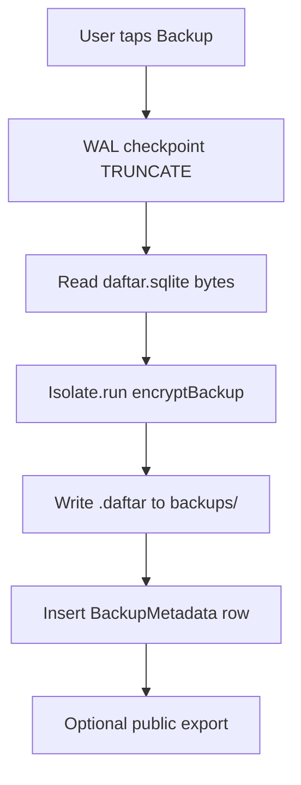
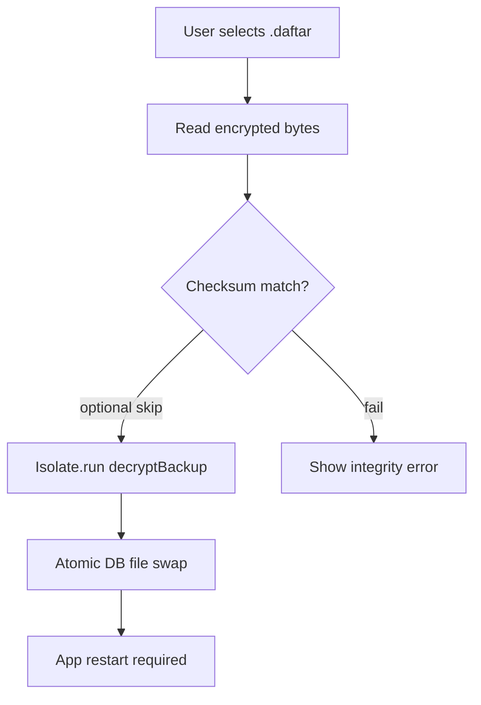

# Daftar Backup Specification — `.daftar` V1

> **Not judging / substrate.** `.daftar` backup format. Used in close-the-day Drive backup; not the contest architecture story. Judges: [`README.md`](../../README.md).

**Status:** Frozen for MVP handoff (v0.1.0)  
**Canonical implementation:** `lib/core/utils/encryption_util.dart`  
**Pipeline:** `lib/data/repositories/backup_repository_impl.dart`

> **Contest note:** Drive / `.daftar` backup is used in the Closing Agent close-the-day ritual. This is **backup**, not multi-device Stage 8 collaboration sync (quarantined for contest).

---

## 1. Purpose and Threat Model

Daftar backups protect merchant ledger data against device loss, corruption, and accidental deletion. The backup format is:

- **Offline-capable** — restore works with zero network
- **App-bound encryption** — ciphertext is useless without the build-time AES key
- **SQLite-native** — the plaintext payload is the raw Drift database file, not JSON

### What the format protects against

| Threat | Mitigation |
|---|---|
| Casual file inspection | AES-256-GCM encryption |
| Tampering in transit/storage | GCM authentication tag (embedded in ciphertext) |
| Wrong-file restore | Magic header `DFTR` + version byte validation |

### What the format does NOT protect against

| Limitation | Detail |
|---|---|
| Key extraction from APK | `envied` obfuscation is not encryption; determined attackers can recover `BACKUP_AES_KEY` |
| Key loss | If `BACKUP_AES_KEY` is lost, all V1 backups are permanently unrecoverable |
| Cross-app portability | Backups decrypt only with the same app build key |

The backup key is **not** stored in `flutter_secure_storage`. The pipeline is stateless across reinstall — the key lives in obfuscated compile-time constants via `envied`.

---

## 2. V1 Binary Layout

The `.daftar` file is a **single binary blob**. It is not JSON, not ZIP, and not a SQLite file until decrypted.

### Byte structure

```text
Offset   Length   Field
──────   ──────   ─────
0        4        Magic header: ASCII "DFTR" (0x44 0x46 0x54 0x52)
4        1        Format version (currently 1)
5        16       Initialization vector (IV) — random per encryption
21       N        AES-256-GCM ciphertext including 16-byte auth tag
```

**Minimum valid file size:** 22 bytes (header + IV + ≥1 ciphertext byte)

### Field reference

| Field | Size | Value | Notes |
|---|---|---|---|
| Magic | 4 B | `DFTR` | Identifies Daftar backup files |
| Version | 1 B | `0x01` | Drives key resolution in `decryptBackup` |
| IV | 16 B | Random | Fresh IV per `encryptBackup` call |
| Ciphertext | Variable | GCM output | Auth tag embedded by `encrypt` package |

### Hex dump example (truncated)

```text
44 46 54 52  01  [16-byte IV]  [ciphertext + GCM tag...]
^DFTR^       ^v1^
```

---

## 3. Plaintext Payload

After decryption, the plaintext is the **complete SQLite database file** (`daftar.sqlite`) captured immediately after a WAL checkpoint.

### Capture pipeline

1. `PRAGMA wal_checkpoint(TRUNCATE)` — flush WAL frames to main DB file
2. Read raw bytes from `{documents}/daftar.sqlite`
3. Encrypt in `Isolate.run()` via `EncryptionUtil.encryptBackup()`
4. Write encrypted bytes to `.daftar` file

**Source files:**

| Step | File |
|---|---|
| WAL checkpoint + read | `lib/data/datasources/local/backup_local_ds.dart` |
| Encrypt | `lib/data/repositories/backup_repository_impl.dart` |
| Create use case | `lib/application/backup/create_local_backup_use_case.dart` |

### Database filename

| Context | Filename |
|---|---|
| Runtime (actual) | `daftar.sqlite` in app documents directory |
| Legacy constant | `DbConstants.databaseName` references `daftar.db` — **stale**; runtime uses `daftar.sqlite` |

The encrypted backup contains the full SQLite schema at the time of backup, including all Drift tables, indexes, and FTS5 virtual tables.

---

## 4. Encryption Parameters

| Parameter | Value |
|---|---|
| Algorithm | AES-256-GCM |
| Key length | 32 bytes (256 bits) |
| Key source | `Env.backupAesKey` — Base64-encoded in `.env`, obfuscated at build time |
| IV length | 16 bytes (AES block size) |
| IV generation | `enc.IV.fromSecureRandom(16)` per encryption |
| Auth tag | 16 bytes, embedded in GCM ciphertext block |

### Key resolution by version

```dart
switch (version) {
  case 1: return base64Decode(Env.backupAesKey);
  default: throw FormatException('Unsupported backup version');
}
```

Future V2/V3 key rotations add new `case` branches. Older backups remain decryptable.

---

## 5. File Naming and Storage

### Filename convention

```text
Daftar_Backup_YYYYMMDD_HHMMSS.daftar
```

Generated in `backup_local_ds.dart` at backup creation time (UTC).

### Storage locations

| Destination | Path | Platform |
|---|---|---|
| Internal backups | `{documents}/backups/` | Both |
| Public export (Android) | `Downloads/Daftar/` via MediaStore | Android |
| Public export (iOS) | `Documents/Daftar/` (Files app) | iOS |

---

## 6. Checksum

SHA-256 hex digest of the **encrypted** `.daftar` file bytes.

| Field | Location | Purpose |
|---|---|---|
| `BackupMetadata.checksum` | Drift `backup_metadatas` table | Local backup history integrity |
| `appProperties.checksum` | Google Drive file metadata | Cloud backup integrity verification |

Checksum is computed over ciphertext, not plaintext SQLite.

**Integrity verification:** `lib/core/utils/backup_download_integrity.dart`

---

## 7. Restore Atomicity

Restore is a destructive operation requiring an app restart.

### Restore pipeline

1. Read encrypted `.daftar` bytes
2. Optional SHA-256 checksum compare (skipped for file-picker restores)
3. Decrypt in isolate (`EncryptionUtil.decryptBackup`)
4. Write decrypted bytes to a temp file
5. Close open database connection
6. Delete `daftar.sqlite-wal` and `daftar.sqlite-shm`
7. Atomic rename temp → `daftar.sqlite`
8. **Restart the application**

**Source:** `lib/application/backup/restore_backup_use_case.dart`

### Failure modes

| Error | Cause |
|---|---|
| `FormatException: Invalid backup file format` | Wrong magic header or unsupported version |
| `StateError` (GCM auth failure) | Tampered ciphertext or wrong `BACKUP_AES_KEY` |
| `FormatException: Payload too short` | Truncated or corrupt file |

---

## 8. Forward Compatibility

### Version byte strategy

The version byte at offset 4 enables coexistence of multiple encryption schemes:

| Version | Key source | Status |
|---|---|---|
| 1 | `Env.backupAesKey` | Current (MVP) |
| 2+ | TBD (e.g. per-user key, HKDF derivation) | Planned |

`decryptBackup` uses a `switch` on the version byte. Encrypt always writes `currentVersion` (1).

### Schema version (separate from encryption version)

Drift schema version is **not** embedded inside `.daftar`. It is recorded in Google Drive `appProperties.schemaVersion` at upload time for operational diagnostics.

| Constant | Value | File |
|---|---|---|
| `DbConstants.schemaVersion` | 26 (current) | `lib/core/constants/db_constants.dart` |
| `DriveBackupConstants.schemaVersion` | Must match Drift version | `lib/domain/constants/drive_backup_constants.dart` |

Restore accepts any SQLite schema the current app can migrate forward from via Drift `onUpgrade`.

---

## 9. What Is NOT in the Backup

| Item | Status | Detail |
|---|---|---|
| Merchant logo image file | **Not bundled** | Logo is a separate file on disk; only `logoPath` column in SQLite is backed up |
| Entitlement token | **Not included** | Stored in `flutter_secure_storage`, not SQLite |
| Auth session bundle | **Not included** | Stored in `flutter_secure_storage` |
| PIN hash (actual) | **Not included** | Only sentinel `configured` in settings row; real hash in secure storage |

Merchant logo bundling inside `.daftar` is a planned Pro feature (roadmap item 4.4 — delayed).

---

## 10. Metadata Model

Backup history is tracked in Drift, not inside the `.daftar` file.

### `BackupMetadata` entity

| Field | Type | Description |
|---|---|---|
| `id` | `String` (UUID v4) | Primary key |
| `filePath` | `String` | Local path to `.daftar` file |
| `sizeBytes` | `int` | Encrypted file size |
| `createdAt` | `DateTime` (UTC) | Backup timestamp |
| `type` | `BackupType` | `LOCAL` or `GOOGLE_DRIVE` |
| `checksum` | `String` | SHA-256 hex of encrypted file |
| `googleDriveFileId` | `String?` | Drive file ID when type is `GOOGLE_DRIVE` |

**Source:** `lib/domain/entities/backup_metadata.dart`

---

## 11. End-to-End Flow Diagrams

### Local backup



### Local restore



---

## 12. Test References

| Test | Path |
|---|---|
| E2E backup/restore | `integration_test/backup_restore_e2e_test.dart` |
| Upload/download | `test/application/backup/` |
| Drive integration | `test/data/repositories/backup_repository_drive_methods_test.dart` |
| Encryption unit | `test/core/utils/` (if present) |

---

## 13. Implementation Checklist for Future Maintainers

- [ ] Increment `currentVersion` in `EncryptionUtil` when rotating keys
- [ ] Add `case 2:` branch in `_resolveKeyForVersion` before shipping V2
- [ ] Keep `DriveBackupConstants.schemaVersion` aligned with `DbConstants.schemaVersion`
- [ ] Never change magic header `DFTR` — breaks all existing backups
- [ ] Never store monetary values as `double` in backup-related code
