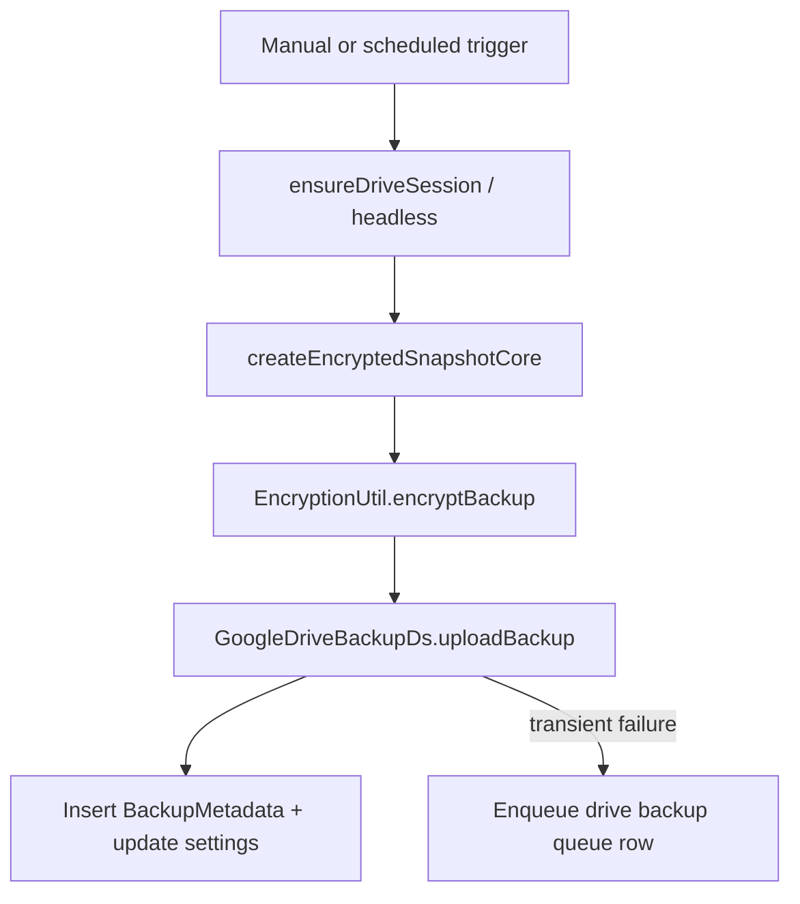
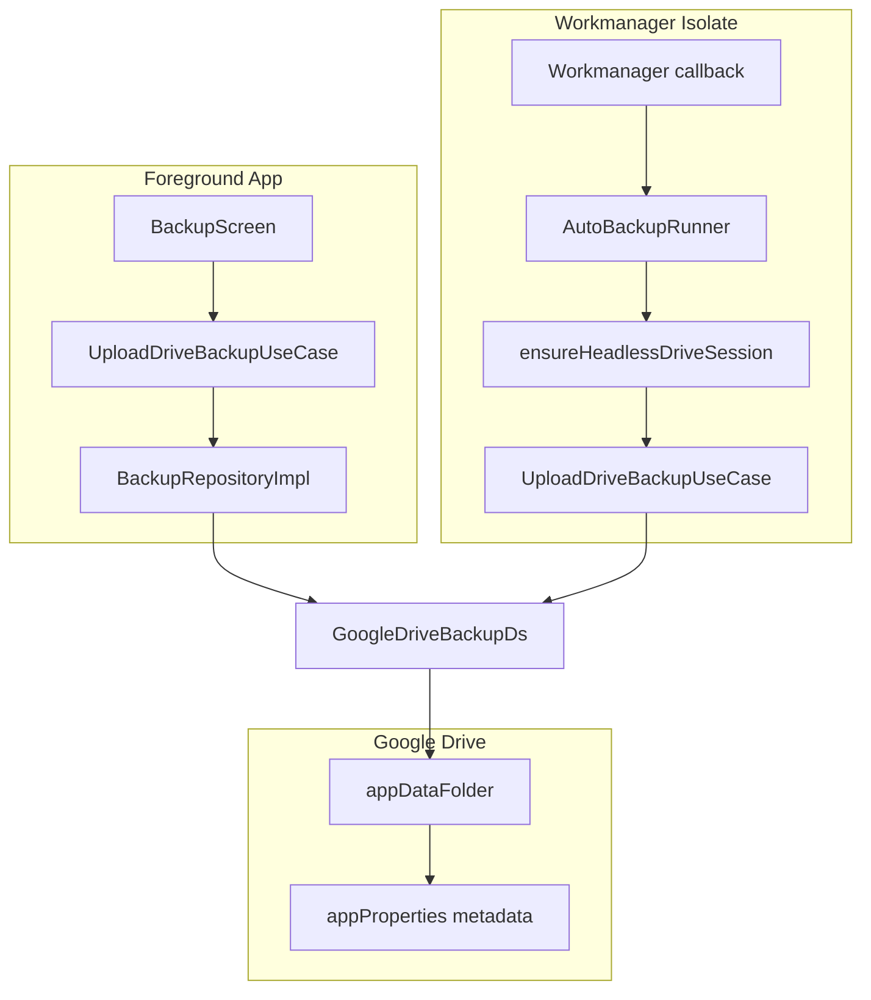

# Daftar Google Drive Backup Specification

> **Not judging / substrate.** Google Drive **backup** (`appDataFolder`) — not multi-device Stage 8 sync and not a judging contract. Judges: [`README.md`](../../README.md).

**Status:** Frozen for MVP handoff (v0.1.0)  
**Scope:** `https://www.googleapis.com/auth/drive.appdata`  
**Canonical implementation:** `lib/application/backup/` + `lib/data/datasources/remote/google_drive_backup_ds.dart`

> **Naming clarity:** This document describes **Google Drive backup** (Auth V2 · `appDataFolder`). It is **not** product Stage 8 multi-device collaboration sync (quarantined for the Closing Agent contest).

---

## 1. Scope and Rationale

Daftar stores encrypted `.daftar` backups in Google Drive's **hidden application data folder** (`appDataFolder`). This folder:

- Is invisible to the user in the Drive UI
- Is isolated per OAuth client
Requires the `drive.appdata` scope for backup. The AppAuth PKCE offline grant **also** requests `openid` + `email` so Flutter can silently mint a Google ID token for Closing Agent Cloud Run. GSI Sign-In `scopeHint` stays `drive.appdata` only.

| Property | Value |
|---|---|
| OAuth scope | `drive.appdata` (GSI Sign-In). PKCE also adds `openid` + `email` for Cloud Run ID tokens |
| Constant | `AuthScopes.driveAppData` |
| Drive API parent | `appDataFolder` |
| CASA audit | **Not required** — classified non-sensitive by Google |

**Source:** `lib/domain/constants/auth_scopes.dart`

---

## 2. Authentication Architecture

Two complementary auth paths serve interactive UI and headless background **backup**.

### Interactive sign-in (simplified)

One button tap uses **Google Sign-In only**:

1. `authenticate(scopeHint: drive.appdata)` — account picker (combined authz when the platform supports it)
2. Silent `authorizationForScopes` only — Drive `appdata` token if already granted
3. Persist `AuthSessionBundle` + reconcile Drift identity

**Do not** chain `authorizeScopes` after the picker — on Android that second
consent sheet often loses the Activity/user-gesture chain and appears to do
nothing. **AppAuth PKCE is not chained** into Sign In either (Custom Tab
`prompt=consent` + resume silent auth stacked consent UIs in a loop).

### Automatic refresh — no Google One Tap

Automatic paths (**app resume**, **connectivity restore**, **init**,
`AuthRepository.signInSilently` when a session bundle already exists, and
Stage 8 `obtainIdToken(allowInteractive: false)` for sync JWT exchange) must
**never** call `attemptLightweightAuthentication()`. On Android that API opens
Credential Manager One Tap / account UI even though the user is still linked.

| Path | Allowed refresh |
|---|---|
| Linked + PKCE grant | `ensureDriveCredential` / headless PKCE only |
| Linked, no grant / expired | Return failure — UI shows “Complete Drive authorization” |
| Closing Agent ID token (Send) | PKCE refresh (`openid`) — never GSI lightweight / One Tap |
| No bundle (migration only) | GSI lightweight may run once |
| Stage 8 sync ID token (auto) | Cached / silent GSI only — never lightweight; fail-closed if missing |
| Stage 8 sync ID token (manual Sync Now / invite) | Interactive `authenticate` when `allowInteractive: true` |

**Source:** `lib/data/datasources/remote/google_auth_ds.dart`,
`lib/data/repositories/auth_repository_impl.dart`,
`lib/presentation/providers/backup_providers.dart`,
`lib/data/repositories/sync_auth_bridge_repository_impl.dart`

Offline grant for headless Workmanager is a **separate** user action:
Settings → Drive backup → “Complete Drive authorization” banner
(`completeDriveAuthorization` → `DriveOfflineGrantDs.acquire`).

**Source:** `lib/data/repositories/auth_repository_impl.dart`,
`lib/data/datasources/remote/google_auth_ds.dart`

### Offline headless grant (PKCE)

| Component | Role |
|---|---|
| `DriveOfflineGrantDs` | AppAuth RFC 8252 native-app PKCE flow (user-initiated only) |
| `GOOGLE_OAUTH_CLIENT_ID_ANDROID` | Android installed-app client |
| `GOOGLE_OAUTH_CLIENT_ID_IOS` | iOS client (matches `GIDClientID`) |

### Headless session pipeline

`ensureHeadlessDriveSession()` runs a 4-step PKCE-only pipeline for Workmanager callbacks without UI.

**Source:** `lib/application/backup/ensure_drive_session.dart`

### Session persistence

| Store | Schema version | Content |
|---|---|---|
| `AuthSessionStore` | v4 | Refresh tokens, scope grants, account identity |

Stored in `flutter_secure_storage` — not in SQLite or `.daftar` backups.

---

## 3. Upload Flow



### Upload parameters

| Parameter | Value |
|---|---|
| Parent folder | `['appDataFolder']` |
| Filename | `*.daftar` (enforced if missing extension) |
| Resumable threshold | > 5 MB (`_resumableUploadThresholdBytes`) |

**Source:** `lib/data/datasources/remote/google_drive_backup_ds.dart`

### Drive `appProperties` metadata

String key-value map attached to each Drive file:

| Key | Example | Purpose |
|---|---|---|
| `appVersion` | `0.1.0+1` | App build label |
| `schemaVersion` | `26` | Drift schema at backup time |
| `checksum` | SHA-256 hex | Encrypted file integrity |
| `backupTimestamp` | ISO-8601 UTC | Backup creation time |
| `googleAccountEmail` | `user@gmail.com` | Optional account label |

**Source:** `lib/application/backup/upload_drive_backup_use_case.dart`

---

## 4. Download and Integrity

Before restore from Drive:

1. Download encrypted bytes
2. Verify SHA-256 checksum against `appProperties.checksum`
3. Decrypt via `EncryptionUtil.decryptBackup`
4. Atomic SQLite swap (see [BACKUP_SPEC.md](BACKUP_SPEC.md))

**Source:** `lib/core/utils/backup_download_integrity.dart`, `lib/application/backup/download_drive_backup_use_case.dart`

---

## 5. Retry Policy — In-Process

`BackupRetryPolicy` handles transient failures during queue processing.

| Parameter | Value |
|---|---|
| `maxAttempts` | 5 |
| `baseDelay` | 2 seconds |
| `maxDelay` | 5 minutes |
| Backoff formula | `min(2000 * 2^(n-1), 300000)` ms |
| Jitter | ±25% uniform random |

Used by `ProcessBackupQueueUseCase` with per-row `backupRetryCount` and `nextRetryAt`.

**Source:** `lib/core/utils/backup_retry_policy.dart`

---

## 6. Auto-Backup Scheduler (Android-first rewrite)

**Module:** `lib/application/auto_backup/`

iOS auto-backup is **deferred**. All scheduling APIs no-op unless `Platform.isAndroid`.

### Initialization

`AutoBackupScheduler.initialize(autoBackupDispatcher)` in `main.dart`:

1. Ensures Workmanager is bound to the top-level `@pragma('vm:entry-point')` dispatcher
2. Channel priming via `AutoBackupNotifications.ensureReady()` (pre-`runApp` OK)
3. `POST_NOTIFICATIONS` requested **after** first frame only

### Scheduling conditions

| Condition | Field |
|---|---|
| Auto-backup enabled | `settings.driveAutoBackupEnabled == true` |
| Google account linked | `settings.googleAccountId` non-empty |

Enabling in UI also requires a ready PKCE offline grant (`hasDriveOfflineGrant`).

### Intervals

| Setting key | Interval |
|---|---|
| `daily` | 24 hours |
| `weekly` | 7 days |

Legacy stored value `every_30_min` (former test cadence) is treated as `daily` by `DriveAutoBackupInterval.fromStorage`.

### Platform model

| Platform | Model |
|---|---|
| **Android** | Chain-only one-off `com.akrmcodes.daftar.autobackup.chain` → `auto_backup_run`. After each attempt, re-arm with `ExistingWorkPolicy.replace`. Legacy `com.akrmcodes.daftar.backup.*` names are cancelled on every schedule. |
| **iOS** | Deferred — no auto-backup registration in this rewrite |

### Task registry

| Unique name | Task name | Purpose |
|---|---|---|
| `com.akrmcodes.daftar.autobackup.chain` | `auto_backup_run` | Android auto-backup chain |
| `com.akrmcodes.daftar.autobackup.queue` | `auto_backup_queue_drain` | Offline upload queue drain |

**Source:** `lib/application/auto_backup/auto_backup_ids.dart`

### Reliability guards

| Guard | Behavior |
|---|---|
| Cadence 80% | Skip upload if `lastBackupAt` within 80% of interval |
| Remaining-time re-arm | On skip, delay = remaining to eligibility (floor 30s) |
| Cancel on disable | No account / auto off → `cancelAutoBackupChain` (never zombie re-arm) |
| Manual/auto success | Re-arm full interval from now |
| Catch-up | Resume + offline→online → `ensureScheduled` (5s force when overdue/stale) |
| Flight lock | SharedPreferences cross-isolate lock |
| OEM battery gate | One-shot unrestricted-battery sheet on first enable |
| Notifications | Channels `daftar_auto_backup_v1` (HIGH) + `daftar_auto_backup_urgent_v1` (MAX) |

### Work constraints

```dart
Constraints(
  networkType: NetworkType.connected,
  requiresBatteryNotLow: false,
  requiresStorageNotLow: false,
)
```

> **Timing honesty:** WorkManager is best-effort under Doze. Exact 30:00 is not
> guaranteed. Runs while the phone is on, online, and not force-stopped — **not**
> while powered off. UI key: `backupDriveTimingHonesty`.

### Notification permission

- Post-`runApp` only; re-request on enable; denied → snackbar + open settings
- Kotlin `AutoBackupNotificationChannels` mirrors Dart IDs at HIGH/MAX

---

## 7. Chain Ownership — AutoBackupRunner

Auto-backup **always returns `true`** to WorkManager (chain owns retry).

| Outcome | Next chain delay |
|---|---|
| Success / sticky reauth / quota | Full configured interval |
| Cadence skip | Remaining to 80% window |
| Transient network / soft auth | `min(5 minutes, interval / 6)` |
| Disabled / no account / no bundle | **Cancel chain** |

Queue drain may return `false` for OS retry; it does not re-arm the chain.

### Sticky `needs_reauth` (interactive required)

Only:

- `drive_refresh_token_revoked` (`invalid_grant`)
- `drive_scopes_not_authorized` / `drive_unauthorized` / `drive_forbidden`
- `canceled`

**Never** sticky for `NetworkFailure` or PKCE `unavailable`.

**Source:** `lib/application/backup/ensure_drive_session.dart`,
`lib/application/auto_backup/auto_backup_runner.dart`

### OAuth publishing (ops — required for long-lived refresh)

Google Cloud Console → OAuth consent screen must be **In production**.
Apps left in **Testing** issue refresh tokens that expire in **7 days**, which
presents as sudden “sign in again” prompts. Publishing status change does **not**
require full verification for `drive.appdata`, but users must re-consent once
after the switch so a non-expiring refresh token is minted.

---

## 8. Schedule Store and Catch-up

| Component | Purpose |
|---|---|
| `AutoBackupScheduleStore` | `nextScheduledAt` + `lastCompletedAt` in SharedPreferences |
| `AutoBackupScheduler.ensureScheduled` | Catch-up on resume / connectivity when overdue or stale |

Overdue grace: 15 minutes. Catch-up delay: 5 seconds.


---

## 9. Failure Outcome Recording

Settings fields updated after each auto-backup attempt:

| Field | Values |
|---|---|
| `lastAutoBackupOutcome` | `success`, `failed`, `skipped` |
| `lastAutoBackupFailureCode` | Machine-readable code (e.g. `needs_reauth`, `network_unavailable`) |

---

## 10. Upload Queue (Offline-First Resume)

When a Drive upload fails transiently:

1. Row inserted into `drive_backup_queue_rows` Drift table
2. `auto_backup_queue_drain` processes queue headlessly
3. `BackupRetryPolicy` governs per-row retry with `nextRetryAt`

**Source:** `lib/application/backup/enqueue_drive_backup_upload_use_case.dart`, `lib/application/backup/process_backup_queue_use_case.dart`

---

## 11. Preflight Smoke Test

Settings → **Run Cloud Smoke Test** executes 8 sequential diagnostics:

1. Sign in
2. Scope authorization (`drive.appdata`)
3. Upload test backup
4. Download test backup
5. Verify checksum
6. Delete test backup
7. Sign out
8. Silent re-authentication

**Source:** `lib/presentation/screens/settings/preflight_smoke_test_screen.dart`

---

## 12. End-to-End Architecture Diagram



---

## 13. Configuration Checklist

| Step | Action |
|---|---|
| 1 | Enable Google Drive API in Google Cloud Console |
| 2 | Create Web, Android, iOS OAuth clients |
| 3 | Register Android SHA-1 fingerprint |
| 4 | Add all OAuth IDs to `.env` |
| 5 | Regenerate envied code |
| 6 | Run Cloud Smoke Test on debug build |
| 7 | Verify `DriveBackupConstants.schemaVersion` matches `DbConstants.schemaVersion` |

---

## 14. Test References

| Test area | Path |
|---|---|
| Drive repository | `test/data/repositories/backup_repository_drive_methods_test.dart` |
| Queue processing | `test/application/backup/` |
| Cadence / catch-up | `test/application/auto_backup/auto_backup_policy_test.dart` |
| Contracts / channels | `test/application/auto_backup/auto_backup_contracts_test.dart` |
| Battery gate | `test/application/auto_backup/auto_backup_battery_gate_test.dart` |
| Silent auth (no One Tap) | `test/data/repositories/auth_repository_impl_test.dart` |
| Background runner | `lib/application/auto_backup/auto_backup_runner.dart` |
