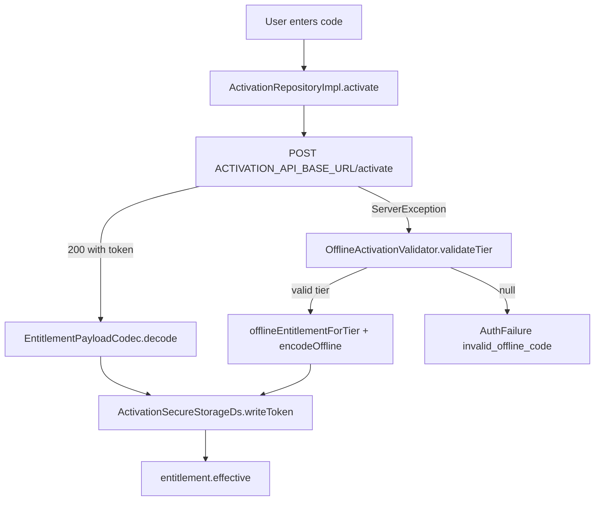

# Daftar Monetization Specification

> **Not judging / substrate.** Tiers / activation. Monetization and RevenueCat are **not** a judging focus. Judges: [`README.md`](../../README.md).

**Status:** Frozen for MVP handoff (v0.1.0)  
**Canonical implementation:** `lib/data/repositories/activation_repository_impl.dart`  
**Entitlement SSOT:** `lib/domain/entities/entitlement.dart`

> **Contest note:** Activation / tiers remain part of the disclosed ledger substrate. Monetization and RevenueCat Shipaton are **not** a judging focus for All Things Agentic — see [`docs/roadmap_v2.md`](../roadmap_v2.md).

---

## 1. Tier Model

Daftar uses three subscription tiers defined by `AppTier`:

| Tier | Enum value | Workspace limits | Premium features |
|---|---|---|---|
| **Free** | `AppTier.free` | 1 ledger, 50 contacts, 500 transactions | None |
| **Pro** | `AppTier.pro` | Unlimited | `brandedPdf`, `ledgerArchiving`, `smartMerge` |
| **Pro+** | `AppTier.proPlus` | Unlimited | All Pro + `multiDeviceSync`, `whatsappAutomation`, `advancedAnalytics`, `customerPortal` |

### Free-for-all features

These are **not** gated by tier (available on Free):

| Feature key | Constant |
|---|---|
| Cloud backup | `AppConstants.featureCloudBackup` |
| CSV import | `AppConstants.featureCsvImport` |
| Credit limits | `AppConstants.featureCreditLimits` |

**Source:** `ActivationRepositoryImpl.isFeatureKeyUnlocked`

### Limit constants

| Resource | Free limit | Pro/Pro+ limit | Constant |
|---|---|---|---|
| Ledgers | 1 | Unlimited (-1) | `EntitlementLimits.freeMaxLedgers` |
| Contacts | 50 | Unlimited (-1) | `EntitlementLimits.freeMaxContacts` |
| Transactions | 500 | Unlimited (-1) | `EntitlementLimits.freeMaxTransactions` |

`-1` means unlimited (`EntitlementLimits.unlimited`).

---

## 2. Entitlement Entity

`Entitlement` is the single source of truth for monetization policy.

### Fields

| Field | Type | Description |
|---|---|---|
| `tier` | `AppTier` | Current subscription tier |
| `activeFeatures` | `Set<FeatureFlag>` | Unlocked premium capabilities |
| `maxLedgers` | `int` | Workspace cap (-1 = unlimited) |
| `maxContacts` | `int` | Workspace cap (-1 = unlimited) |
| `maxTransactions` | `int` | Workspace cap (-1 = unlimited) |
| `expiryDate` | `DateTime?` | UTC expiry; null = no expiry |

### Factory constructors

| Factory | Tier | Features | Limits |
|---|---|---|---|
| `Entitlement.defaultFree()` | Free | `{}` | 1 / 50 / 500 |
| `Entitlement.forPro({expiryDate})` | Pro | Pro feature set | Unlimited |
| `Entitlement.forProPlus({expiryDate})` | Pro+ | Pro+ feature set | Unlimited |

### Tier resolution at runtime

```dart
Entitlement get effective =>
    isExpired ? Entitlement.defaultFree() : this;
```

When `expiryDate` is in the past, `effective` downgrades to free tier regardless of stored token.

### Capability checks

| Method | Purpose |
|---|---|
| `hasFeature(FeatureFlag)` | Feature flag membership |
| `canAddLedger(int count)` | Workspace limit check |
| `canAddContact(int count)` | Workspace limit check |
| `canAddTransaction(int count)` | Workspace limit check |

---

## 3. Activation Flow

Activation is **online-first** with **offline fallback**.



### Step-by-step

1. Trim and validate non-empty code
2. Attempt online activation via `ActivationApiDs.activate()`
3. On success: decode server token, persist, return `effective`
4. On `ServerException` only: attempt offline validation
5. On offline success: build 1-year entitlement, encode offline token, persist
6. On offline failure: return `AuthFailure`

Non-server errors do not fall through to offline validation.

---

## 4. Online Activation API

### Configuration

| Setting | Source |
|---|---|
| Base URL | `Env.activationApiBaseUrl` from `.env` |
| Endpoint | `POST {baseUrl}/activate` |
| Timeout | 15s send + 15s receive |

### Request

```json
POST /activate
Content-Type: application/json

{
  "code": "USER-ENTERED-CODE"
}
```

### Response (success)

Either field is accepted:

```json
{
  "token": "<signed-entitlement-jwt-or-payload>"
}
```

```json
{
  "payload": "<signed-entitlement-jwt-or-payload>"
}
```

### Response (failure)

HTTP error maps to `ServerException`, triggering offline fallback.

**Source:** `lib/data/datasources/remote/activation_api_ds.dart`

---

## 5. Activation Code Formats

### UI format (user-facing)

| Aspect | Value |
|---|---|
| Display hint | `XXXX-XXXX-XXXX` |
| Formatter | `ActivationCodeFormatter` |
| Max raw alphanumeric | 16 characters |
| Grouping | Hyphen every 4 characters |
| Case | Uppercased on input |

**Source:** `lib/presentation/screens/premium/widgets/activation_code_formatter.dart`

### Offline validator format (server-unavailable fallback)

| Tier | Prefix | Total length | Checksum |
|---|---|---|---|
| Pro | `PRO-` | 16 characters | mod-97 |
| Pro+ | `PROPLUS-` | 24 characters | mod-97 |

#### Checksum algorithm (placeholder)

```dart
bool _checksumValid(String code) {
  var sum = 0;
  for (final unit in code.codeUnits) {
    sum += unit;
  }
  return sum % 97 == 0;
}
```

### Known technical debt

The UI formatter accepts generic `XXXX-XXXX-XXXX` codes, but the offline validator expects `PRO-` / `PROPLUS-` prefixed codes. Online codes are validated server-side and can be arbitrary strings.

---

## 6. Token Formats

Tokens persist in `flutter_secure_storage` under key `daftar_entitlement_token`.

### Server JWT

```text
{header}.{payload}.{signature}
```

Signature verification is **not** performed client-side (placeholder).

### Offline Daftar v1 token

```text
daftar1.{base64url(payload)}.{base64url(signature)}
```

#### Payload JSON schema

```json
{
  "v": 1,
  "tier": "pro",
  "features": ["brandedPdf", "ledgerArchiving", "smartMerge"],
  "maxLedgers": -1,
  "maxContacts": -1,
  "maxTransactions": -1,
  "exp": "2027-06-17T00:00:00.000Z",
  "iat": "2026-06-17T12:00:00.000Z"
}
```

#### Signature (placeholder)

```dart
sha256("daftar-offline:{payloadSegment}") -> base64url
```

**Source:** `lib/data/services/entitlement_payload_codec.dart`

### Offline entitlement defaults

| Tier | Expiry |
|---|---|
| Pro | Now + 365 days UTC |
| Pro+ | Now + 365 days UTC |

---

## 7. EntitlementPayloadModel Schema

| JSON key | Type | Maps to |
|---|---|---|
| `v` | `int` | `schemaVersion` (currently 1) |
| `tier` | `string` | `AppTier` |
| `features` | `string[]` | `FeatureFlag` names |
| `maxLedgers` | `int` | Workspace limit |
| `maxContacts` | `int` | Workspace limit |
| `maxTransactions` | `int` | Workspace limit |
| `exp` | ISO-8601 or Unix seconds | `expiresAt` |
| `iat` | ISO-8601 or Unix seconds | `issuedAt` |

---

## 8. Secure Storage

| Key | Value | Storage |
|---|---|---|
| `daftar_entitlement_token` | Signed JWT or offline token | `flutter_secure_storage` |

---

## 9. Development Override

When `DevEntitlement.forceProPlusInDevelopment` is true, `getEntitlement()` returns Pro+ without reading secure storage. Never enable in release builds.

---

## 10. Production Setup Checklist

1. Deploy Supabase Edge Function at `/activate`
2. Set `ACTIVATION_API_BASE_URL` in `.env`
3. Regenerate env code via `build_runner`
4. Implement server-side code validation and JWT signing
5. Test online activation before relying on offline placeholder checksum
