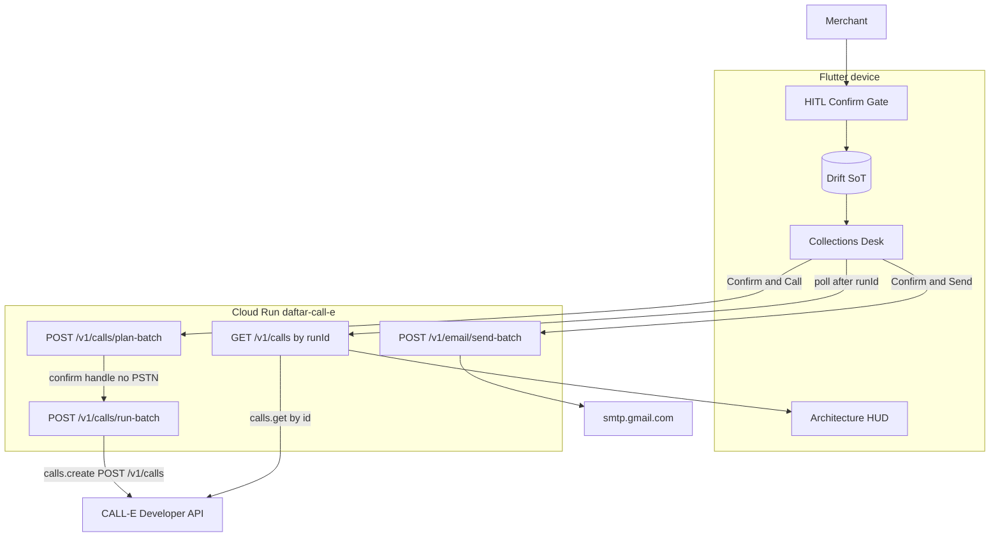
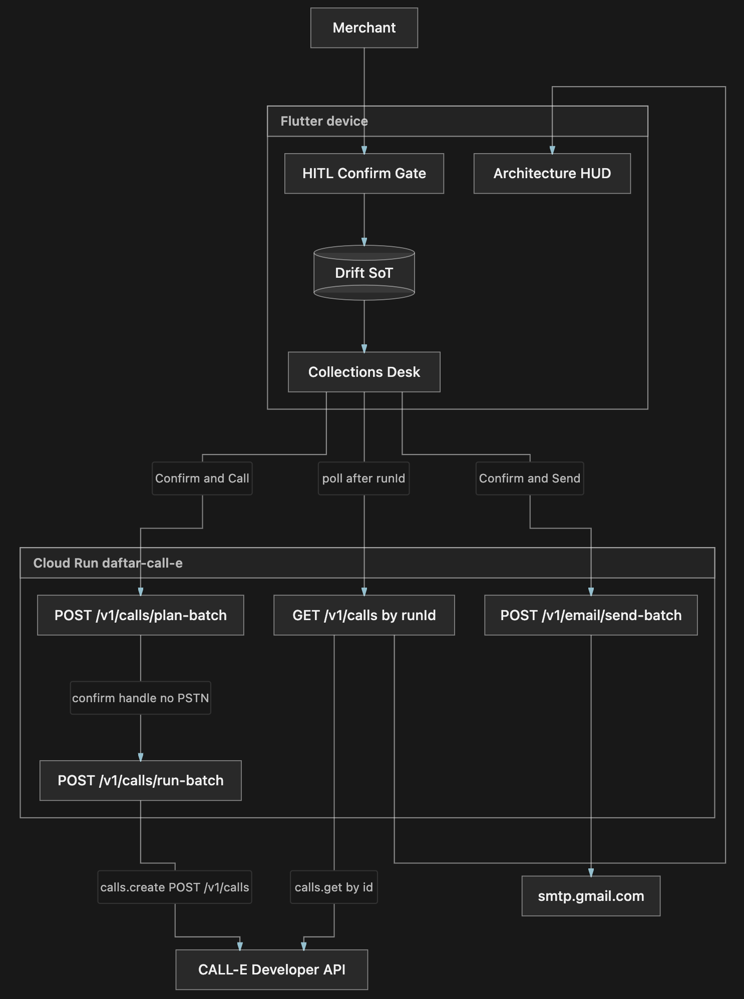
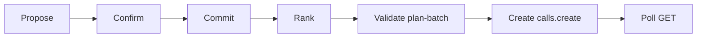

# Daftar Closing Agent — Confirm & Call (CALL-E architecture)

> **Hackathon:** [CALL-E: Your Code Is Calling](https://call-e.devpost.com/) · prize aim **Most Practical**  
> **Runtime:** Flutter + Drift · Cloud Run **`daftar-call-e`** · `calle-ai==0.7.0` · Gemini 3.5 (proposals only) · Gmail SMTP (email rail)  
> **Binding contract:** [`docs/roadmap_v3.md`](../roadmap_v3.md) v3.5 · **Wire:** [`agent/openapi.yaml`](../../agent/openapi.yaml)  
> **Heritage (do not execute):** [`docs/roadmap_v2.md`](../roadmap_v2.md) v2.8

CALL-E Stage Two is four equal scores (Impact, Idea, Technical, Experience). This page is the judge glance for **Technical Implementation**: the Python SDK is **imported and actually called at runtime** on `daftar-call-e`. It is not an All Things Agentic Taskmaster brief.

## Judge glance

```
Merchant → Flutter (HITL, Drift SoT) → Cloud Run daftar-call-e (sibling FastAPI)
Close: aging rank (device; Gemini does not pick IDs)
  Call rail:  Confirm & Call → plan-batch (local, no PSTN) → run-batch
              → calle-ai calls.create / POST /v1/calls → poll GET /v1/calls/{runId}
  Email rail: Confirm & Send Statements → send-batch → smtp.gmail.com
HUD observes CALL-E call.id last-8. Gemini never dials and never cashiers.
Promise ≠ payment. YE / unsupported region → email / callUnavailable.
```

## System diagram

Source of truth is the mermaid below (TB system diagram, not the HITL strip). After aging rank, **Confirm & Call** runs Daftar-local `plan-batch` (allowlist / J.10 / DNC / C.3 echo — **zero PSTN**, **zero** CALL-E). The device holds the opaque confirm handle, then `run-batch` calls `CalleClient.calls.create` / `POST https://api.heycall-e.com/v1/calls`. The device **polls** `GET /v1/calls/{runId}` (`runId` := CALL-E `call.id`). Email rail is `send-batch` only after **Confirm & Send Statements**. HUD observes; it does not parent the confirm gate.

**Not drawn:** `POST /run` and the eight ADK FunctionTools, Vertex Gemini, Chirp `POST /v1/tts`, Drive backup, Hybrid E WhatsApp leftover, portable skill dry-run, frozen Agentic hostname.



`plan-batch` **never dials**. `run-batch` is the only path that creates a CALL-E call. Poll is **GET** only — no `create_and_wait` on Cloud Run, no public webhook.

**Owner PNG (heritage until replaced):** the embed below is the Agentic-era export (`daftar-closing-agent`, eight tools, Vertex Gemini). Do not use it as the glance. Export the **TB mermaid above** ~1400px wide and overwrite this file. No E.164, no API keys, no frozen Agentic hostname as the live service box. Devpost uploads PNG (not Markdown). Keep size 10 KB–5 MB.



## HITL rail

Propose → Confirm → Commit → Rank → **Validate** (`plan-batch`) → **Create** (`run-batch` / `calls.create`) → **Poll** (`GET /v1/calls/{runId}`).

Money **Commit** is on the device after Confirm (Model C). A structured promise write-back is **display-only** — never `AddTransaction`. Mid-day `propose_*` still uses `POST /run`; that planner is **not** the call plane and is not drawn above.



| Path | Stations |
| --- | --- |
| **Mid-day capture** | Propose → Confirm → Drift commit |
| **Close-the-day call** | Propose (`propose_closing_plan`) → plan confirm starts ritual → Rank → **Confirm & Call** → Validate → Create → Poll → integer promise card |
| **Close-the-day email** | Same ritual → **Confirm & Send Statements** → `send-batch` → SMTP **250** + Message-ID |
| **Confirm without calling / sending** | First-class. Ritual runs; `run-batch` / `send-batch` are never called |

## Captions

| Caption | Fact |
| --- | --- |
| **CALL-E is not an ADK tool** | Sibling FastAPI on `daftar-call-e`, same pattern as SMTP `send-batch`. Catalog freeze forbids a dial FunctionTool. |
| **Agentic URL is not this service** | Frozen hostname `daftar-closing-agent-1487285471` is All Things Agentic production — describe-only through 13 Oct 2026. This submission’s runtime is **`daftar-call-e`**. |
| **Production = Developer API not MCP** | Python SDK `from calle import CalleClient` at runtime. Not MCP `plan_call` / `run_call`. `create_and_wait` is Gate 0 laptop smoke only. |
| **Dual rail** | Device aging ranks. Call set: J.10 + allowlist + DNC, cap **5**. YE / unsupported → email / `callUnavailable`, never a failed dial. Send set ≤20; MIME PDF on ranked **Top 5**. Gemini does not pick recipients. |
| **Proof of Action** | Integer `promised_amount_minor`. `task_completed` ≠ paid. SMTP **250** ≠ delivered. Poll ≠ webhook theater. |
| **Credentials** | Cloud Run IAM + ID tokens (custom audiences). Secret Manager `calle-api-key` and `gmail-smtp-app-password`. Never Flutter, git, or chat. No `allUsers`. |
| **Demo destination** | Owner Callcentric US DID answered in Linphone (disclose owner answers). No live E.164 in git. Never real debtors. |
| **State** | Drift is SoT. Confirm handles are process-local — live dial window uses min instances **1**, then min **0**. Cloud Run down → ledger intact. |
| **Integer money** | `amountMinor: int` only. Never `double` / `num` on the wire or in Drift. |

## Frozen tool catalog

Eight ADK FunctionTools on `root_agent` (`Agent` name `closing_agent`) — no ninth tool, no send-email tool, **no dial tool**:

| Wire name | Role |
| --- | --- |
| `parse_goal` | Ask / backup_only / ambiguous only |
| `propose_debt` | Mid-day debt capture |
| `propose_payment` | Mid-day payment capture |
| `propose_create_contact` | New contact |
| `propose_create_ledger` | New ledger |
| `propose_closing_plan` | Close-the-day plan only |
| `propose_whatsapp_drafts` | Leftover Hybrid E prepare — not close path |
| `propose_statement` | On-demand statement |

Enforced by [`agent/tests/test_tool_catalog_freeze.py`](../../agent/tests/test_tool_catalog_freeze.py) and Flutter `ProposalTool`.

Reusable contribution **outside** this runtime diagram: Agent Skill [`ledger-collections-call`](https://github.com/CALLE-AI/awesome-phone-call-agents/pull/385) (dry-run default; never posts without `--live`). Complementary to `kept` — display-only promise, never cashiers.

## Observability (demo + judges)

| Surface | What to show |
| --- | --- |
| Device HUD | `Call ·` + `runId` last-8 (= CALL-E `call.id`) + terminal status — not delivered/paid |
| Cloud Logging | `daftar.agent.call` on service **`daftar-call-e`** (`plan` / `run` / `action=terminal`; masked phone; `outcome`) |
| Inbox | Email-rail Proof of Action — PDF on ranked Top 5; text-only remainder intentional |

## Related docs

- [`docs/roadmap_v3.md`](../roadmap_v3.md) — binding CALL-E contract
- [`docs/contest/AGENTIC_CLOUD_RUN_FREEZE.md`](../contest/AGENTIC_CLOUD_RUN_FREEZE.md) — frozen Agentic snapshot
- [`README.md`](../../README.md) — claims, folder map, spin-up (§6.2 will retarget this from heritage)
- [`docs/README.md`](../README.md) — documentation index
- [`docs/CONTEST_DISCLOSURE.md`](../CONTEST_DISCLOSURE.md) — substrate vs contest-new
- [`docs/qa/calle_live_dial_window.md`](../qa/calle_live_dial_window.md) — film-day arm / disarm
- [`agent/README.md`](../../agent/README.md) — deploy, smoke, observability
