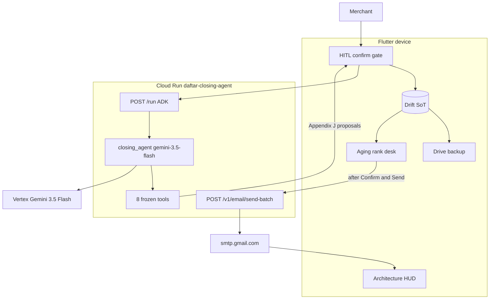

# Daftar Closing Agent — Contest Architecture (Taskmaster)

> **Track:** Taskmaster · **Stack:** Flutter + Drift · Cloud Run (ADK) · Gemini 3.5 · Gmail SMTP  
> **Binding contract:** [`docs/roadmap_v2.md`](../roadmap_v2.md) · **Wire:** [`agent/openapi.yaml`](../../agent/openapi.yaml)

Best Architectural Design is awarded to top scorers on **Architectural Discipline (30%)** — not a separate rubric.

## Judge glance

```
Merchant → Flutter (HITL, Drift SoT) → Cloud Run POST /run (ADK, 8 tools) → Vertex Gemini 3.5
Close: Confirm & Send Statements → ritual (localDay → Drive → aging) → desk → send-batch
       → smtp.gmail.com → inbox + Cloud Logging Message-ID → Architecture HUD observes
```

## System diagram


HITL confirm gate calls `POST /run`. Drift → Drive is **backup upload only** — it does not invoke the agent. Desk → `send-batch` only after **Confirm & Send Statements**. HUD observes SMTP; it does not parent the confirm gate.

One Cloud Run service (`closing_agent`). No webhook service. No second agent runtime.

`POST /v1/tts` is a sibling FastAPI route on the same service (Chirp, not an ADK tool) — **not drawn**. Day Journal is an AI **audit** trail; closing totals come from Drift `localDay`, not the journal.

Editable source (same edges):



| Caption | Fact |
| --- | --- |
| **Decouple** | `/run` emits proposals only. Drift commits money. `send-batch` is sibling FastAPI — not a FunctionTool. `tools → Flutter` = proposals. `desk → send` = auto-dispatch only after **Confirm & Send Statements**. |
| **State** | Drift is SoT. `ClosingAgentPhase` on device. Scoped `daftarContext` — the ledger is not dumped into Gemini. Cloud Run may scale to zero. |
| **Credentials** | Cloud Run IAM + ID tokens (**custom audiences**). Gmail App Password = Secret Manager file mount `/secrets/gmail-smtp-app-password` — never Flutter, git, or chat. No `allUsers`. |
| **Failures** | Confirm-gate single-flight per `proposalId`. Drive fail does not abort close. SMTP rows `failed` / `skipped`. Auth 535 halts the batch. Cloud Run down → ledger intact. Durable send key is device `batchId` / Drift (process-local Cloud Run idempotency is wiped on scale-to-zero). |
| **Integer money** | `amountMinor: int` only. Never `double` / `num` on the wire or in Drift. |
| **Day Journal** | Contest AI audit. **Not** the money SoT. Closing totals = Drift `localDay`. |
| **Send set** | Device aging ranks. `min(shortlist, 20)` emailed. MIME PDF on ranked **Top 5** only (device statement isolate). Remainder C.2 text-only. Gemini does not pick recipients. |
| **Confirm without sending** | First-class. Ritual runs; `send-batch` is never called. |
| **HUD** | Observes `/run` echo + last SMTP Message-ID. Does **not** feed the confirm gate. |
| **Drive** | Close path is Drift **→** Drive **upload**. Restore is recovery, not the filmed climax. |

**Continuous Action (lens):** eight frozen, scoped FunctionTools — [`agent/tests/test_tool_catalog_freeze.py`](../../agent/tests/test_tool_catalog_freeze.py). No send-email tool.

**Evolving Knowledge (lens):** integer money schema + Drift `localDay` + scoped `daftarContext`. **No vector embeddings** — a debt ledger is a financial source of truth, not a RAG corpus.

**Multi-Agent Nexus (lens):** Taskmaster, not Fortified. Separation of concerns is **planner (one `LlmAgent`) / device ritual / SMTP worker** — not extra ADK agents. See below.

## Human-in-the-loop (Model C)

Gemini **proposes**; the merchant **confirms**; the device **commits** to Drift. Outreach is **Gmail SMTP** only after **Confirm & Send Statements** on the closing plan — never an ADK send tool. Cloud Run invokers use Google **ID tokens** with custom OAuth audiences (not public `allUsers`).

| Path | Stations |
| --- | --- |
| **Mid-day capture** | Propose → Confirm → Drift commit |
| **Close-the-day** | Propose (`propose_closing_plan`) → **Confirm & Send Statements** → ritual (`localDay` summary → Drive upload → aging rank) → Collections Desk → auto-dispatch `send-batch` → SMTP **250** + Message-ID |

**Confirm without sending** skips desk dispatch and `send-batch`; the ritual still runs.

The §5.6 **Architecture HUD** (debug toggle) shows routing, tool scope (Capture / Close / Ask), the HITL rail, and `Sent ·` Message-ID last-8 after SMTP — not a product tour.

## Frozen tool catalog (Gate 5)

Eight ADK FunctionTools on `root_agent` (`Agent` name `closing_agent`) — no ninth tool, no send-email tool:

| Wire name | Role |
| --- | --- |
| `parse_goal` | Ask / backup_only / ambiguous only |
| `propose_debt` | Mid-day debt capture |
| `propose_payment` | Mid-day payment capture |
| `propose_create_contact` | New contact |
| `propose_create_ledger` | New ledger |
| `propose_closing_plan` | Close-the-day plan only |
| `propose_whatsapp_drafts` | Leftover Hybrid E prepare — not close path |
| `propose_statement` | On-demand statement |

Enforced by [`agent/tests/test_tool_catalog_freeze.py`](../../agent/tests/test_tool_catalog_freeze.py) and Flutter `ProposalTool`.

## Why not SequentialAgent or B-Prime?

**Taskmaster** judges score a complete workflow (40%), engineering discipline (30%), and live demo + GCP proof (30%). Multi-agent routing bullets in the official rules target **other** categories (Fortified Enterprise Fleet / Multi-Agent Nexus) — not Taskmaster.

Nexus-style **separation of concerns** in this submission is planner vs device vs SMTP — **one** ADK `LlmAgent` (`closing_agent`) with instruction-based routing and a frozen eight-tool catalog:

- **Mid-day** is intent-dependent (one hop, parallel `propose_*` in one turn) — not a fixed pipeline. `SequentialAgent` would run every sub-agent in order or add latency without utility.
- **Close-the-day** ritual (summary → Drive → aging → send-batch) is **device-deterministic** after one plan confirm; the agent emits `propose_closing_plan` only.
- **HITL** is the architecture story: Cloud Run plans, Drift commits, SMTP is a sibling FastAPI route — stronger for this product than a coordinator + scoped sub-agents that risk empty Confirm cards and extra Vertex hops.

Coordinator + scoped sub-agents (B-Prime) remain a **post-contest** option only if a local ADK harness proves Appendix J envelopes still parse from `/run` events.

## Observability (demo + judges)

| Surface | What to show |
| --- | --- |
| Device HUD | `Cloud Run · gemini-3.5-flash`, tool scope, HITL step, correlation last-8, `Sent ·` Message-ID last-8 |
| Cloud Logging | `daftar.agent.model`, `daftar.agent.tool`, `daftar.agent.email` (SMTP **250** + **Message-ID**), `daftar.agent.call` (`plan` / `run` / terminal `action=terminal` with masked phone + `runId` + `outcome`) |
| Inbox | Proof of Action — PDF on ranked Top 5; text-only remainder intentional |

SMTP **250** is server **accept**, not mailbox-delivered. Gmail has no delivery webhook — do not fake `delivered`.

## Related docs

- [`README.md`](../../README.md) — claims, folder map, spin-up
- [`docs/README.md`](../README.md) — documentation index
- [`docs/CONTEST_DISCLOSURE.md`](../CONTEST_DISCLOSURE.md) — substrate vs contest-new
- [`docs/contest_demo.md`](../contest_demo.md) — ≤4 min film script
- [`agent/README.md`](../../agent/README.md) — deploy, smoke, observability
