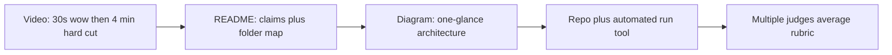

# Christina Lin check-in — contest briefing (Daftar / Taskmaster)

> **Owner briefing, not a submission file.** Judges should not start here — use [`docs/README.md`](../README.md).  
> **Source:** All Things Agentic: The Pre-Submission 'Check-In' with Christina Lin (transcript not in repo) · 25 Aug 2026 · 47 min  
> **Speakers:** Christina Lin (DevRel Engineering Manager / judge), Willie Turney (Google Cloud PMM), Darlyze Calixte (DevPost)  
> **Akrm Q&A:** 34:38 (live) · 40:04 (read back)  
> **Binding execution:** [`docs/roadmap_v2.md`](../roadmap_v2.md) Stage 6–7 · **Track:** Taskmaster

---

## 1. Executive verdict (read first)

### Stay on Taskmaster

Do **not** pivot to Fortified Enterprise Fleet or Collaborative Partner. Christina classified a governed Cloud Run + ADK + durable-workflow project as **Taskmaster** (Vito Q, 33:22) and noted Taskmaster is **under-submitted** relative to other tracks (33:48). That is a ranking opportunity for Daftar.

### Fast `/run` is not a penalty

Christina’s direct answer to Akrm (40:35–41:18):

> *“No, it's not about having the agent runs for days and does not shut down. It's about how clever your agents runs a several day off of your tasks.”*

- Idle always-on agents that “do things you shouldn’t do” = **bad** implementation.
- Instant `/run` + a task that is **long-running from the user’s perspective** still counts as Taskmaster.
- Earlier framing (06:20) about “hours, weeks, or months” means the **task domain** can span time — not that Cloud Run must stay hot.

### What Daftar should claim

| Frame | How |
| --- | --- |
| **Long-running task** | The **merchant’s business day**: mid-day voice capture → evening close → Drive backup → FIFO aging → ranked SMTP outreach. |
| **Persistence** | Drift is source of truth; `ClosingAgentPhase` survives Cloud Run scale-to-zero; Drive backup is recovery. |
| **Clever, not theatrical** | Event-driven Cloud Run on `/run`; device owns ritual after one plan confirm; HITL on money and email. |

### What moves score this week

**Packaging** (video 30s wow, README claims + folder map, simple accurate diagram) — Stage 6 — **not** a new agent graph, SequentialAgent, or always-on Cloud Run.

---

## 2. Locked judge quotes (with timestamps)

Use this language in README, video narration, diagram captions, and Devpost.

| Time | Speaker | Quote / requirement | Daftar action |
| --- | --- | --- | --- |
| 06:04–06:20 | Christina | Taskmaster = agent that **solves tasks**, not a simple Q&A chatbot. Tasks can span hours/weeks/months **depending on the task**. | Claim **close-the-day workflow**, not “chat with ledger.” |
| 06:20 | Christina | Taskmaster helps humans do things they **don’t want to do** anymore. | Paper ledger → autonomous close + collections. |
| 08:31–08:50 | Christina | **README** must state claims and **where things are** — judges dig code when video is thin. | **Done** — folder map + start-here paths (26 Aug). |
| 08:50 | Christina | **Architecture diagram**: agents, deploy, coordination, **why this stack**. AI-generated OK if **accurate**. | Keep [`contest_architecture.md`](../architecture/contest_architecture.md); **Judge glance** added 26 Aug. |
| 08:50 | Christina | **Video is first touch**; **wow in ~30 seconds** so judges read the rest. | Problem still in first 30s; do not open on settings. |
| 10:18–10:51 | Christina | **Innovation** + **does it actually operate** — they run tooling against submissions and read code. | Repo must match claims; smoke tests green. |
| 10:51–11:12 | Christina | Architecture must match the problem: long-running claims need **recovery**, **persistence**, **data source rationale**. | Document Drift SoT, phase machine, Drive backup, scale-to-zero. |
| 11:12 | Christina | **Mandatory Google Cloud** (Cloud Run, GCP DB, event-driven, etc.). | Film Cloud Run + Logging on camera. |
| 12:36 | Willie | Winners promoted on **Cloud socials** — video must work **for the masses**. | Clear problem/solution; no insider jargon in first minute. |
| 12:36 | Christina | **No AI voices** in demo video (her preference; other judges may differ). | Human EN narration or EN subtitles over AR UI. |
| 13:33–13:52 | Christina | Long-running in 4 min: **problem → end state → scroll logs**; they verify duration in **code/docs**. | Inbox + `daftar.agent.email` log scroll; README explains day-spanning state. |
| 14:28 | Christina | **Hard cut at 4:00** — nothing after is watched. | Time script; no epilogue after 3:55. |
| 16:34 | Christina | **External action** = bonus marks (Collaborative Partner context; still relevant for wow). | Gmail SMTP + inbox PDF is external delivery — show it. |
| 19:20 | Christina | Want **planning** **and** **well-executed workflow** — agents are good at planning. | `propose_closing_plan` + device ritual is the story. |
| 23:55–24:31 | Christina | Film **one workflow that wows**; document other use cases in **README**. Happy path alone scores poorly. | Film close + SMTP; README lists capture, Ask Books, statements. |
| 24:58–25:33 | Christina | Diagram = **one glance**, components + connections — **not an essay**. | Short captions; no paragraph blocks on the figure. |
| 25:49–26:47 | Christina | Watch **4 min** video → repo → **automated feasibility tool** → rubric; **multiple judges** average scores. | README + diagram must survive shallow first pass. |
| 27:48 | Christina | Video: **problem statement** + **how you solve it** + optional detail. | Match [`contest_demo.md`](../contest_demo.md) structure. |
| 33:22 | Christina | Governed Cloud Run + ADK + durable workflow → **Taskmaster** (not Fortified). | Validates our track choice. |
| 33:48 | Christina | Surprised how few **Taskmaster** submissions vs other tracks. | Double down on Taskmaster packaging. |
| 34:38–34:56 | Christina | Akrm live Q: focus on workflow that **wows** — if end-to-end close is the go-to, **focus on that**. | Aligns with v2.8 filmed climax. |
| 40:35–41:18 | Christina | **Fast execution OK** — clever instant response + task long-running **from user perspective** = Taskmaster. | Narration line for video/README. |
| 41:29 | Christina | README: short description, **folder structure**, implementation **insights**, **proud items** not in video. | **Done** — Stage 6.1 README pass (26 Aug). |
| 43:52 | Christina | Pre-existing artifacts **OK with disclosure**. | Keep [`CONTEST_DISCLOSURE.md`](../CONTEST_DISCLOSURE.md) accurate. |
| 44:20 | Christina | “Sends” = deliver to **your user’s surface** (web app OK) — email/Slack not required for all projects. | SMTP is extra proof for us — lean into it. |
| 45:54 | Christina | **Submit first**, polish later — judged on what you have. | Devpost before last-hour panic. |
| 46:12 | Willie | **Have fun**; get across the finish line. | — |

---

## 3. How judges consume a submission

### Claim path judges must see in &lt;2 minutes

1. **Taskmaster** — multi-step merchant day, not chatbot.
2. **HITL Model C** — Gemini `propose_*` only → merchant Confirm → Drift commit.
3. **Eight frozen FunctionTools** on one `root_agent` — [`agent/tests/test_tool_catalog_freeze.py`](../../agent/tests/test_tool_catalog_freeze.py).
4. **Cloud Run** `daftar-closing-agent` + Vertex **Gemini 3.5 Flash**.
5. **Outreach** — `POST /v1/email/send-batch` after **Confirm & Send Statements** (not an ADK tool).
6. **Proof of Action** — SMTP **250** + **Message-ID** in Logging **and** inbox (PDF on ranked Top 5; text-only remainder intentional).
7. **§5.6 HUD** — architecture instrument in frame (model, scope, HITL rail, correlation, sent chip).

---

## 4. Status as of 30 Aug 2026

Stage 6 packaging is closed (video locked, APK hosted, disclosure dated **2026-08-30**). Stage 7 is closed: Devpost **Track = Taskmaster**, submitted, freeze, SHA `71f05be0692ba1f415d9be8823f34e866ec373ba` (`contest-submit-2026-08-30`).

Quotes below stay binding for README / video / Devpost copy.

| Judge ask | Current state | Gap / action |
| --- | --- | --- |
| Wow 30s + ≤4 min live | [`contest_demo.md`](../contest_demo.md) **32s illustrated night** then live close; **video locked** (30 Aug) | Christina prefers human VO (12:36). Official Devpost allows AI VO. Cut uses TTS + burned-in EN subtitles. |
| README: claims, folder map, insights, unfilmed pride | [`README.md`](../../README.md) has Christina’s four blocks + SMTP Proof of Action | **Done** (docs pass 26 Aug). |
| Simple accurate diagram | [`architecture/contest_architecture.md`](../architecture/contest_architecture.md) **Judge glance** + mermaid + in-repo PNG | **Done**. |
| Persistence / recovery for “long-running day” | Named in README, Judge glance, demo narration | In the locked cut. |
| GCP proof on camera | HUD + Logs Explorer in the locked cut | **Done**. |
| Disclosure vs v2.8 | [`CONTEST_DISCLOSURE.md`](../CONTEST_DISCLOSURE.md) dated **2026-08-30**; contest-new rows **Landed** | **Done**. |
| Multimodal (voice encouraged) | Composer STT landed | One voice capture in 4 min. |
| Planning + execution | `propose_closing_plan` + device ritual | Plan card + **Confirm & Send Statements** in video. |
| Best Architectural Design / Best Multimodal (side prizes) | Eligible | Optional Devpost tags; voice + HUD + diagram support Multimodal claim. |

---

## 5. Must-do improvements (26–31 Aug 2026)

Packaging only unless a filmed path is broken. **Non-goals:** SequentialAgent, AgentTool, always-on Cloud Run, second agent service, claiming SMTP `delivered`, B-Prime coordinator. **Voice:** Christina prefers human; shooting bible uses English TTS + burned-in EN subtitles (official Devpost allows AI VO).

### 5.1 Video (highest leverage)

Shooting bible: [`contest_demo.md`](../contest_demo.md). Video **locked** 30 Aug (unedited live, public YouTube/Vimeo).

| Segment | Content |
| --- | --- |
| **0:00–0:30** | Paper-ledger pain; merchant closes day from memory. **Wow / problem.** |
| **0:30–1:35** | One mid-day capture (Mohamed / voice) — proves multimodal + HITL; keep short. |
| **1:35–2:50** | Close-the-day: plan confirm → Drift summary → Drive → aging → Desk send set. |
| **2:50–3:25** | **Confirm & Send Statements** → desk dispatch → **inbox PDF** + **text-only remainder**. |
| **3:25–3:55** | **HUD in frame** → GCP Console `daftar.agent.email` (**250** + **Message-ID**). |
| **3:55–4:00** | Report card hold — **hard stop**. |

**Narration lines to include:**

- *“The shop’s day is the long-running task — Cloud Run plans on demand; the ledger on the phone is the source of truth.”*
- *“SMTP 250 is server accept, not mailbox delivered — the inbox is Proof of Action.”*

**Christina checklist:** problem → end state → log scroll · human voice · social-shareable · no fake `delivered` webhook.

### 5.2 README (Christina’s four sections)

**Addressed 26 Aug 2026** in [`README.md`](../../README.md): short description (Taskmaster day + fast `/run`), folder map, insights, unfilmed pride, SMTP Proof of Action.

### 5.3 Diagram (one glance)

**Addressed 26 Aug 2026** in [`contest_architecture.md`](../architecture/contest_architecture.md): Judge glance + four captions (Drift, confirm gate, SMTP outside ADK, recovery if Cloud Run cold).

### 5.4 Disclosure

**Addressed** in [`CONTEST_DISCLOSURE.md`](../CONTEST_DISCLOSURE.md) (as-of **2026-08-30**): contest-new rows landed (agent, bridge, close ritual, SMTP, HUD, FAB custom overlay); substrate unchanged; Hybrid E is contest-period leftover; linked from README.

### 5.5 Devpost

- **Track:** Taskmaster · **Category:** Individual (or team if applicable).
- **Built with:** Google ADK, Cloud Run, Gemini 3.5, Flutter.
- **Optional side categories:** Best Architectural Design, Best Multimodal (voice + HUD).
- **Submit before** last-hour polish (Christina 45:54).
- **Hard deadline:** 31 Aug 2026 **17:00 PDT** (= 1 Sep 03:00 AST).
- Private repo: share with `testing@devpost.com` + `cloudhackathons@google.com`.

---

## 6. Do-not-do list (from the room)

| Do not | Why |
| --- | --- |
| Keep agent “running for days” as theater | Christina: bad implementation (40:35). |
| Use AI voiceover | Christina preference (12:36). |
| Essay architecture diagram | “Basically an essay” loses judges (25:16). |
| Demo five workflows in 4 min | One wow path in video; rest in README (23:55). |
| Hide GCP | Mandatory Cloud proof; live UI + dashboard counts (11:12, 39:56). |
| Skip README folder map | They dig code and run automated checks (08:31, 26:04). |
| Film only happy path | Low points (23:55) — show confirm gates + real SMTP + inbox. |
| Claim `delivered` / fake webhooks | Gmail has no delivery webhook; v2.8 law. |
| Pivot to Fortified for “multi-agent” story | Wrong track; B-Prime deferred per [`contest_architecture.md`](../architecture/contest_architecture.md). |
| Put content after 4:00 in video | Judges will not watch it (14:28). |

---

## 7. Akrm Q&A — canonical answer for judges

**Question (34:38):** Each `/run` finishes in seconds, but the workflow is capture → close → backup → FIFO aging → ranked email with HITL. For Taskmaster, is **workflow depth** what counts, not wall-clock agent uptime? Will fast execution hurt scoring?

**Christina (34:40):** Focus on the workflow that **wows** — if complete end-to-end close is your go-to, **focus on that**.

**Christina (40:35–41:18):** **No penalty for fast execution.** Not about agent running days without shutdown. About how **cleverly** the agent handles a task that spans the user’s timeframe. Instant response + task still **long-running from the user’s perspective** = Taskmaster.

**Daftar one-liner for Devpost / video:**

> Daftar Closing Agent completes a merchant’s **entire business day** in one HITL workflow — voice capture, close-the-day planning on Cloud Run, local ledger commit, Drive backup, FIFO collections, and ranked Gmail outreach — with Cloud Run event-driven on purpose and Drift as the durable source of truth.

---

## 8. Stage 6 checklist cross-reference

Map this briefing to [`roadmap_v2.md`](../roadmap_v2.md) §Stage 6 (closed 30 Aug):

- [x] Architecture diagram judge-glance + full mermaid
- [x] README four sections (§5.2)
- [x] `contest_demo.md` aligned with Christina video order
- [x] Record unedited ≤4 min video (EN subtitles; video locked 30 Aug)
- [x] HUD + inbox PDF + text-only remainder + GCP logs in cut
- [x] Update `CONTEST_DISCLOSURE.md`
- [x] Devpost **draft** (owner still submits — Stage 7)
- [x] Optional: `#AllThingsAgenticHackathon` social (+0.2 bonus) — [DEV](https://dev.to/akrmcodes/daftar-closing-agent-gemini-plans-the-shops-day-the-phone-commits-the-books-5bgl) · [X](https://x.com/AkrmCodes/status/2092993899778457916)

---

## 9. Related docs

| Doc | Role |
| --- | --- |
| Transcript (not in repo) | Primary source — 25 Aug 2026 check-in |
| [`contest_demo.md`](../contest_demo.md) | Film script |
| [`architecture/contest_architecture.md`](../architecture/contest_architecture.md) | Diagram + HITL + tool freeze |
| [`CONTEST_DISCLOSURE.md`](../CONTEST_DISCLOSURE.md) | Eligibility |
| [`roadmap_v2.md`](../roadmap_v2.md) | Stage 6–7 execution |
| [`GATE0_OWNER_CHECKLIST.md`](GATE0_OWNER_CHECKLIST.md) | GCP / Devpost ops (complete) |

---

*Owner briefing from the 25 Aug 2026 pre-submission check-in. Not a judging artifact. Status as of 30 Aug 2026: Stage 6 closed; Stage 7 submit still owner.*
