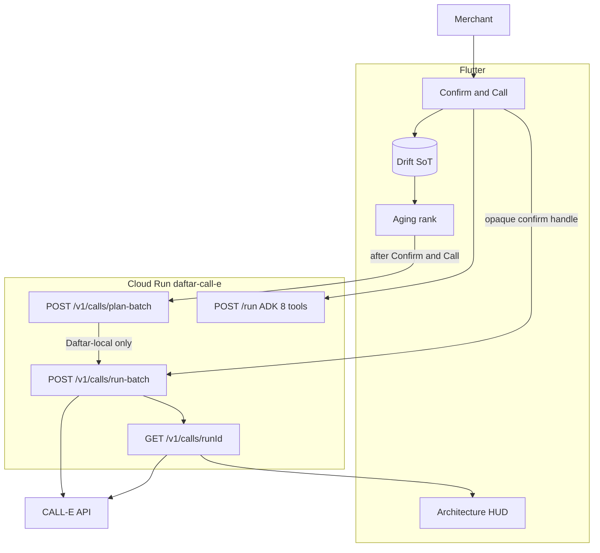

# Daftar Closing Agent — Architecture Plan

> **Version:** 3.2 · **Date:** 2026-09-01 · **Submit:** 14 Sep 2026 23:45 SGT (owner buffer ≤ 18:00 AST)
>
> **Orientation only** — not a judging artifact and not a second checklist.
> **Hackathon:** [CALL-E: Your Code Is Calling](https://call-e.devpost.com/) · prize aim **Most Practical**.
> **Execution:** [`docs/roadmap_v3.md`](../roadmap_v3.md) **v3.2 only**. [`docs/roadmap_v2.md`](../roadmap_v2.md) v2.8 is **frozen All Things Agentic heritage** — do not execute its gates.
> **Supersedes:** this file’s v3.0 Agentic orientation (26 Aug 2026) and the May 2026 product plan (v2.0) for **active** work.
> Judges still start at [`README.md`](../../README.md) and [`docs/README.md`](../README.md). Those files still describe Agentic until Stage 6.

---

## 1. Executive summary

**Daftar Closing Agent** (وكيل إغلاق الدفتر) — **Confirm & Call** sits on Daftar’s offline-first Arabic ledger. The merchant captures the day by voice, then closes:

1. Drift `localDay` financial summary (source of truth)
2. Google Drive backup
3. Account aging / collections desk (device ranks; Gemini does not pick who is called)
4. **Confirm & Call** (HITL) → Daftar-local `plan-batch` then `run-batch` → Cloud Run **`POST /v1/calls`** (`calle-ai==0.7.0` `calls.create`) on **new** service **`daftar-call-e`**
5. **Confirm & Send Statements** (HITL) → Gmail SMTP send-batch (J.7) for the email set

**Gemini never dials and never cashiers.** Money still commits **on confirm** (Model C). A CALL-E structured **promise** is not a ledger transaction. Dual rail: CALL-E for region-eligible, allowlisted overdue contacts; Gmail SMTP for Yemen / missing phone / unsupported region / Confirm without calling.

Do **not** redeploy frozen All Things Agentic Cloud Run `https://daftar-closing-agent-1487285471.us-central1.run.app`. Snapshot: [`AGENTIC_CLOUD_RUN_FREEZE.md`](AGENTIC_CLOUD_RUN_FREEZE.md).

Eligibility: [`CONTEST_DISCLOSURE.md`](../CONTEST_DISCLOSURE.md) (Stage 0.0 — three-way split).

---

## 2. Strategic principles

1. **Offline-first ledger SoT** — Money and balances live in Drift. The agent proposes; the device commits.
2. **Cloud Run planner** — Google ADK + Gemini **3.5+** on Cloud Run emit `propose_*` / `parse_goal` only. **Eight FunctionTools stay frozen.** CALL-E is **not** an ADK tool.
3. **Confirm gate (Model C)** — Money commits **on confirm**. Closing totals come from Drift `localDay`, not journal-only AI text. Device **Confirm & Call** is HITL. There is **no** API `confirm_token`.
4. **Dual-rail outreach** — CALL-E after Confirm & Call (call set ≤5). Gmail SMTP after Confirm & Send Statements (send set ≤20, PDF Top 5). YE → email / `callUnavailable`. Hybrid E `wa.me` is a **contest-period leftover**, not the filmed climax.
5. **Sibling CALL-E routes** — Mirror [`agent/email_send/`](../../agent/email_send/). `plan-batch` is **Daftar-local** (allowlist / J.10 / DNC / kill switch / C.3 echo — **zero PSTN**, **zero** CALL-E). `run-batch` dials via Developer API `calls.create`. Production is **not** MCP `plan_call` / `run_call`.
6. **Poll-first** — Device polls `GET /v1/calls/{runId}` (`runId` := CALL-E `call.id`). No public webhook. Do **not** `create_and_wait` on Cloud Run (Gate 0 laptop smoke only).
7. **Arabic-first RTL** — Khazna / Lapis Law for all agent UI ([`design_system.md`](../design_system.md)).
8. **Integer money** — `amountMinor: int` only. Coerce `promised_amount_minor` to int or `needsHuman`. Never `double` / `num`.

---

## 3. Tech stack

| Layer | Technology |
| --- | --- |
| Client | Flutter · Drift · Riverpod (`@riverpod`) · go_router · fpdart · Freezed |
| Secure / backup | flutter_secure_storage · Google Sign-In · Drive `appDataFolder` |
| Agent | Google **ADK** · **`gemini-3.5-flash`** · Cloud Run **`daftar-call-e`** (authenticated + ID token, min **0** / max **2**) |
| CALL-E | Python **`calle-ai==0.7.0`** (`from calle import CalleClient`) · Secret Manager **`calle-api-key`** · `https://api.heycall-e.com` |
| SMTP (heritage) | Sibling `POST /v1/email/send-batch` · Secret Manager `gmail-smtp-app-password` |
| Contest hygiene | Stage 8 multi-device sync **quarantined** (`kContestDisableMultiDeviceSync`) |

Banned: Twilio / Bland / Skype / Google Voice as the dialer; `create_and_wait` on the Cloud Run request; `--allow-unauthenticated` / `allUsers`; `CALLE_API_KEY` or the Gmail App Password in Flutter / git / chat. Product Stage 18 Gemini **3.1** single-parse remains archived.

---

## 4. Architecture topology

**Diagram (judges, Stage 6):** [`architecture/contest_architecture.md`](../architecture/contest_architecture.md) + PNG are **Agentic heritage** (SMTP climax, service `daftar-closing-agent`) until Stage 6 redraws them for Confirm & Call / `daftar-call-e`.

Wire contract: [`roadmap_v3.md`](../roadmap_v3.md) **Appendix J**. J.1–J.7 inherited from v2.8 onto **`daftar-call-e`**. **J.9** = plan / run / get. **J.10** = CALL-E regions (YE unsupported). Machine-readable: [`agent/openapi.yaml`](../../agent/openapi.yaml) (extend in Stage 1).

```
Flutter (RTL, Khazna, HUD)
        │  Google ID token
        ▼
Cloud Run daftar-call-e   (NEW — do not mutate the frozen Agentic URL)
        ├─ POST /run                     ADK · 8 frozen tools · Gemini 3.5
        ├─ POST /v1/email/send-batch     Gmail SMTP (J.7)
        ├─ POST /v1/calls/plan-batch     Daftar-local gate (no CALL-E, no dial)
        ├─ POST /v1/calls/run-batch      CALL-E calls.create / POST /v1/calls (dials)
        ├─ GET  /v1/calls/{runId}        CALL-E calls.get (poll)
        ├─ POST /v1/tts                  Chirp (heritage)
        └─ Secret Manager                gmail-smtp-app-password · calle-api-key
        │
        ▼
Device Confirm Gate → Drift (SoT) · collection_call_* · collection_promises
```



Two CALL-E surfaces — do not conflate: **Developer API / `calle-ai`** is production; **MCP / CLI** (`plan_call` / `run_call`) is owner-ops only. Chat ringing does not prove API KYC.

Drive backup ≠ multi-device sync — see [`architecture/GOOGLE_DRIVE_BACKUP_SPEC.md`](../architecture/GOOGLE_DRIVE_BACKUP_SPEC.md) and [`architecture/BACKUP_SPEC.md`](../architecture/BACKUP_SPEC.md).

---

## 5. Substrate vs contest-new

Honest three-way split (see [`CONTEST_DISCLOSURE.md`](../CONTEST_DISCLOSURE.md)):

| Bucket | Examples |
| --- | --- |
| Substrate (pre-Aug 2026) | Ledger schema, use cases, Drive Auth V2, Khazna shell, tiers, quarantined Stage 8 code |
| All Things Agentic (Aug 2026) | ADK/Cloud Run planner, device bridge, confirm gate, Day Journal, close ritual, Gmail SMTP send-batch, Architecture HUD — **prior work**, not claimed as CALL-E-new |
| CALL-E-new (this fork) | Confirm & Call, `agent/calls/` sibling, schema 26, dual-rail aging, HUD call chip, `ledger-collections-call` skill PR, Cloud Run **`daftar-call-e`** |

---

## 6. Non-goals (this submission)

Product Phase 2 Stages 8–19 (multi-device sync as product, Delight, viral, RevenueCat, enterprise) stay **deferred**. Stub: [`docs/product/roadmap.md`](../product/roadmap.md). Archive: [`docs/archive/`](../archive/).

Also **out of scope** (roadmap v3.2): inbound merchant hotline; Gemini Multimodal Live as the call plane; WhatsApp / WABA climax; mutating the frozen Agentic Cloud Run service/URL; public CALL-E webhook / `allUsers` on `/run`; dialing **YE / +967**; treating `task_completed` or SMTP `250` as **paid**; LLM chooses who is called; creating a txn from a structured promise; App Password or `CALLE_API_KEY` in Flutter / git / chat; Twilio / Bland as dialer; auto-dial on credit-limit save.

---

## 7. Execution

**Sole checklist owner:** [`docs/roadmap_v3.md`](../roadmap_v3.md) v3.2 Stages 0–7 (feature freeze 11 Sep; video lock 13 Sep; submit 14 Sep).

CALL-E Gate 0 lives **in that file** (account, KYC, US DID, `create_and_wait` laptop smoke). [`GATE0_OWNER_CHECKLIST.md`](GATE0_OWNER_CHECKLIST.md) is **complete Agentic heritage**.

[`README.md`](README.md) in this folder still points at v2.8 until Stage 0/6 — **this file’s execution pointer is v3.2**. Root README / architecture PNG / `contest_demo.md` remain Agentic until Stage 6.

Minimum filmable product, winning map, C.3 task, and J.9 schemas: **roadmap only**.

---

## Appendix — superseded plans

The May 2026 product plan (v2.0: “AI FROZEN / Phase 2 sync next”) is **not** the active architecture. [`roadmap_v2.md`](../roadmap_v2.md) v2.8 is **frozen heritage**, not the live checklist. Institutional Phase 2 detail remains under `docs/archive/` and the deferred [`roadmap.md`](../product/roadmap.md) stub.
