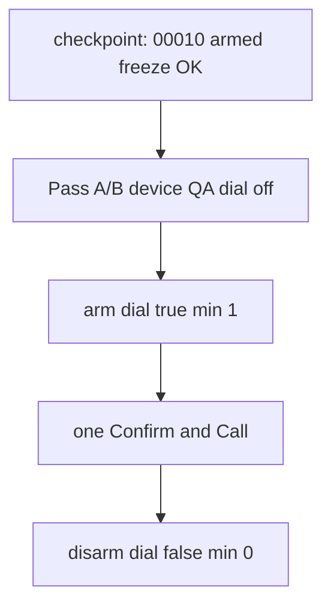

# Pre–Stage 5.5 owner rehearsal

Owner-ops runbook: **dry-run device QA**, then **one** consented US DID ring, then **immediate shut down**. This is **not** Stage 5.5 implementation and **not** film day.

**Do not** tick [`docs/roadmap_v3.md`](../roadmap_v3.md) §5.5 / Gate 5. **Do not** film. Goal: prove Confirm & Call + promise card + HUD on the dedicated demo device, then leave the stack **cold**.

Related SOPs (do not substitute this file for them):

- Dial-off phone QA: [`stage4_phone_qa.md`](stage4_phone_qa.md)
- Stage 6 film window: [`calle_live_dial_window.md`](calle_live_dial_window.md)
- Overlay keys (no live DID in git): [`tool/demo_seed_emails.md`](../../tool/demo_seed_emails.md)



**Credits:** one `run-batch` `calls.create` burns **one** CALL-E credit. Polls are GET (free). Cloud Run **min 1** costs GCP only while armed. Shutdown restores **min 0** / `CALLE_ALLOW_DIAL=false`.

---

## Never

- `gcloud run deploy daftar-closing-agent`
- `gcloud run services update daftar-closing-agent`
- `gcloud run services replace` / `replace-traffic` / `delete` on that service
- IAM binds on `daftar-closing-agent`
- `adk deploy cloud_run` (any `--service_name`)
- `--allow-unauthenticated` or `allUsers`
- `flutter run` against `daftar-closing-agent-1487285471`
- `CALLE_ALLOW_DIAL=true` left overnight
- Second Confirm & Call or §5.1 retry while armed
- Printing full E.164, `CALLE_ALLOWLIST`, or `CALLE_API_KEY`

Legal mutate target is service **`daftar-call-e` only**, via [`agent/scripts/deploy_daftar_call_e.sh`](../../agent/scripts/deploy_daftar_call_e.sh).

---

## Checkpoint (2026-09-09)

Pass A/B on device are **green** (kill-switch copy + SMTP). Live window is **armed for this session** on revision **`daftar-call-e-00010-qrp`**. Do **not** leave dial true overnight. Owner will ask to disarm. Frozen Agentic service is describe-only. Do not tick §5.5.

| Step | Status | Evidence |
| --- | --- | --- |
| Identity + freeze | **Done** | Account `akrm.codes@gmail.com`; project `daftar-closing-agent`; `tool/check_agentic_freeze.sh` → Freeze OK; frozen rev **`daftar-closing-agent-00055-pbm`** |
| Overlay lockstep | **Done** | Last-4 **`7244`** + length agree across `$HOME/.daftar-owner-ops/test-did`, `calle-allowlist`, and gitignored overlay keys `DAFTAR_SEED_US_DID` / `CALLE_ALLOWLIST`. Region **`US`**. Overlay `CALLE_ALLOW_DIAL` is exact **`true`** (gitignored; not committed) |
| Deploy dial off, min 0 | **Done** | Prior cold revision **`daftar-call-e-00009-659`**. Pass A/B used this |
| Warm `/list-apps` | **Done** | ID-token curl of owner-ops `daftar-call-e-url` → `["closing_agent"]`. Never the frozen hostname |
| Laptop no-PSTN smoke | **Done** | `python3 agent/scripts/smoke_calls_plan_run.py` → `overall_pass=True` (unauth 403, dry-run plan, YE unsupported region, kill-switch plan + run 403) |
| Pass A/B on device | **Done** | Kill-switch HUD: “Calls are paused… Email still works…”. SMTP statements succeeded. Overlay was empty for that pass |
| Arm live (dial true, min 1) | **Done** | Wrapper: `DAFTAR_CALL_E_DEPLOY=true`, `DAFTAR_CALL_E_ALLOW_DIAL=true`, `DAFTAR_CALL_E_MIN_INSTANCES=1`. Revision **`daftar-call-e-00010-qrp`**. Post-verify: `calle_allow_dial=true`, scale **1/2**, `freeze=ok`, SA `call-e-runner` |
| Confirm & Call | **Remaining** | Owner taps after full rebuild + Linphone ready. Each tap on a new close-day burns one credit |
| Shutdown | **Remaining** | Do not disarm until the owner asks. Then dial false, min 0, overlay empty |

**Session state (current):** Cloud Run dial **true**, min **1**. Device overlay exact `true`. Frozen Agentic service untouched. **Not** the overnight default.

---

## 0. Identity lock (before any mutate)

From repo root. Account **must** be `akrm.codes@gmail.com`, project **`daftar-closing-agent`**, region **`us-central1`**.

```bash
gcloud config get-value account   # akrm.codes@gmail.com
gcloud config get-value project   # daftar-closing-agent
bash tool/check_agentic_freeze.sh # Freeze OK
```

Describe **both** services (read-only). Frozen `latestReadyRevisionName` must stay **`daftar-closing-agent-00055-pbm`** ([`docs/contest/AGENTIC_CLOUD_RUN_FREEZE.md`](../contest/AGENTIC_CLOUD_RUN_FREEZE.md)).

```bash
gcloud run services describe daftar-closing-agent --project=daftar-closing-agent --region=us-central1 --format='value(status.latestReadyRevisionName,spec.template.spec.serviceAccountName)'
gcloud run services describe daftar-call-e --project=daftar-closing-agent --region=us-central1 --format='yaml(status.latestReadyRevisionName,spec.template.metadata.annotations,spec.template.spec.containers[0].env)'
```

Check env `CALLE_ALLOW_DIAL` (expect `false` until the live window). Do **not** print `CALLE_ALLOWLIST`. Confirm `.env` `CLOSING_AGENT_BASE_URL` matches `$HOME/.daftar-owner-ops/daftar-call-e-url` (hostname `daftar-call-e-*`, never `…1487285471…`).

**Device:** package `com.akrmcodes.daftar` on `R5CT10G3LXH`. Dedicated demo profile. Do not overwrite the Agentic judging APK.

**Overlay lockstep** (gitignored files only; compare last-4 + length, never log the rest): `$HOME/.daftar-owner-ops/test-did`, `calle-allowlist`, `tool/demo_seed_emails.local.json` keys `DAFTAR_SEED_US_DID` and `CALLE_ALLOWLIST`. Region file and overlay `CALLE_ALLOWLIST_REGION` = `US`. Pass A: overlay `CALLE_ALLOW_DIAL` **empty**. Live pass: exact `"true"`.

**Linphone:** registered to Callcentric (extension SIP password, UDP). Phone on Wi‑Fi. Ready to answer **before** Confirm & Call.

---

## 1. Deploy recent agent code (already done — skip unless stale)

Flutter 5.2/5.3 (GlowPill, promise card, schema 28) is on-device; it does not need a new Cloud Run image for Pass A. Skip this section while revision is **`daftar-call-e-00009-659`** and `agent/` is unchanged.

If `agent/` **did** change after that revision, redeploy **dial still off**:

```bash
export DAFTAR_CALL_E_DEPLOY=true
# do NOT set DAFTAR_CALL_E_ALLOW_DIAL
# do NOT set DAFTAR_CALL_E_MIN_INSTANCES (defaults to 0)
bash agent/scripts/deploy_daftar_call_e.sh
```

Expect post-verify `calle_allow_dial=false`, scale `0/2`, `freeze=ok`. Re-run `bash tool/check_agentic_freeze.sh`. Frozen revision must still be `00055-pbm`.

Warm once (cold start after min 0, ~30s). Never curl the frozen hostname:

```bash
SERVICE_URL="$(cat "$HOME/.daftar-owner-ops/daftar-call-e-url")"
TOKEN=$(gcloud auth print-identity-token)
curl -sS -H "Authorization: Bearer $TOKEN" "$SERVICE_URL/list-apps"
# expect ["closing_agent"]
```

Optional laptop proof (no PSTN, no `CALLE_ALLOW_DIAL=true` in the process):

```bash
cd agent && python3 scripts/smoke_calls_plan_run.py
```

---

## 2. Pass A / B — device QA, zero CALL-E credits

**Resume here.** Overlay `CALLE_ALLOW_DIAL` must be `""`. Confirm before launch. Dart-defines are compile-time: **stop the app** and rebuild. Hot restart is **not** enough.

```bash
flutter run -d R5CT10G3LXH --debug --dart-define-from-file=tool/demo_seed_emails.local.json
```

**Settings:** Architecture HUD on. GlowPill **Allow CALL-E outbound** may be on in debug (seeder sets `calleAllowDial: kDebugMode`) — that is **intent only**. Effective dial = GlowPill **AND** dart-define exact `true` **AND** Cloud Run `true`. Pass A Cloud Run is `false` → **no ring**.

If Mohamed is still YE after overlay DID is set: Settings **Reset sample store data** (or onboarding demo store).

Follow [`stage4_phone_qa.md`](stage4_phone_qa.md):

- Close the day → Collections Desk: **US** call-eligible (Mohamed) + **YE** `callUnavailable`.
- **Confirm & Call** once: kill-switch / `needsHuman` / failed progress; **Linphone silent**; YE never in call set.
- **Confirm & Send Statements** still available (SMTP burns GCP, not CALL-E). Optional Pass B.
- HUD must not say `delivered` or `paid`.
- Optional Logs Explorer: `resource.labels.service_name="daftar-call-e"` and `jsonPayload.event="daftar.agent.call"` — `action=plan` only, no successful `create`.

**Stop.** Do not arm until Pass A is green.

---

## 3. Arm live window (short; credit-risk)

Confirm-handle store is **process-local**. **min 0 during live** can drop the handle between `plan-batch` and `run-batch` (`invalidHandle` → one extra `create`). This rehearsal uses **min 1**, then returns to **min 0**. Default forever remains min 0.

Do **not** copy the env-only snippet in [`calle_live_dial_window.md`](calle_live_dial_window.md) that sets `CALLE_ALLOW_DIAL=true` with `--min=0`.

1. Linphone registered; speaker ready.
2. Collapse the mental call set to **one** US recipient (do not tap retry).
3. Edit **local** overlay only: `"CALLE_ALLOW_DIAL": "true"` (same DID/allowlist). Do not commit.
4. Stop the running `flutter run`. Rebuild:

```bash
flutter run -d R5CT10G3LXH --debug --dart-define-from-file=tool/demo_seed_emails.local.json
```

Re-seed if Mohamed is still YE. Confirm GlowPill **Allow CALL-E outbound** is on.

5. Deploy **armed** (same wrapper, never frozen service):

```bash
export DAFTAR_CALL_E_DEPLOY=true
export DAFTAR_CALL_E_ALLOW_DIAL=true
export DAFTAR_CALL_E_MIN_INSTANCES=1
bash agent/scripts/deploy_daftar_call_e.sh
```

Expect post-verify `calle_allow_dial=true`, scale `1/2`. Re-check freeze `00055-pbm`. Warm `/list-apps` again.

If the image is already `daftar-call-e-00009-659` (or a later cold revision) and you only need env/scale, an env-only update is allowed **on `daftar-call-e` only** and **must** set **min 1**:

```bash
gcloud run services update daftar-call-e \
  --project=daftar-closing-agent --region=us-central1 \
  --update-env-vars=CALLE_ALLOW_DIAL=true \
  --min=1 --max=2 --min-instances=1 --max-instances=2
```

**Never** those flags on `daftar-closing-agent`.

---

## 4. One live Confirm & Call

1. Close the day → Collections Desk → **Confirm & Call** **once** (`callConsented` blocks a second tap on the same desk).
2. Answer on Linphone. Script: identify as the store’s assistant; promise an **integer** amount and an ISO date (“I’ll pay {integer} on {date}”). No card numbers, no legal threats.
3. Wait for terminal GET (~60s then ~7s). HUD: `Call ·` + `runId` last-8 + `completed` (not delivered/paid).
4. Contact **promise card**: pending integer + date. Optional: mark **Kept** → payment dialog prefilled; **do not Save** (promise ≠ paid).
5. Optional: Logs Explorer `daftar.agent.call` `action=terminal` on **`daftar-call-e`**. Match HUD last-8 to `call.id`.
6. YE row still `callUnavailable`; do **not** Confirm & Call again; do **not** use §5.1 retry.

If Linphone does not ring within ~30s: **disarm first** (§5), then debug. Do not tap Confirm & Call again.

---

## 5. Shut down immediately (mandatory)

Within minutes of terminal GET (or immediately if no ring).

**Cloud Run** (legal service only):

```bash
export DAFTAR_CALL_E_DEPLOY=true
# DAFTAR_CALL_E_ALLOW_DIAL unset → false
export DAFTAR_CALL_E_MIN_INSTANCES=0
bash agent/scripts/deploy_daftar_call_e.sh
```

Or env-only on **`daftar-call-e`**:

```bash
gcloud run services update daftar-call-e \
  --project=daftar-closing-agent --region=us-central1 \
  --update-env-vars=CALLE_ALLOW_DIAL=false \
  --min=0 --max=2 --min-instances=0 --max-instances=2
```

**Never** those flags on `daftar-closing-agent`.

**Device:** set overlay `CALLE_ALLOW_DIAL` back to `""`. Stop app. `flutter run` again **without** `true`. Optional: GlowPill off. Re-seed not required to prove dial-off.

**Verify:**

```bash
gcloud run services describe daftar-call-e --project=daftar-closing-agent --region=us-central1 --format='yaml(spec.template.metadata.annotations,spec.template.spec.containers[0].env)'
bash tool/check_agentic_freeze.sh
```

Expect `CALLE_ALLOW_DIAL=false`, min **0**, max **2**, freeze OK. Fresh desk **Confirm & Call** → kill-switch refusal, Linphone silent.

GCP: min 0 → scale to zero. CALL-E: no further `create`.

---

## 6. Film day (later; not this rehearsal)

Same as §3–5, one session, after Stage 5.5 freeze if that gate is still wanted first. Beat sheet: [`docs/roadmap_v3.md`](../roadmap_v3.md) §6.3. Canonical film SOP: [`calle_live_dial_window.md`](calle_live_dial_window.md) — for film, still use **min 1** while armed (same process-local handle rule). Do not leave the window armed overnight.

---

## Out of this rehearsal

- Implementing §5.5 (`flutter analyze` / freeze checkboxes)
- Laptop `create_and_wait` (already Gate 0; extra credit burn)
- Push `skill-pack`, Devpost, Agentic APK
- Logging allowlist numbers or keys
