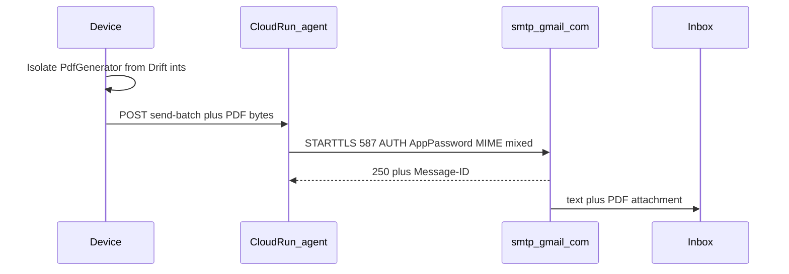
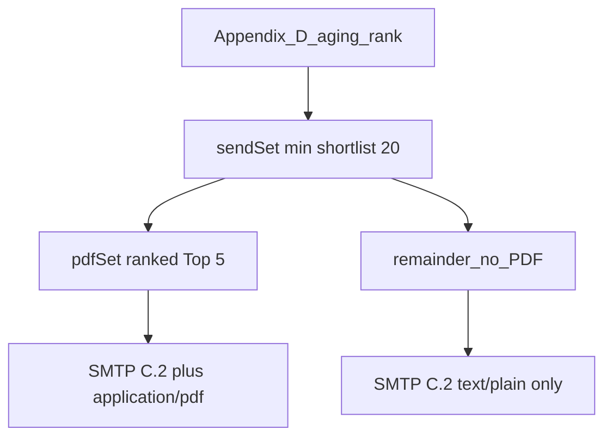
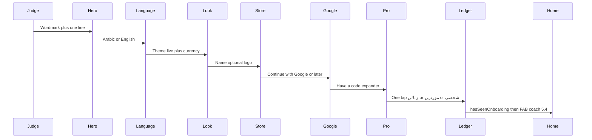

# Daftar Closing Agent — Contest Execution Roadmap (v2)

> **FROZEN (All Things Agentic).** This file is heritage only. Do **not** execute its Stages 0–7 or Gate 7 submit checklist in this repository.
>
> **Binding contract for CALL-E:** [`docs/roadmap_v3.md`](roadmap_v3.md).
>
> v2.8 remains the All Things Agentic close-the-day / Gmail SMTP contract (submitted). CALL-E work must not mutate the frozen Agentic Cloud Run URL.

> **Version:** 2.8 · **Date:** 2026-08-26 · **Submission Period:** 3–31 Aug 2026
>
> **Derived from:** Locked Closing Agent feature catalog (brainstorm Aug 2026) · [All Things Agentic Hackathon](https://allthingsagentichackathon.devpost.com/) rules · disclosed offline-first ledger substrate already in this repository · product Phase 2 material archived under `docs/archive/`
>
> **v2.8 headline:** This project ships **Daftar Closing Agent** for the All Things Agentic hackathon — a Taskmaster agent that captures the merchant’s day by voice and runs a full **close-the-day** workflow (**Drift `localDay` summary** → Drive backup → account aging → **Confirm & Send Statements** → **Gmail SMTP to the send set**). Stack mandate: **Gemini 3.5+**, **Google ADK**, **Cloud Run**. Money commits **on confirm** (Model C). Outreach is **Gmail SMTP**: **send set** = aged overdue ∩ valid email, **`min(shortlist, 20)`**; **MIME statement PDF only on ranked Top 5**; remainder **text-only C.2**. **Hybrid E** (`wa.me` + human Send) is **landed leftover**, not the filmed climax and not the send fallback. Delivery proof is SMTP **`250` + unique `Message-ID`** in Cloud Logging **and** the recipient **inbox** on camera (**PDF where attached**). Gmail SMTP has **no** delivery/read webhooks — do **not** fake them. Demo **Architecture HUD** (debug/demo toggle) shows model / tool / latency on device. First-run is a **Khazna setup spine**. FAB explanation is a **custom overlay spotlight** after onboarding. Product Stage 8 multi-device sync is **professionally disabled / quarantined**. Appendix I stretch is **retired**. **One** Cloud Run service (agent). Meta WhatsApp Cloud API / WABA / Graph templates / HMAC webhooks are **out of this submission**.
>
> **v2.8 changelog:** Send set vs statement set. Cap 5 on **who is emailed** was a Meta To-list leftover; live contract is **email ≤20 / PDF ranked Top 5** (device aging, not Gemini). Remainder of the send set gets **C.2 text only** — missing PDF is **not** `failed`. Remaining Stage 4 is **§4.13 + §4.10–4.11 + Gate 4**. HUD **§5.6 landed** in Stage 5. §4.6–4.9 landed under **v2.7** semantics (cap 5, PDF required); do not pretend they already implement the split.
>
> **v2.7 changelog (retained):** Lead-rail swap — **Gmail SMTP + App Password** replaces WhatsApp Cloud API. **§4.12 / Appendix J.8 retired** (no second Cloud Run, no Meta HMAC). Appendix **C.2** is device-owned **email subject + body** (no Meta UTILITY templates, no approval wait). Contacts gain nullable **`email`**. Schema **23** stores `smtpMessageId` / `smtpCode` (not `wamid`). HUD chip = SMTP **`Message-ID` last-8**. Gate 4 floor = SMTP smoke + **inbox PDF**. **Superseded for send/PDF split by v2.8**; SMTP rail itself remains. Remaining Stage 4 under v2.7 was **§4.6–4.11 + Gate 4** (not webhooks) — **§4.6–4.9 are now landed**.
>
> **v2.6 changelog (retained):** Promoted three former stretch items into the then-binding contract: **§4.12** delivery/read webhooks (second Cloud Run, HMAC); **PDF as UTILITY DOCUMENT header** (`daftar_balance_statement`, device-generated, Graph `media_id`); **§5.6 Architecture HUD**. Retired Appendix I. Live WABA, Hey Daftar, replay coaches, Phase 2 Delight / MCC / 5s traps are **non-goals**. Calendar history unchanged. **Superseded for outreach by v2.7** (SMTP + MIME PDF; §4.12 / Graph DOCUMENT header removed from the live contract). HUD still Stage 5.
>
> **v2.5 changelog (retained):** Contest onboarding **§5.5** replaces the 4-page walkthrough with a Linear/Revolut-style setup (one decision per beat; Google **recommended / skippable**; Pro code collapsed; store name ungated from `brandedPdf`; no new packages). Does **not** delay Gate 4.
>
> **v2.4 changelog (retained):** In-app explanations locked as Khazna FAB spotlight (**§5.4**). Original engine lock was `tutorial_coach_mark` — **superseded 26 Aug 2026**: package removed; FAB hole is a custom `OverlayEntry` in [`daftar_coach_mark.dart`](../lib/presentation/shared/widgets/daftar_coach_mark.dart). Catalog cap **3** (FAB Must; first Confirm Should; Confirm & Send Should). Replaces §2.5 sheet UX. Does **not** delay Stage 4 Cloud API.
>
> **v2.3 changelog (retained):** WhatsApp Cloud API promoted from Appendix I into **Stage 4 lead rail** — Meta test WABA (developer `qubati.akrm@gmail.com`); system-user token in Secret Manager (never Flutter); deterministic Cloud Run `POST /v1/whatsapp/send-batch` (not an ADK send tool); cap Top 5; device preview = approved UTILITY template `daftar_balance_reminder`; Hybrid E retained as Graph 4xx fallback; no in-app To-list OTP; unofficial WhatsApp banned. §4.1–4.5 remain landed substrate; §4.6–4.11 + Gate 4 film are the Stage 4 exit.
>
> **v2.2 changelog (retained):** Accuracy pass — headline aligned with Model C Drift totals; Vertex `global`/`us` model routing; ADK-native smoke endpoints; Cloud Run auth locked; Appendix J frozen device↔agent contract; calendar as-of slip note; FAB tip Must; Hybrid E queue persistence.
>
> **v2.1 changelog (retained):** Stage 8 complete removal → kill-switch quarantine; eligibility disclosure moved to Stage 0; MCP + Drift closing-summary truth; Stage 1 OpenAPI/auth/`adk deploy cloud_run`; stretch demoted to Appendix I; demo/GCP gates hardened.
>
> **Binding contract:** `docs/roadmap_v2.md` is the **sole implementation contract** for this submission. Product Phase 2 (`docs/product/roadmap.md` stub + `docs/archive/`) is **deferred** and must not drive contest work.

---

## Contest Identity

| Item | Value |
| --- | --- |
| **Hackathon** | All Things Agentic (Google / Devpost) |
| **Track** | **Taskmaster** (Collaborative-style clarifies/confirms are flavor — **do not** submit Collaborative unless the partner-adaptation arc becomes the centerpiece) |
| **Submission Period** | **3–31 Aug 2026** (Devpost project start: **3 Aug 2026**) |
| **Deadline** | **31 Aug 2026 @ 5:00pm PDT** (hard) · submit by **31 Aug ≤ 18:00 AST** (safe buffer) |
| **Product name** | Daftar Closing Agent / وكيل إغلاق الدفتر |
| **Mandatory stack** | Gemini **3.5+** (API or Vertex) · **≥1** of ADK / GenAI SDK / GenKit · **≥1** GCP infra (**Cloud Run**) |
| **Judging** | 40% utility · 30% architecture · 30% demo + GCP proof |
| **GCP account** | Contest compute + billing on **`akrm.codes@gmail.com`** / project **`daftar-closing-agent`**; keep Drive OAuth clients on **product** GCP — do not mix |
| **Gmail SMTP sender** | Dedicated Google mailbox with **2-Step Verification** + **App Password** (Mail). **Not** the contest GCP login (`akrm.codes@gmail.com`), **not** Meta, **not** product Drive OAuth clients. **Do not write a live From/To address in this roadmap.** Secret Manager: `gmail-smtp-app-password`. Env: `GMAIL_SMTP_USER` / `GMAIL_SMTP_FROM` (same address), host/port pin. IAM `secretAccessor` for `agent-runner@daftar-closing-agent.iam.gserviceaccount.com` only |
| **Package ID** | `com.akrmcodes.daftar` (use a dedicated demo device/profile) |

> **Deadline math:** Hard cutover is **31 Aug 2026 17:00 PDT** = **1 Sep 2026 03:00 AST** (PDT = UTC−7; AST = UTC+3). The **31 Aug ≤ 18:00 AST** target is a ~9h safety buffer before the hard deadline—do not treat it as the official Devpost time.

### Explicit non-goals (this submission)

- Product Phase 2 Stages 8–19 (multi-device sync, onboarding Delight, viral, RevenueCat Shipaton, enterprise handoff) — deferred; see [`docs/product/roadmap.md`](product/roadmap.md) stub
- Merging Closing Agent into a separate post-contest product Phase 2 track during the Submission Period
- Lock-screen / always-on / in-app “Hey Daftar” wake
- **Meta WhatsApp Cloud API / WABA / Graph templates / system-user token / To-list OTP / live WABA / App Review** this submission
- **Resend / Brevo / Amazon SES / Gmail API OAuth / Telegram Bot API / Twilio WhatsApp** this submission
- Claiming SMTP **`250` equals mailbox-delivered or read** (Gmail SMTP has **no** DSN / delivery webhooks)
- IMAP polling, Gmail push notifications, or a **second public Cloud Run** for “email webhooks”
- App Password or mailbox password in Flutter / git / chat
- LLM-authored email bodies on the close path
- **LLM chooses who gets a statement** (device aging ranks; the plan **narrates**, it does not pick IDs)
- Send without **Confirm & send**; send **`>20`**; **PDF on more than ranked Top 5 on the close path**; public PDF URLs / GCS `document.link` for statements
- Silent mass-send without consent (one **Confirm & send** on the plan is the outreach consent)
- Unofficial WhatsApp (Baileys, Evolution, WhatsApp Web automation, or any non-official client)
- Gating contest send behind Pro+ `FeatureFlag.whatsappAutomation` (ignored for this submission)
- Shadow money staging until night (rejected in favor of Model C)
- Firebase App Distribution / Play listing polish (post-contest)
- App-wide `ShowcaseView` wrapping `MaterialApp` / intro-slider carousels as “coach marks”
- Settings “replay tour” / extra coach marks beyond the §5.4 catalog of three
- GPS / SIM MCC / IP geolocation to pick country
- Notification priming, PIN, or CSV import **inside** first-run
- 5-second undismissable teaching traps / Phase 2 Stage 9 Delight System
- `introduction_screen` / `intro_slider` / extra onboarding packages
- Requiring Google Sign-In to **finish** onboarding (recommended + skippable only)
- Firestore / status-poll DB for outreach ticks (HUD uses `/run` + send-batch; SMTP `250` is Logging, inbox film is the visual proof)

---

## Roadmap Overview

| Phase | Stages | Calendar (2026) | Objective |
| --- | --- | --- | --- |
| **Contest Foundation** | Stage 0 | 12–13 Aug | Quarantine landed · GCP owner-ops · disclosure · Gate 0 |
| **Agent Brain** | Stage 1 | 14–16 Aug | ADK + Cloud Run + Gemini 3.5 tool proposals |
| **Device Contract** | Stage 2 | 17–19 Aug | Bridge · Day Journal · confirm · FAB |
| **Day Clerk** | Stage 3 | 20–22 Aug | Mid-day capture completeness · aging · on-demand PDF |
| **Closing Ritual** | Stage 4 | 23–26 Aug | Close-the-day · Gmail SMTP send set · MIME PDF on ranked Top 5 |
| **Speech & Polish** | Stage 5 | 27–28 Aug | STT/TTS · Khazna · FAB spotlight · setup onboarding · **HUD** |
| **Package** | Stage 6 | 29–30 Aug | Diagram · README · video · Devpost draft (**packaging first**) |
| **Submit** | Stage 7 | 31 Aug | Freeze · Devpost submit |

### Active Workstreams

| Workstream | Owner surface | Status |
| --- | --- | --- |
| Closing Agent (Taskmaster) | Stages 0–7 below | **Binding** |
| Product Phase 2 | [`docs/product/roadmap.md`](product/roadmap.md) stub + [`docs/archive/`](archive/) | Deferred after submit |
| Shipaton / RevenueCat | Post-contest | Out of scope |

### Dependency Graph

```
Stage 0 (GCP Preflight + Hygiene + Stage 8 Quarantine)
  └── Stage 1 (ADK Agent Runtime on Cloud Run + Gemini 3.5)
        └── Stage 2 (Device Bridge + Confirm Gate + Day Journal Schema + FAB)
              └── Stage 3 (Mid-day Clerk: debt/payment/create/ask/PDF)
                    └── Stage 4 (Close the Day + Collections + Gmail SMTP + ranked PDF)
                          └── Stage 5 (Speech + Khazna + Coach Marks + Setup Onboarding + HUD)
                                └── Stage 6 (Packaging: diagram / README / video / Devpost)
                                      └── Stage 7 (Final Validation Gate + Devpost Submit)
```

> [!IMPORTANT]
> **Feature freeze:** 28 Aug 2026 EOD — no new tools after Stage 5 gate unless Stage 4 Gate 4 (Gmail SMTP film) is already green. **Do not start Stage 5 until Gate 4.**
> **Video lock:** 30 Aug 2026.
> **Do not start Stage N+1** until Stage N Validation Gate is checked.
> **Stop product Phase 2 / Shipaton work** until after submit — Closing Agent only.

### Minimum Contestable Product (MCP)

Must be **filmable by ~25 Aug**. Everything beyond this is polish:

1. Text (or voice) goal → multi-step plan on Cloud Run (Gemini 3.5 + ADK)
2. Confirm debt → Drift commit + Day Journal row
3. Close the day → **Drift `localDay` summary** → Drive backup → aged **send set** (contacts with **email**, demo ~10, cap **20**) → **Confirm & Send Statements** → Cloud Run **Gmail SMTP** (C.2 text; **MIME PDF on ranked Top 5 only**) to seeded inboxes → report
4. GCP Console / Cloud Run logs proof (`daftar.agent.model`, **`daftar.agent.email`** with SMTP **`250`** + unique **`Message-ID`**) **and** recipient **inbox** on camera (**PDF where attached**)

**Slip protocol:** If Gate 0/1 slips past 14–16 Aug, collapse Stage 2 + thin Stage 3 (one golden debt path) before perfect aging/STT. Text path must be demo-grade by Gate 4; Stage 5 may ship **TTS read-back only** if STT slips — **FAB spotlight (§5.4 #1) still Must**; **HUD (§5.6) still Must**. If Stage 5 calendar dies, onboarding **minimum** is **Hero + Language + Look + Google**; Store / Pro / ledger templates may collapse to defaults. If SMTP owner-ops slip, film authenticated smoke to an **owned** inbox — **do not** treat Hybrid E as the lead story; **do not** fake Graph / WhatsApp Cloud API. HUD remains Stage 5.

**Demo utility framing (40% judging):** Film autonomous heavy lifting — plan → summary → Drive → aging → **Confirm & Send Statements → send set emails → ranked Top 5 inbox with PDF → remainder text-only inbox → Cloud Logging `daftar.agent.email` (`250` + `Message-ID`)**. SMTP accept is **not** MTA “delivered” — say so in README if asked; the inbox is the Proof of Action. Statement PDF remains the floor proof. Judges may score from **video + repo**. Hybrid E human Send is a **contest-period leftover**, not the filmed climax. Architecture HUD in-frame for the 30% architecture score.

### Key Architectural Pivots (Contest v2.8)

| Pivot | Prior product idea | Contest (v2.8) | Rationale |
| --- | --- | --- | --- |
| **Scope** | Phase 2 Stages 8→19 | Closing Agent only | Contest deadline + Taskmaster fit |
| **AI shape** | Stage 18 single parse → Confirm Card | **Goal → multi-step plan → tools → confirm → report** | Taskmaster “complete workflow” |
| **Money truth** | N/A staging debate | **Model C**: commit on confirm; journal = AI audit; **closing totals from Drift** | Balances true all day; summary cannot lie |
| **Outreach** | Future `whatsappAutomation`; v2.2 Hybrid E; v2.3–v2.6 Meta Cloud API; v2.7 email-only Top 5 | **Gmail SMTP** (**Confirm & Send Statements** → Cloud Run MIME to the **send set ≤20**); Hybrid E = **leftover, not filmed**; Meta WABA = **non-goal** | Completes the overdue book; App Password never in Flutter; contest ToS |
| **PDF on send** | Share-sheet / Hybrid E; v2.6 Graph DOCUMENT header; v2.7 PDF on every Approve row | **MIME `application/pdf` only on ranked Top 5**; remainder **text-only C.2**; device PDF bytes; never a public URL | Agent triage, not mail-merge; no Meta template review |
| **Delivery proof** | Graph `wamid`; v2.6 webhook `delivered` | SMTP **`250` + unique `Message-ID`** in Logging **and** **inbox on camera** (**PDF where attached**). No DSN webhook | Honest: accept ≠ mailbox-delivered |
| **HUD** | Console-only traces | **§5.6** debug/demo overlay (model · tool · latency · correlation) | 30% architecture + 30% demo |
| **Sync** | Stage 8 hardened | **Disabled / quarantined (not excised)** | Avoid Drive/RBAC breakage; contest calendar |
| **Execution locus** | Edge `ai-voice-parse` (product) | **Cloud Run plans + SMTP send; device commits money + PDF bytes** | Offline-first integrity + GCP proof; App Password server-side |
| **FAB** | Center = quick-add | **Tap = AI · long-press = quick-add**; first-run = **§5.4 spotlight** on the FAB | Agent is primary entry |
| **First-run** | 4-page marketing carousel | **§5.5 setup spine** (hero → language → look → store → Google recommended → Pro collapsed → first ledger) | Judges’ first impression; confirm-not-configure |
| **Ledger on create** | Manual sheet | If **>1 ledger**, agent **must ask** | Prevents wrong-book writes |
| **Currency** | Settings + sheet | Ask currency **only if** `isMultiCurrencyEnabled` | Matches product settings truth |
| **Model id** | Product Stage 18 Gemini 3.1 Lite | Pin **`gemini-3.5-flash`** (3.1 **banned**) | Contest mandatory stack |

---

## Product Spec — Locked Feature Catalog

### Mental model

**Voice clerk by day · Closing agent by night · Confirm before any money or customer outreach leaves the merchant’s control.**

### Model C — Hybrid ledger truth

| Piece | Rule |
| --- | --- |
| Money events (debt/payment) | Commit to **real Drift ledger immediately after confirmation** |
| Day Journal | Append-only **AI audit/UX** trail of today’s agent-captured events (not sole source of closing totals) |
| Close the day summary | **Drift queries for merchant `localDay`** (merchant local TZ) — counts/totals must include long-press quick-add and non-AI edits for that day; journal may annotate AI rows |
| Forbidden | Holding money in a shadow table until night; closing summary that disagrees with Drift |

### Chapter 1 — Wake the clerk

| Feature | Spec | Status |
| --- | --- | --- |
| AI entry UI | Dedicated Closing Agent surface | Must |
| Center FAB | **Tap** → agent · **Long-press** → manual quick-add (`showQuickAddBottomSheet`) | Must |
| One-time tip | **Spotlight coach mark** on the center FAB (custom overlay + Khazna card): tap → agent · hold → manual. Persist `hasSeenAgentFabTip`. Not a disconnected bottom sheet | Must |
| Contest onboarding | **§5.5** Khazna setup spine on `/onboarding` (replace 4-pager). Language unskippable; Google **recommended / skippable**; store name ungated; Pro collapsed. Then home + §5.4 FAB coach | Must |
| Architecture HUD | **§5.6** debug/demo overlay: Gemini 3.5 · tool name · Cloud Run latency · correlation last-8. Email chip = send-batch `Message-ID` last-8. Not a product tour | Must (Stage 5) |
| “Hey Daftar” | — | Out of scope |
| Lock-screen wake | — | Out of scope |

### Chapter 2 — Mid-day capture

| Feature | Spec |
| --- | --- |
| Record debt by voice/text | e.g. “Mohamed Ali owes 500 for sugar” → resolve → **spoken/UI read-back** → confirm → `AddTransactionUseCase` → journal |
| Record payment | Same loop |
| Identity resolution | Use `GetActiveVoiceContextUseCase` + fuzzy/semantic match; disambiguate “which Mohamed?” |
| Create contact if missing | Ask permission → if **multiple ledgers**, **ask which ledger** → offer **phone contact picker** (`NativeContactPickerService`) or voice fields → `CreateContactUseCase` |
| Currency on create | If `!isMultiCurrencyEnabled` → use `AppSettings.defaultCurrency` (**do not ask**). If enabled → require currency at creation |
| Create ledger | Permissioned voice/text → confirm → `CreateLedgerUseCase` |
| Ask-the-books | “Who hasn’t paid?” / balance questions → read tools only |
| On-demand PDF | “Statement for Mohamed Ali” → generate → share sheet (mid-day). Close-path PDF is SMTP attach, not share |
| Spoken result | TTS confirmation after commit |

### Chapter 3 — Close the day (Taskmaster climax)

Canonical sequence:

1. Goal: “Close the day” / “سكر اليوم”
2. Agent shows **plan** (async progress visible)
3. Merchant **confirms plan** (one plan-level confirm)
4. **Day summary** from **Drift `localDay`** (merchant TZ); journal is supporting audit/UX
5. **Drive backup** via existing upload/enqueue use cases (fail does **not** abort the ritual)
6. Build **overdue shortlist** via account aging among contacts with **non-empty email**. **Send set** = **`min(shortlist, 20)`**. **Statement set** = ranked **Top 5 of the send set** (Appendix D). There is **no** unranked Yes/all-20 blast. Cap 5 on **who is emailed** is **dead** (Meta leftover)
7. **One card:** ranked **send-set email previews** (preview **equals** subject + body Cloud Run will send — Appendix C.2; **statement vs reminder-only** badge). Live dispatch progress — **no second desk CTA**. Outreach consent is **Confirm & Send Statements** on the plan (**Confirm without sending** skips SMTP).
8. On **Confirm & Send Statements** → device generates statement PDFs **only for ranked Top 5** (Isolate) → Cloud Run **`POST /v1/email/send-batch`** (stagger ~1s) → Gmail SMTP (C.2 body; **MIME PDF on Top 5 only**) lands in seeded inboxes
9. **Closing report** (card + TTS hook): `prepared` / `sent` / `failed` / `skipped` / `needsHuman`. HUD email chip = last `Message-ID`

Empty close (0 overdue) is success: backup + “nothing to collect.”
**Confirm without sending** is first-class (no SMTP).
Missing or invalid email → that row **`failed` or `skipped`**. Do **not** auto-open WhatsApp after **Confirm & Send Statements**.

### Chapter 4 — Collections & email (Gmail SMTP lead)

| Rule | Detail |
| --- | --- |
| Lead rail | **Gmail SMTP** (`smtp.gmail.com`, port **587** STARTTLS; **465** implicit SSL allowed if 587 is blocked). **Confirm & send** on the plan dispatches the **send set** from Cloud Run (desk is live progress) |
| Consent | Does **not** silently send. Plan **Confirm & Send Statements** is the outreach consent. Confirm without sending sends nothing |
| Cap | **Send set** = **`min(shortlist, 20)`**. **Statement set** = ranked **`min(sendSet, 5)`**. Consumer Gmail allows [500 recipients/day](https://support.google.com/mail/answer/22839) — that is the **vendor ceiling**, not the product target. Safety cap **20** is contest quality (demo seed is **10** desk-eligible) |
| Preview = sent | On-device composer **must match** filled **subject + body** (Appendix C.2). PDF badge **only** when `attachPdf` (ranked Top 5). No LLM bodies on the close path. Gemini does **not** pick who gets a statement |
| Queue UX (success) | Progress `Sending i of N` from **server per-row results**, not `wa.me` |
| Missing email | Omit from the **send set** or mark `skipped` / `failed`. **Not** Hybrid E |
| Message shape | **Subject** + greeting · store · **clear outstanding amount** · tone CTA · optional age note · dignified close · AR default / EN parity — Appendix C.2 |
| Adaptive tone | Friendly / Reminder / Firm via `cta_line` (+ optional `note`) on **one body** |
| PDF | **Ranked Top 5 only:** MIME `application/pdf` on the same SMTP message. Remainder: **text-only C.2** (missing PDF is **not** `failed`). Device `PdfGenerator` isolate + `PrepareContactStatementUseCase`; bytes travel **inside SMTP DATA only**. Cap **5 MB/file** (Gmail send limit is [25 MB](https://support.google.com/mail/answer/6584) including encoding). Share-sheet = **on-demand / leftover only** |
| Delivery | SMTP **`250`** = Gmail **accepted**. Unique **`Message-ID`** required (duplicate → `421 4.7.28`). **No** delivery/read webhook. Film **≥1 inbox with PDF** (Must) **and ≥1 text-only inbox** (Should). Do **not** log a fake `delivered` event |
| Secret | Gmail **App Password** in **Secret Manager** (`gmail-smtp-app-password`) on contest GCP. **Never** Flutter, git, or chat. `From:` **must** equal the authenticated mailbox |
| Deep-link truth | `WhatsAppUtil` / `wa.me` = **disclosed substrate**; Hybrid E (`propose_whatsapp_drafts`) is a **contest-period leftover** — not the lead, not filmed |
| Contest entitlements | Do **not** gate send on `FeatureFlag.whatsappAutomation` |

### Confirm layering (professionalism)

| Moment | Confirm |
| --- | --- |
| Each money write | Always (read-back) |
| Create contact/ledger | Ask first (+ ledger pick if needed) |
| Start close-the-day plan | Once |
| Customer outreach | **Confirm & Send Statements** on the plan (then live desk dispatch) **or** Confirm without sending — not a second desk CTA on the lead path |
| Attach PDFs | SMTP lead = MIME attachment **only on ranked Top 5**. Remainder text-only. Share-sheet remains on-demand / leftover only |
| Hybrid E | **Not** the send fallback. Landed code retained; **do not film** |

### Account aging (before draft)

Running balances + daily settlements — **not** fake per-line due dates.

Signals per contact with balance > 0 and **email** present:

- Current balance (integer minor units)
- Oldest unpaid age (FIFO mental model over debt/payment timeline)
- Days since last payment / last debt
- Payment behavior band

Message discusses **live account balance** (+ optional age rationale). Specific line items only if merchant asks or PDF lists them.

### Languages

Arabic-first RTL **and** English equal quality. Locale drives agent replies and draft language.

### Offline honesty

If Cloud Run unreachable: clear localized message; **manual ledger + quick-add still work**.

---

## Architecture

### Runtime topology

```
Flutter (RTL, Khazna, optional HUD)
        │  Google ID token
        ▼
Cloud Run agent (ADK /run + POST /v1/email/send-batch)
        │
        ├──────── Gemini 3.5 Flash
        ├──────── Secret Manager (gmail-smtp-app-password)
        ├──────── smtp.gmail.com:587 STARTTLS
        └──────── Cloud Logging  daftar.agent.email  (250 + Message-ID)
        │
        ▼
Device Confirm Gate → Drift (SoT) + PdfGenerator isolate
        │
        ├──────── Drive backup
        └──────── MIME: C.2 text/plain  (+ application/pdf on ranked Top 5)  →  recipient inbox
```

### Execution rule (non-negotiable)

| Action class | Where | When |
| --- | --- | --- |
| Plan / NLP | Cloud Run + Gemini (`propose_*` only) | Online |
| Read balances, journal, aging, **email subject/body strings** | Device (Drift) | Always preferred for truth |
| Create/update money, contacts, ledgers | Device use cases | **After confirm only** |
| Drive backup | Device Drive use cases | After closing-plan confirm (fail does not abort) |
| Gmail SMTP send | **Cloud Run agent** SMTP client (`POST /v1/email/send-batch`) | After plan **Confirm & Send Statements** |
| Statement PDF bytes | Device `PrepareContactStatementUseCase` + `PdfGenerator` isolate | After **Confirm & Send Statements**, **ranked Top 5 only** (int money on device) |
| MIME assemble + SMTP | Cloud Run agent `smtp.gmail.com:587` STARTTLS | Per recipient; C.2 `text/plain`; PDF **inside SMTP DATA** when attached; never a public URL |
| Share-sheet PDF | Device share sheet | **On-demand / leftover only** (not the close-path lead) |

### Reuse map (do not reinvent)

| Capability | Path |
| --- | --- |
| Voice entity context | `lib/application/ai/get_active_voice_context_use_case.dart` |
| Reminder candidates (extend) | `lib/application/contact/get_reminder_eligible_contacts_use_case.dart` |
| Gmail SMTP send | Cloud Run agent `POST /v1/email/send-batch` (Appendix J.7); device `DispatchCollectionsEmailUseCase` (indicative) |
| WhatsApp Hybrid E leftover | `lib/core/utils/whatsapp_util.dart` — **not** the lead; **not** filmed; **not** the missing-email fallback |
| Contact statement PDF | [`prepare_contact_statement_use_case.dart`](../lib/application/contact/prepare_contact_statement_use_case.dart) + [`pdf_generator.dart`](../lib/core/utils/pdf_generator.dart) isolate |
| Architecture HUD | indicative `lib/presentation/shared/widgets/daftar_architecture_hud.dart` — presentation only; echo `/run` + send-batch |
| Contact picker | `lib/core/utils/native_contact_picker_service.dart` |
| Drive upload | `lib/application/backup/upload_drive_backup_use_case.dart` (+ enqueue/process queue) |
| Create contact / ledger / add txn | matching `lib/application/{contact,ledger,transaction}/` use cases |
| Center FAB host | `lib/presentation/shared/widgets/main_shell.dart` |
| Coach overlay | `lib/presentation/shared/widgets/daftar_coach_mark.dart` (indicative) — presentation only; persist via settings use cases |
| FAB tip seen | `lib/application/settings/mark_agent_fab_tip_seen_use_case.dart` |
| Onboarding gate | `lib/app/router/onboarding_gate_notifier.dart` · `hasSeenOnboarding` |
| Onboarding UI | `lib/presentation/screens/onboarding/onboarding_screen.dart` (replace 4-pager in §5.5) |
| Complete onboarding | `lib/application/settings/complete_onboarding_use_case.dart` |
| Locale / theme / currency | existing settings providers (Settings screen pickers) |
| Store identity | `MerchantProfiles` + merchant UCs — **name ungated in §5.5**; logo stays Pro `brandedPdf` |
| Google Sign-In | `lib/presentation/providers/auth_providers.dart` `signInWithGoogle` |
| Pro code | [`ActivateCodeUseCase`](../lib/application/activation/activate_code_use_case.dart) + [`activation_code_formatter.dart`](../lib/presentation/screens/premium/widgets/activation_code_formatter.dart) |
| Create ledger | [`create_ledger_use_case.dart`](../lib/application/ledger/create_ledger_use_case.dart) (first-ledger beat) |
| Logo picker | `image_picker` (already in tree; Pro `brandedPdf` only) |
| Errors | `lib/core/utils/error_translator.dart` (never raw `Failure.message`) |

### New Drift tables (Stage 2)

Schema today: version **25** (`DbConstants.schemaVersion`) — **§5.6** `demoArchitectureHud` (default **false**; demo seeder **true**). **§5.1** mute TTS `ttsMuted` (default false). **§4.8** landed nullable `contacts.email` + index for shortlist WHERE; item send statuses `pending` \| `sending` \| `sent` \| `failed` \| `skipped`; `smtpMessageId`, `smtpCode`; header `batchId`. **§4.13 does not bump schema** (`attachPdf` already exists per row). Hybrid E send-queue tables from §4.3 **remain** but are **inert for the lead path**. Confirm / Approve coach flags would bump **26** (FAB reuses `hasSeenAgentFabTip`). Bump `DbConstants` and `DriveBackupConstants.schemaVersion` **together**. Stage 8 sync tables **remain inert** under quarantine (do **not** drop in Stage 0). Contest tables landed in Stage 2.1. `hasSeenAgentFabTip` landed in Stage 2.3. `idx_txn_created_at` landed in Stage 4.1.

Proposed contest tables (names indicative — finalize in migration):

| Table | Purpose |
| --- | --- |
| `day_journal_entries` | `id` UUID · `localDay` · `kind` · `payloadJson` · `ledgerId?` · `contactId?` · `amount?` int · `currencyCode?` · `createdAt` UTC |
| `agent_sessions` | `id` · `mode` (capture/closing) · `status` · `startedAt` / `endedAt` |
| `agent_turns` | `id` · `sessionId` · `role` · `transcript` · `proposalJson` · `confirmState` · `createdAt` |
| Optional `agent_outbox` | Offline capture clips / pending parse (strengthens architecture score) |

Invariants: UUID PKs · integer money · UTC · soft-delete only where entity is domain-mutable · audit on commits via existing audit path.

---

## Precise Implementation Timeline

| Dates (2026) | Stage | Focus | Exit |
| --- | --- | --- | --- |
| **Wed 12 – Thu 13 Aug** | 0 | GCP + Stage 8 quarantine + disclosure + hygiene | Gate 0 |
| **Fri 14 – Sun 16 Aug** | 1 | ADK Cloud Run + Gemini tools + OpenAPI contract | Gate 1 |
| **Mon 17 – Wed 19 Aug** | 2 | Bridge + journal + confirm + FAB | Gate 2 |
| **Thu 20 – Sat 22 Aug** | 3 | Mid-day clerk + aging + PDF | Gate 3 |
| **Sun 23 – Wed 26 Aug** | 4 | Close-the-day + Collections + **Gmail SMTP** + **ranked MIME PDF** · **MCP filmable** | Gate 4 |
| **Thu 27 – Fri 28 Aug** | 5 | Speech + polish + FAB spotlight + setup onboarding + **HUD** · **feature freeze EOD 28** | Gate 5 |
| **Sat 29 – Sun 30 Aug** | 6 | Packaging (video/README/diagram) · **video lock 30** | Gate 6 |
| **Mon 31 Aug** | 7 | Submit by **official 17:00 PDT** (owner buffer ≤ **18:00 AST**) | Gate 7 |

> **As-of note (v2.8):** §4.6–4.13 and §4.10–4.11 automated are landed. Live contract is **send set ≤20 / PDF ranked Top 5**. Remaining Stage 4 is **owner Gate 4 film**. **§4.12 / J.8 retired.** Architecture HUD **§5.6 landed**. Calendar dates stay historical.
>
> **As-of note (v2.7, retained):** Gmail SMTP + MIME PDF were remaining Stage 4 (§4.6–4.11). **Superseded for send/PDF split by v2.8.** §4.6–4.9 are now landed. Architecture HUD remains **§5.6 Stage 5**. Calendar dates stay historical.
>
> **As-of note (v2.6, retained):** PDF DOCUMENT header + delivery webhooks were remaining Stage 4 under v2.6. **Superseded by v2.7.** Architecture HUD remains **§5.6 Stage 5**. Calendar dates stay historical.
>
> **As-of note (v2.5, retained):** §5.5 contest onboarding is **Stage 5 polish**. It **does not** delay §4.6–4.11 or Gate 4. Debug seeder keeps `hasSeenOnboarding: true`. Do **not** start Stage 5 until Gate 4.
>
> **As-of note (v2.4, retained):** §5.4 coach marks are **Stage 5 polish**. They **do not** delay §4.6–4.11 or Gate 4. Do **not** start Stage 5 until Gate 4.
>
> **As-of note (v2.3, retained):** §4.1–4.5 are **code-complete** (closing ritual, Collections Desk, Hybrid E queue, adaptive tone, demo seed docs). Remaining Stage 4 **exit** is **§4.6–4.11 + Gate 4 device film** (v2.7: real **Gmail SMTP** + inbox PDF — not Graph). Calendar dates above stay historical — do **not** rewrite them. **Do not start Stage 5 until Gate 4.**
>
> **As-of note (v2.2, retained):** If Gate 0 GCP ops are incomplete after 13 Aug, keep Stage 8 quarantine checkboxes as landed; compress Stage 1 to a thin vertical slice (deploy + one tool + ADK curl) and do **not** rewrite calendar history—use the MCP slip protocol above.

---

## Stage 0: GCP Preflight + Contest Hygiene + Stage 8 Quarantine

**Goal:** Contest GCP project is usable; multi-device sync/collaboration is **professionally disabled** (engines never start, UI unreachable); Drive backup and core ledger still run; eligibility disclosure exists; secrets never land in git.

**Prerequisites:** This repository is ready with `.env` present locally (gitignored). Treat git carefully; never commit secrets.

**Features from Product Spec:** N/A (foundation).

**Integration / Architecture Notes:**

- Product Stage 8 is **quarantined (`CONTEST_QUARANTINED`)**, not deleted. Code stays in tree; runtime + UI + network paths are hard-off.
- **Keep** Google Sign-In for **Drive** (`finalize_drive_credentials_use_case.dart`, `handle_google_account_change_use_case.dart`, session bootstrap).
- **Do not call** sync JWT bridge (`exchange_sync_token_*`, `ensure_pro_plus_sync_token_*`, `verify-google-token`) — skip at bootstrap; leave files in place.
- Drift sync tables + `syncVersion` columns **remain inert** — **do not** drop tables or bump schema solely for excision.

### Task Checklist

**0.0 Contest hygiene (day 1 — eligibility)**

- [x] Create [`docs/CONTEST_DISCLOSURE.md`](CONTEST_DISCLOSURE.md): substrate (offline ledger, Drive Auth V2, WhatsApp util, voice context UC, activation) vs contest-new (`agent/`, device bridge, Day Journal, confirm gate, closing ritual, Collections Desk, Hybrid E queue)
- [x] Submit All Things Agentic **$150 credits form** immediately (review ≤72 business hours; form closes **IGNORED CUASE 300 Free Trial already on akrm.codes@gmail.com**): https://forms.gle/riGhgDSHkHeMx8Ca6 — see [`GATE0_OWNER_CHECKLIST.md`](contest/GATE0_OWNER_CHECKLIST.md)
- [x] Set Devpost project **start date** to **3 Aug 2026** (Submission Period 3–31 Aug)
- [x] Stop product Firebase / Shipaton / Phase 2 work until after submit
- [x] Dedicated demo device/profile for package `com.akrmcodes.daftar`

**0.1 Google Cloud account & credits**

- [x] Sign in as **`akrm.codes@gmail.com`**
- [x] Create GCP project (e.g. `daftar-closing-agent`) · note `PROJECT_ID` · **Cloud Run region** prefer `us-central1`
- [x] Link billing · redeem credits onto **this** billing account only (do not mix product Drive OAuth clients)
- [x] Budget alerts at **$50 / $100 / $140**
- [x] Install/configure `gcloud`: `auth login` · `config set project $PROJECT_ID`
- [Delayed] Plan Vertex **model routing** separately from Cloud Run region: set agent env `GOOGLE_GENAI_USE_VERTEXAI=TRUE` and `GOOGLE_CLOUD_LOCATION=global` (or multi-region `us`) so `gemini-3.5-flash` does not 404 on a narrow regional endpoint

**0.2 Enable APIs**

```bash
gcloud services enable \
  aiplatform.googleapis.com \
  generativelanguage.googleapis.com \
  run.googleapis.com \
  artifactregistry.googleapis.com \
  cloudbuild.googleapis.com \
  secretmanager.googleapis.com \
  logging.googleapis.com \
  monitoring.googleapis.com \
  speech.googleapis.com \
  texttospeech.googleapis.com \
  storage.googleapis.com \
  iam.googleapis.com \
  iamcredentials.googleapis.com
```

- [x] Confirm each API shows Enabled in Console (verified via `gcloud services list` on `daftar-closing-agent`, 13 Aug 2026)

**0.3 Identity & Secret Manager**

- [x] Create runtime SA `agent-runner@daftar-closing-agent.iam.gserviceaccount.com` (13 Aug 2026)
- [x] Grant least privilege: `roles/aiplatform.user`, `roles/secretmanager.secretAccessor`, `roles/logging.logWriter`, `roles/speech.client` (classic STT); TTS uses API enablement only — no predefined IAM role for Synthesis API
- [x] Prefer Vertex + SA (**no Gemini API key in Flutter**). If API key required: Secret Manager only · inject into Cloud Run via `--service-account=agent-runner@…` + secret env at deploy (Stage 1)
- [x] Verify `.gitignore` covers `*.env`, `.env.*`, `client_secret_*.json`, `client_*.plist` (patterns present; `git check-ignore` + no tracked matches)
- [x] Never commit `.env` or OAuth client JSON from repo root (verified: zero tracked secret-pattern files)

**0.4 Stage 8 — professional disable (client quarantine)**

Hard kill in this order (compile-safe, Drive-safe). Mark surfaces `CONTEST_QUARANTINED` in comments/docs.

**Policy**

| Action | Contest policy |
| --- | --- |
| Runtime | Sync engine, deep-link invite listener, JWT bridge exchange — **never start** |
| UI | Sync/invite/member settings rows + routes — **unreachable** |
| Network | No calls to `verify-google-token` / push-pull / invite Edge Functions |
| Schema | **Keep** sync Drift tables + `syncVersion` inert |
| Code | **Keep** directories; do not delete |
| Server | Leave `supabase/` + `link-hosting/` in tree; do not operate for contest |
| Narrative | Solo merchant Closing Agent; multi-device sync out of contest scope |

**1. Entitlement / unlock hard-off**

- [x] Add `AppConstants.kContestDisableMultiDeviceSync = true`
- [x] Force `IsMultiDeviceSyncUnlockedUseCase.call()` → `false` when constant is true (check first)
- [x] Keep `FeatureFlag.multiDeviceSync` enum value (permanently locked off for this submission)
- [x] Soften/hide settings copy that promises sync
- [x] Hide Join Workspace row when kill-switch is on (no redirect loop)
- [x] Soften Pro+ activation/pricing sync marketing copy if it appears on demo path (contest ARB keys + omit compare sync row; 13 Aug 2026)

**2. Stop runtime engines** (`lib/main.dart`)

- [x] No-op `_startSyncEngine()` and `_startDeepLinkListener()` (empty stubs + `// Contest quarantine — Stage 8 disabled`)
- [x] Do **not** touch `_bootstrapAuthSession()`, Drive finalize, or `PendingCloudSyncStore` (**Drive**, not multi-device)

**3. Neutralize write-path side effects**

- [x] Make `triggerSyncAfterLocalMutation` an early-return no-op when kill-switch is on

**4. UI / route quarantine**

- [x] Hide settings rows gated by `FeatureFlag.multiDeviceSync` / `isMultiDeviceSyncUnlockedProvider`
- [x] Redirect `syncReport`, `memberManagement`, `joinWorkspace`, `inviteCeremony`, `inviteAccept` → settings (or home)
- [x] Stub `canPerform` / workspace role to **local owner** for merchant edits (`PermissionMatrix.allows(WorkspaceRole.owner, …)`)

**5. Auth strip (behavior only)**

- [x] Skip `exchange_sync_token_*` / `ensure_pro_plus_sync_token_*` on session paths when kill-switch is on
- [x] **KEEP** `finalize_drive_credentials_*`, `handle_google_account_change_*`, `reconcile_drift_identity_*`, session bootstrap for Drive
- [x] On sign-out: keep Drive invalidation; sync-bridge clear may remain inert

**6. Explicit non-work for Stage 0**

- [x] ❌ Do **not** drop Drift sync tables / bump schema solely for excision
- [x] ❌ Do **not** delete `lib/application/sync|collaboration|deep_link/`
- [x] ❌ Do **not** delete `supabase/` or `link-hosting/`
- [x] ❌ Do **not** rewrite merge engine / audit pending-push joins

**0.4b Stage 8 — server (leave in tree, do not operate)**

`supabase/` Edge Functions and migrations stay in the repo for product mainline parity. Contest builds **must not** call:

- `verify-google-token`, `push-sync-ops`, `pull-sync-ops`
- `invite-worker`, `revoke-worker-invite`
- `create-deep-link`, `resolve-deep-link`, `claim-deep-link`, `log-deep-link-click`
- `request-new-invite`, `list-invite-renewal-requests`, `fulfill-invite-renewal-request`

Keep `ACTIVATION_API_BASE_URL` / activation Supabase usage if still required for Pro codes. Do not strip env blindly.

**0.4c KEEP matrix (do not quarantine / do not delete)**

| Surface | Paths / notes |
| --- | --- |
| Core ledger | ledgers / contacts / transactions / balances / audit |
| Drive backup | `lib/application/backup/*`, Drive DS, auto-backup packages |
| Google identity for Drive | account management UI, `google_auth_ds` (Drive scopes) — **not** sync bridge |
| `PendingCloudSyncStore` | **Drive** offline upload queue — **never** quarantine |
| `FeatureFlag.smartMerge` | Restore similarity UX — **≠** Merge Engine |
| `activate_archived_imports_*` | Import promotion — **≠** collab workspace |
| Quick-add | `lib/presentation/widgets/transactions/quick_add_*` |
| Contact picker + WhatsApp util | as listed in reuse map |
| Voice context UC | `get_active_voice_context_use_case.dart` |
| Reminder eligibility UC | extend in Stage 3–4; do not delete |
| Activation / tiers | keep; hide sync-promise copy |
| Multi-currency settings | `isMultiCurrencyEnabled` / `defaultCurrency` |
| Entity `syncVersion` columns | schema invariant — leave inert |

**0.5 Docs & hygiene**

- [x] Root README points to `docs/roadmap_v2.md` (Closing Agent)
- [x] Confirm `docs/product/roadmap.md` is a deferred stub (Phase 2 archived)
- [x] `flutter analyze` clean on touched files
- [x] Manual: cold start · create ledger · add txn · Drive sign-in smoke (if credentials present) · settings opens without sync rows
  - Owner checklist: [`docs/contest/GATE0_OWNER_CHECKLIST.md`](contest/GATE0_OWNER_CHECKLIST.md)

#### Stage 0 Validation Gate

- [x] GCP project + credits form submitted + budget alerts visible
- [x] Listed APIs enabled (`daftar-closing-agent`, 13 Aug 2026)
- [x] `docs/CONTEST_DISCLOSURE.md` present
- [x] Sync engine and deep-link invite bootstrap do **not** run
- [x] Sync/invite/member UI unreachable; accidental route → safe redirect
- [x] Mutation path does **not** attempt sync push
- [x] Permissions behave as solo owner for merchant edits
- [x] Drive backup path still compiles (analyze clean on backup/auth Drive UCs)
- [x] Drive sign-in + upload **manual** smoke (owner device)
- [x] `flutter analyze` — no issues on touched surfaces
- [x] Secrets not staged (`.env` gitignored; no secret paths in `git status`)

> [!IMPORTANT]
> Do **not** start Stage 1 until Stage 0 Validation Gate is complete.

---

## Stage 1: Agent Runtime (ADK + Cloud Run + Gemini 3.5)

**Goal:** A deployed ADK agent on Cloud Run that returns multi-step **plans / tool proposals** for Closing Agent goals using **`gemini-3.5-flash`** (or newer 3.5+), with a frozen wire contract and logs visible in Cloud Logging.

**Prerequisites:** Stage 0 gate.

**Features from Product Spec:** Plan generation for capture + closing goals (no device writes yet).

**Integration / Architecture Notes:**

- New top-level folder: `agent/` (Python ADK app)
- Prefer official deploy: `adk deploy cloud_run` ([ADK docs](https://google.github.io/adk-docs/deploy/cloud-run/) / [GCP tutorial](https://docs.cloud.google.com/run/docs/ai/build-and-deploy-ai-agents/deploy-adk-agent))
- Tools emit **proposals** (JSON schemas), not direct Drift writes — see **Appendix J**
- Correlation ID on every request for Logging screenshots
- Product Stage 18 Gemini **3.1** models are **banned** for this submission
- **Auth lock:** Cloud Run service is **authenticated** (no public `--allow-unauthenticated` for the Flutter client). Flutter calls with an IAM-compatible Google ID token for the Run audience. Local ADK Dev UI smoke may be separate; it is **not** the production client path.
- **Cost lock:** Cloud Run **min instances = 0**, **max instances = 2** on the same service (hard ban: default max **100**). Set both service-level `--min=0 --max=2` and revision-level `--min-instances=0 --max-instances=2` on every `adk deploy cloud_run` / `gcloud run` update. Verify: `gcloud run services describe …` → `Scaling: Auto (Min: 0, Max: 2)`.
- **Model routing:** Cloud Run in `us-central1`; container env `GOOGLE_CLOUD_LOCATION=global` (or `us`) + `GOOGLE_GENAI_USE_VERTEXAI=TRUE`

### Task Checklist

**1.0 Wire contract (mandatory before Flutter UI)**

- [x] Publish `agent/openapi.yaml` covering all proposal types (matches **Appendix J**; 13 Aug 2026)
- [x] Every request includes Appendix J request fields (`correlationId`, locale, `merchantLocalDay`, ledgers, voice hints, currency flags, goal) — schema `DeviceAgentRequest` + `stateDelta.daftarContext`
- [x] Every proposal includes: `proposalId` (UUID), integer money fields only (`amountMinor`) — schema `AgentProposal` / `AmountMinor`
- [x] Auth: Cloud Run invoker IAM + Flutter **ID token** (primary). Contest shared-secret header from Secret Manager is fallback only if ID-token path blocks demo—document if used. **Never** put a Gemini API key in Flutter — OpenAPI `securitySchemes` + [`agent/README.md`](../agent/README.md)
- [x] Confirm gate contract: single-flight lock; reject double-commit on same `proposalId` — OpenAPI `/contract/confirm` + `/contract/cancel` (device-side; Stage 2 implements)

**1.1 Scaffold**

- [x] Create `agent/closing_agent/` ADK project · pin model id **`gemini-3.5-flash`** on Vertex (13 Aug 2026)
- [x] Deploy via `adk deploy cloud_run` · Artifact Registry · min instances **0** · max instances **2** · SA `agent-runner@…` · **authenticated** invokers — URL `https://daftar-closing-agent-1487285471.us-central1.run.app`
- [x] Cost locks on the same deploy: `minScale=0`, `maxScale=2` (service `run.googleapis.com/maxScale=2` + revision `autoscaling.knative.dev/maxScale=2`). Hard ban: Cloud Run default max **100** — 13 Aug 2026
- [x] Set env: `GOOGLE_GENAI_USE_VERTEXAI=TRUE`, `GOOGLE_CLOUD_LOCATION=global`, `GOOGLE_CLOUD_PROJECT=daftar-closing-agent`
- [x] Map custom domain optional — `*.run.app` URL sufficient for contest

**1.2 Tool proposal surface (minimum)**

- [x] Goal classification: `parse_goal` **or** instruction + structured output that yields the same classes — capture_debt / capture_payment / ask / close_day / statement / create_* / backup_only (classifier need not be a separate ADK tool if typed proposals still emit) — `parse_goal` + routing instruction in `closing_agent/` (13 Aug 2026)
- [x] `propose_debt` / `propose_payment` — contact hint, `amountMinor` int, currency, note, ledger hint — context-aware + integer guards
- [x] `propose_create_contact` — name, phone, **ledgerId required if multi-ledger context says so**
- [x] `propose_create_ledger`
- [x] `propose_closing_plan` — ordered steps
- [x] `propose_whatsapp_drafts` — list of {contactId, tone, body}
- [x] `propose_statement` — contactId
- [x] Do **not** invent a parallel custom `GET /health` unless wrapping ADK; smoke uses ADK-native routes below

**1.3 Observability**

- [x] Structured logs: session id, tool name, latency_ms, model id — ADK `before_/after_` model+tool callbacks → stdout JSON (`daftar.agent.*`) for Cloud Logging (13 Aug 2026)
- [x] Verify logs in Cloud Logging / Cloud Run request logs — query `jsonPayload.event="daftar.agent.tool"` / `daftar.agent.model` on service `daftar-closing-agent`

**1.4 Smoke (ADK API server)**

- [x] `GET {SERVICE_URL}/list-apps` → includes contest agent app name — `["closing_agent"]` HTTP 200 (13 Aug 2026)
- [x] `POST {SERVICE_URL}/apps/{app}/users/{userId}/sessions/{sessionId}` → create session — HTTP 200
- [x] `POST {SERVICE_URL}/run` with ADK JSON body · text goal “close my day” → multi-step / tool proposals (≥3 steps or equivalent tools) — `propose_closing_plan` with **4** steps
- [x] Same path · “Mohamed owes 500” → `propose_debt` shape with integer `amountMinor` — **500** YER
- [x] First live model call succeeds (not Vertex 404) with `gemini-3.5-flash` in logs — `jsonPayload.model_id`

#### Stage 1 Validation Gate

- [x] Service URL responds to ADK `/list-apps` with auth as designed
- [x] Model id **`gemini-3.5-flash`** visible in logs **and** first `/run` succeeds (no regional 404)
- [x] OpenAPI / schema pack committed and matches Appendix J + smoke responses
- [x] Tool-calling / structured proposals returned for closing + capture goals
- [x] Screenshot path documented for demo (Console → Cloud Run / Logs) — see [`agent/README.md`](../agent/README.md) Observability

---

## Stage 2: Device Bridge + Confirm Gate + Day Journal + FAB

**Goal:** Flutter talks to Cloud Run; confirm gate commits via use cases; Day Journal persists; FAB gesture split works; multi-ledger and currency rules enforced.

**Prerequisites:** Stage 1 gate.

### Task Checklist

**2.1 Schema**

- [x] Add `day_journal_entries`, `agent_sessions`, `agent_turns` (+ optional outbox)
- [x] Migration / schemaVersion bump
- [x] Mappers + repositories + use cases (application layer — no Drift in presentation)

**2.2 Agent client**

- [x] Env/flavor: `CLOSING_AGENT_BASE_URL` (Envied) — contest `.env` only
- [x] Dio client to Cloud Run · timeouts · **ID token auth** per Stage 1.0 / Appendix J · error → `NetworkFailure` / `AuthFailure` → `ErrorTranslator`
- [x] Riverpod `@riverpod` notifiers — call use cases only (client lives in **data**; UCs in **application**)
- [x] Confirm gate: single-flight on `proposalId`; reject double-commit

**2.3 UI — Closing Agent screen**

- [x] Route + Khazna layout (monochrome + lapis glow CTA — **no** blue `FilledButton` fill)
- [x] Text goal input + mic button (mic may stub to text until Stage 5)
- [x] Plan checklist UI · async running states
- [x] Confirm Card: show proposed debt/payment/create · Confirm / Cancel
- [x] On Confirm → existing use case → append Day Journal · TTS stub OK
- [x] On Cancel → journal optional “skipped” · no write

**2.3b Speech path decision (lock by Gate 2)**

- [x] **LOCKED — Option B:** Gemini 3.5 Flash **turn-based multimodal audio** → same Appendix J proposal schema (fewer moving parts). Device still commits on confirm (Model C). **Do not implement speech/audio/`audioRef` now** — Stage 5 only. Mic stays a stub. Not Gemini Live API / native-audio WebSockets (different model, streaming session).
- [x] Text path remains demo-grade regardless

**Lock detail.** Option B uses the pinned Cloud Run model (`gemini-3.5-flash` on `https://daftar-closing-agent-1487285471.us-central1.run.app`): native **audio input** (`audio/wav`, `audio/mpeg`, `audio/ogg`, …) plus existing tool calling. Stage 5 captures one utterance and sends it on the current ADK `/run` path (`audioRef` in Appendix J.2); proposals stay unchanged.

**Rejected Option A:** Cloud Speech-to-Text → text `goalText` → same `/run` (extra API hop). `speech.googleapis.com` / `roles/speech.client` (§0.3) remain a **slip fallback** only. Existing slip protocol stands: Stage 5 may ship TTS-only if STT/multimodal slips.

**2.4 Rules**

- [x] **Multi-ledger:** if active ledger count > 1 and create-contact (or ambiguous ledger for txn), agent UI **asks which ledger** before confirm enabled
- [x] **Currency:** if `!isMultiCurrencyEnabled`, force `defaultCurrency`; if enabled, require currency on create-contact confirm
- [x] Providers never call repositories directly

**2.5 FAB**

- [x] `main_shell.dart`: tap → Closing Agent route; long-press → existing quick-add
- [x] Haptic via `HapticService`
- [x] **Must:** first-run tip sheet (“Tap for AI · hold for manual entry”) — **superseded as UX by §5.4** (spotlight on the FAB; same `hasSeenAgentFabTip`)

**2.6 Tests**

- [x] Unit: journal append on confirm; no append on cancel
- [x] Unit: multi-ledger gate blocks confirm without ledgerId

#### Stage 2 Validation Gate

- [x] Text “record debt” → confirm → Drift txn + journal row
- [x] Cancel leaves balances unchanged
- [x] Two ledgers → create contact requires ledger choice
- [x] Multi-currency off → no currency prompt
- [x] FAB tap/long-press behaviors correct (AR + EN smoke)

---

## Stage 3: Mid-day Clerk Completeness

**Goal:** Full daytime capture loop: payments, disambiguation, picker, create ledger, ask-the-books, on-demand PDF, aging data ready for closing.

**Prerequisites:** Stage 2 gate.

### Task Checklist

**3.1 Capture**

- [x] Payment proposals → confirm → `AddTransactionUseCase`
- [x] Disambiguation UI/voice when multiple name matches
- [x] Create-contact path: **Pick from phone contacts** button → `NativeContactPickerService`
- [x] Create-ledger confirm path
- [x] Ask-the-books: overdue list / balance Q&A using **device Drift reads** (+ optional agent narration when online)

**3.2 Aging analysis (device)**

- [x] Extend beyond “has phone” in reminder eligibility:
  - balance > 0
  - compute oldest unpaid age, days since last payment, behavior band
- [x] Expose VO for Collections (contactId, name, phone, balance, ageDays, toneBand)
- [x] Tests with Mohamed 100 then +50 timeline fixtures
- [x] Aging runs **on device** even if Cloud Run is unreachable; agent only narrates when online

**3.3 On-demand PDF**

- [x] Goal “statement for X” → resolve contact → existing statement/PDF pipeline → share sheet
- [x] Confirm identity if ambiguous

**3.4 Resilience**

- [x] Airplane mode: agent call fails gracefully; quick-add still works
- [x] All user errors via `ErrorTranslator` / ARB

#### Stage 3 Validation Gate

- [x] Golden set (AR + EN): debt, payment, unknown contact→create, ask balance
- [x] Contact picker create path works
- [x] PDF share for one contact works
- [x] Aging fixtures produce expected tone bands

---

## Stage 4: Close the Day + Collections + Gmail SMTP

**Goal:** Filmable close: Drift `localDay` summary → Drive backup → ranked **send-set** preview → **Confirm & Send Statements** → device PDFs **for ranked Top 5 only** → Cloud Run **Gmail SMTP** (C.2 `text/plain`; **MIME PDF on Top 5**) lands in **real inboxes** → SMTP **`250` + `Message-ID`** in Cloud Logging → truthful report.

**Prerequisites:** Stage 3 gate. **§4.6–4.9 landed.** **§4.13 must land before Gate 4 film** (live contract is send set ≤20 / PDF Top 5; landed code still caps at 5 and fails text-only). **No §4.12. No second Cloud Run.** Gate 4 Must includes SMTP `250` **and** at least one inbox with PDF.

**Features from Product Spec:** Chapter 3 close-the-day · Chapter 4 Gmail SMTP lead · ranked MIME PDF.

**Integration / Architecture Notes:**

- **Plans vs send:** Gemini / ADK still emit **`propose_*` only**. Close-the-day uses `propose_closing_plan`. **Do not** add an ADK tool that fires email. **Do not** let Gemini pick who gets a statement. Send is a **deterministic FastAPI** route on the **agent** Cloud Run service (`daftar-closing-agent`), same Google ID-token auth as `/run` (Appendix J.1 / J.7). Device aging ranks; the plan **narrates** the split.
- **One Cloud Run service:** agent = IAM ID-token (`DAFTAR_ROLE=agent`). **No** public webhook service. **No** `--allow-unauthenticated` on the agent. Cloud Run IAM is service-wide — do **not** make the agent public.
- **Money vs outreach:** Model C unchanged. Outreach is **not** a Drift money write. PDF amounts stay **device int money**.
- **Cap (v2.8):** **Send set** = `min(shortlist, 20)`. **Statement set** = ranked `min(sendSet, 5)`. Consumer Gmail allows [500/day](https://support.google.com/mail/answer/22839) — vendor ceiling, not the product target. Demo seed is **10** desk-eligible.
- **PDF (v2.8):** MIME **`application/pdf`** only on ranked Top 5 of the send set. Remainder = **text-only C.2**. Missing PDF part is **not** `failed`. Device `PdfGenerator` isolate → send-batch PDF bytes → Cloud Run `EmailMessage`. **Never** a public URL. Cap **5 MB/file**. Share-sheet = on-demand / leftover only.
- **Not Pro+ gated** for contest (`FeatureFlag.whatsappAutomation` ignored).
- **`propose_whatsapp_drafts`:** leftover unused ADK tool; **do not** send LLM `body` strings. Close-path drafts = on-device composer aligned to Appendix C.2.
- **Identity split:** Gmail SMTP sender mailbox ≠ contest GCP (`akrm.codes@gmail.com`) ≠ product Drive OAuth. App Password lives only in Secret Manager on `daftar-closing-agent`.
- **Judges / seed inboxes:** Official rules allow scoring from video + repo. Seeded addresses you control for the **send set** (plus-aliases allowed). README (Stage 6) discloses SMTP accept ≠ mailbox-delivered. **Meta WABA is a non-goal.**

> **Hard bans (Stage 4):** App Password / mailbox password in Flutter, git, or chat · unofficial WhatsApp (Baileys / Evolution / WA Web) · send without **Confirm & Send Statements** · send `>20` · **PDF beyond ranked Top 5 on the close path** · LLM email bodies · LLM picks statement recipients · public PDF URLs · fake `delivered` webhook · `From:` spoof (must equal authenticated mailbox) · duplicate `Message-ID` · logging full recipient emails or PDF bytes · opening the agent Cloud Run to `allUsers`

### Task Checklist

**4.1–4.5 Substrate (landed — keep `[x]`)**

§4.1–4.5 shipped the closing ritual, Collections Desk, Hybrid E queue, adaptive tone, and demo-seed docs. **Retain the code.** **v2.7 overlay:** after §4.8 the **lead UX** was **Approve & send email** (not Yes/all-20, not **Start sending**, not per-row Open). **Live CTA (v2.8 one-gate):** **Confirm & Send Statements** on the plan; desk is progress only. Hybrid E Open / sticky bar **must not** be the success path (leftover, not filmed). **v2.8 overlay:** landed §4.7–4.8 still cap **5** and **fail** `attachPdf == false`. Live law is **§4.13** (send set ≤20 / PDF ranked Top 5). Do **not** un-tick §4.7–4.8.

**4.1 Closing orchestrator**

- [x] `propose_closing_plan` → UI plan confirm
- [x] Step: **Drift `localDay` summary** aggregates (counts + optional totals; include quick-add)
- [x] Step: Drive backup (enqueue/upload) with localized success/fail
- [x] Step: load aged shortlist
- [x] Prompt: Prepare reminders? **Yes / Top 5 / No** — **superseded as lead UX by §4.8** (Skip outreach | Approve & send). **§4.13** send set is **not** the old unranked Yes/all-20 blast
- [x] Prompt: Attach PDFs? **None / selective / selected** — **superseded as lead UX by §4.8**; **§4.13** attaches MIME **only on ranked Top 5** (share-sheet remains on-demand / leftover)
- [x] Closing report card + TTS hook
- [x] Empty overdue path
- [x] Skip-all path

**4.2 Collections Desk**

- [x] Ranked list UI (Khazna)
- [x] Draft preview per row (AR/EN)
- [x] Tone display (+ change control)
- [x] Per-row: Open WhatsApp · Copy · Skip · Attach PDF toggle — Open WhatsApp is **leftover** after §4.9 (not the lead)
- [x] Batch Start sending — **superseded as lead UX by §4.8 Approve & send**

Implement later against: [`run_closing_ritual_use_case.dart`](../lib/application/agent/run_closing_ritual_use_case.dart), [`closing_agent_controller.dart`](../lib/presentation/providers/closing_agent_controller.dart), [`collections_desk_panel.dart`](../lib/presentation/screens/closing_agent/widgets/collections_desk_panel.dart).

**4.3 Hybrid E send queue**

- [x] Open WhatsApp with prefilled text via `WhatsAppUtil`
- [x] On resume → advance to next pending / sticky bar
- [x] Skip / Pause
- [x] Persist queue state (Drift table) so process death does not lose “Sending i of N”
- [x] Report metrics: prepared / opened / skipped — **§4.8 extends** with `sent` / `failed` (`opened ≠ sent`; **`sent` only if SMTP `250` + `Message-ID`**)

**4.4 Adaptive tone**

- [x] Three bands (Friendly / Reminder / Firm) — 7/30 age + 14-day firm→reminder cap. §4.8 maps bands to C.2 `cta_line` / `note` (one email body, not three templates)

**4.5 Demo seed**

- [x] Document seed script: Pro code, N contacts, overdue mix, Drive linked, Arabic locale — [`docs/contest_demo.md`](contest_demo.md)
- [x] Pre-write ≤4 min demo script emphasizing autonomous closing steps + GCP proof — [`docs/contest_demo.md`](contest_demo.md)
- §4.10 **replaces filmed phones** with **seeded emails for the send set** (names/store unchanged). Demo **script file not edited** in this v2.8 contract pass.

**4.6 Gmail SMTP owner-ops (not application code)**

Owner executes on a **dedicated sender Google mailbox** (2SV + App Password). Implementer does not put the App Password in Flutter. **Do not paste the App Password into git, chat, or the app.** Do not write live From/To addresses in this roadmap.

Official refs: [smtp.gmail.com / 587 TLS](https://support.google.com/a/answer/176600) · [App passwords require 2SV](https://support.google.com/accounts/answer/185833) · [consumer 500/day](https://support.google.com/mail/answer/22839) · [attachments 25 MB](https://support.google.com/mail/answer/6584) · [unique Message-ID / `421 4.7.28`](https://knowledge.workspace.google.com/admin/support/troubleshooting/gmail-smtp-errors-and-codes).

- [x] Enable **2-Step Verification** on the dedicated sender mailbox. **Do not** use Advanced Protection or security-key-only 2SV (those **cannot** mint App Passwords)
- [x] Create an **App Password** (Mail). Regular account password **will not** work. Less Secure Apps is gone
- [x] Secret Manager on contest project **`daftar-closing-agent`**: create `gmail-smtp-app-password`; IAM `roles/secretmanager.secretAccessor` for `agent-runner@daftar-closing-agent.iam.gserviceaccount.com` only (no webhook SA)
- [x] Non-secret Cloud Run env (set at deploy in §4.7): `GMAIL_SMTP_USER`, `GMAIL_SMTP_FROM` (**same** address), `GMAIL_SMTP_HOST=smtp.gmail.com`, `GMAIL_SMTP_PORT=587`. **App Password is secret-mount only**
- [x] Local smoke: STARTTLS to `smtp.gmail.com:587`, AUTH with App Password, **one owned To**, tiny PDF attachment, **unique `Message-ID`**, SMTP **`250`**, PDF visible in that inbox
- [x] **Explicit skip (not Gate 4):** Gmail API OAuth / restricted-scope verification, Workspace SMTP relay (`smtp-relay.gmail.com`), custom-domain DKIM/SPF/DMARC, Resend / Brevo / SES, Meta WABA

**4.7 Cloud Run send-batch (implementer)** — landed under **v2.7** (cap 5, PDF required). Keep `[x]`. Live J.7 is **§4.13**.

Agent service (`https://daftar-closing-agent-1487285471.us-central1.run.app`). Cost lock: **min 0 / max 2**. **No** `--allow-unauthenticated` on this service. **No** webhook deploy.



- [x] FastAPI `POST /v1/email/send-batch` beside ADK routes. Auth = Appendix **J.1** (Google ID token, same custom audiences as `/run`)
- [x] Mount secret `gmail-smtp-app-password`; env From/user/host/port. App Password **never** in JSON responses or logs
- [x] Request is **device-owned truth** (Appendix **J.7**): JSON fields `batchId` UUID, `correlationId`, `locale` `ar`|`en`, `recipients[]` **≤5** with `contactId`, `to` **email**, named param **strings already formatted on device** (`customer_name`, `store_name`, `amount_line` from **int** money, `cta_line`, optional `note`, `subject`). Plus **per-recipient PDF bytes** (multipart or equivalent). **No** `amountMinor` re-conversion on the server. **No** freeform LLM `body`. Reject file **>5 MB**. Reject `recipients.length > 5` with 400
- [x] Server per recipient: Python stdlib `email.message.EmailMessage` + `smtplib` (or equivalent):
  - `From:` = authenticated mailbox (no spoof)
  - `To:` = that contact only (one SMTP transaction per recipient)
  - `Subject:` UTF-8 / RFC 2047 from device C.2
  - Body: `text/plain; charset=utf-8` (C.2). **No HTML** this contest
  - Attachment: `application/pdf`, `Content-Disposition: attachment; filename=daftar-{sanitized}.pdf`
  - Unique `Message-ID` per message
  - STARTTLS port **587** (465 fallback if 587 blocked)
  - Stagger **~1s**; per-row `sent` + `smtpMessageId` **or** `smtpCode` + safe message
- [x] PDF gen fail on a row: that row `failed`. Do not rebuild amounts on the server. Do not drop the PDF and send text-only on the lead path (Approve default is attach **on**)
- [x] Auth failure (535 / App Password rejected) → `needsHuman: true` — do **not** Hybrid-E-spam every row
- [x] Invalid / missing `to` email → that row `failed` or `skipped`
- [x] Idempotency: same `batchId` + `to` must **not** double-send if a `smtpMessageId` is already stored for that pair
- [x] Observability stdout JSON `event=daftar.agent.email` (`correlationId`, `batchId`, SMTP code, `Message-ID`, **masked recipient** — local-part last-4 or `m***@domain`, never full address). **No PDF bytes in logs. No App Password in logs**
- [x] Smoke: authenticated call to one owned To with tiny PDF; logs visible; inbox shows PDF
- [x] Document the route in [`agent/openapi.yaml`](../agent/openapi.yaml) when implementing (normative human contract is **J.7** now)

**4.8 Device one-Approve + schema 23** — landed under **v2.7** (force `top5` + `allInSet`; fail `!attachPdf`). Keep `[x]`. Live desk/dispatch is **§4.13**. Schema **23** stays.

Landed against: [`collections_reminder_draft_composer.dart`](../lib/domain/constants/collections_reminder_draft_composer.dart), [`collections_send_queues_table.dart`](../lib/data/datasources/local/tables/collections_send_queues_table.dart), [`closing_agent_controller.dart`](../lib/presentation/providers/closing_agent_controller.dart).

- [x] After shortlist: **Skip outreach** | **Approve & send Top 5**. Collapse Yes/all-20 and **Start sending** as the lead path. Desk = ranked **preview of the filled C.2 subject + body** (+ PDF-attached)
- [x] Align `CollectionsReminderDraftComposer` **1:1** with Appendix C.2 (same subject / sentences / params). Integer money formatted **on device only**
- [x] On Approve: for each Top 5 row with attach on (default **on**), run `PrepareContactStatementUseCase` + `PdfGenerator` isolate; attach PDF bytes to send-batch. Fail that row if PDF **>5 MB** or isolate timeout
- [x] Schema **23**: nullable `contacts.email` + index for shortlist WHERE; item statuses `pending` | `sending` | `sent` | `failed` | `skipped`; store `smtpMessageId`, `smtpCode`; header `batchId`. Hybrid E queue tables from §4.3 remain but are **inert for the lead path**. Bump `DbConstants.schemaVersion` **and** `DriveBackupConstants.schemaVersion` together
- [x] New application use case (name indicative) `DispatchCollectionsEmailUseCase`: Drive step already done / still non-blocking; call send-batch via **data** Dio client; **providers call the use case**, never a repository; `Either<Failure, T>`; `NetworkFailure` / `AuthFailure` codes for SMTP / auth
- [x] Presentation: one Khazna outreach CTA (monochrome rectangle + glow, **not** lapis fill). Live copy is **Confirm & Send Statements** on the plan (v2.7 landed as Approve & send). Progress “Sending i of N” from **server results**, not `wa.me`
- [x] Report metrics: `prepared` / `sent` / `failed` / `skipped`. **Opened ≠ sent.** **Sent** only if SMTP **`250` + `Message-ID`**
- [x] ARB EN+AR for all new copy (no hardcoded Arabic). Contact sheet: optional **email** field
- [x] Airplane / Cloud Run down: send-batch fails fast; ledger intact; Skip or retry; **do not** claim sent; **do not** Hybrid E

**4.9 Hybrid E leftover (not the lead)**

- [x] Do **not** auto-open `wa.me` on Approve success
- [x] Missing / invalid email is **`failed` or `skipped`**, not Hybrid E
- [x] Sticky resume bar **must not** appear on the SMTP success path
- [x] PDF share-sheet remains **on-demand / leftover only** (SMTP lead uses MIME attach, not the share sheet)
- [x] Landed Hybrid E code may stay in tree; **do not film** it as the climax

**4.13 Ranked split (v2.8 remaining)**

Live contract now implemented. §4.7–4.8 stay `[x]` as landed **v2.7** semantics (do **not** un-tick). **No schema bump. No ADK send tool. No Gemini picking recipients.** Redeployed the **same** agent Cloud Run after J.7 (min 0 / max 2, secret mount unchanged).



- [x] J.7 / [`agent/email_send/`](../agent/email_send/): `MAX_RECIPIENTS = 20`; reject `recipients.length > 20` with 400. Missing `pdf_{contactId}` → **text-only SMTP**, not `missing_pdf` / `failed`. `filename` optional when no PDF. Present PDF **>5 MB** → that row `failed`
- [x] OpenAPI + pytest: cap 21 → 400; text-only row SMTP `250`; PDF still fail-only when the part is present and over 5 MB
- [x] Device: reminder / desk set = **send set** (do **not** force `ClosingReminderPolicy.top5`). `attachPdf` true **iff rank ≤ 5** of that set (if `N < 5`, PDF on all `N`)
- [x] [`DispatchCollectionsEmailUseCase`](../lib/application/agent/dispatch_collections_email_use_case.dart) must **not** fail `!attachPdf`; text-only rows still call send-batch without PDF bytes
- [x] Desk: ranked list of the **send set**; **statement vs reminder-only** visible **before** **Confirm & Send Statements** (preview = sent)
- [x] Outreach CTA copy drops “Top 5” as if only five emails exist (ARB EN+AR). **Confirm & Send Statements** still covers the whole send set
- [x] Plan card **Should** narrate: five heaviest accounts get statements; the rest get reminders. Aging ranks; Gemini does not pick IDs
- [x] Redeploy `daftar-closing-agent` after J.7 (`us-central1`, min 0 / max 2, secret mount unchanged, **no** `allUsers`)

**4.10 Demo seed = emails**

- [x] Replace `DevDatabaseSeeder` fakes for **all filmed send-set contacts** (demo **10** desk-eligible, not “Top 5 phones only”) with **seeded emails** (plus-aliases `local+tag@gmail.com` allowed so threads can land in inboxes you control)
- [x] **Do not commit** real addresses if avoidable: gitignored overlay (local JSON / dart-define) + committed **example** file with placeholders. This roadmap must not contain live emails or E.164s
- [x] Contacts still match [`docs/contest_demo.md`](contest_demo.md) names (`محمد علي`, store `محل الغانم`); **emails** are the send key. Phone may remain for display. (Demo script markdown is **not** edited in this contract pass.)
- [x] Stage 6 README/testing note (copy then): judges may score from **video**; SMTP `250` is accept not mailbox-delivered; inbox + PDF is Proof of Action for the statement set; text-only remainder is intentional; Hybrid E is a contest-period leftover

**4.11 Tests**

- [x] Agent: send-batch unit tests — cap **20** (21 → 400), optional PDF, text-only `250`, stagger, idempotency, unique `Message-ID` per row, secret **not** logged, **>5 MB** PDF rejected when present, **no PDF bytes in logs**, From equals authenticated user, one `To` per transaction
- [x] Flutter: composer ↔ C.2 fixture (subject + body); dispatch text-only rows `sent` (not `failed`); controller Approve → send-set metrics; `attachPdf` only on ranked Top 5; schema 23 repository (`contacts.email`); hydrate skip SMTP `batchId` (§4.9); **no** App Password in client
- [x] Manual Gate 4 device: warm Cloud Run; Approve the **send set**; **≥1 inbox with PDF** and **≥1 text-only inbox**; Console `daftar.agent.email`

**4.12 WhatsApp webhooks — Retired (v2.7)**

Do **not** deploy `daftar-wa-webhooks`. Do **not** open the agent service to `allUsers`. Gmail SMTP has **no** delivery webhooks; do **not** fake `daftar.agent.whatsapp.status` / `delivered`. Proof = SMTP `250` + `Message-ID` in Logging **and** inbox on camera (**PDF where attached**). Appendix **J.8** is a retired stub. **v2.8 does not revive Meta / webhooks.**

#### Stage 4 Validation Gate

- [x] Close the day: plan **Confirm & send** → Drift summary → Drive (fail does not abort) → live send-set desk dispatch → SMTP on seeded emails (PDF on ranked Top 5; text-only remainder)
- [x] Skip outreach: **no** SMTP; report truthful
- [x] Cap **20** enforced (UI + server); PDF only on ranked Top 5 of the send set
- [x] Cloud Logging `daftar.agent.email` + `Message-ID` in the video
- [x] **Must:** SMTP **`250`** **and** at least one **inbox with PDF**
- [x] **Should:** **five statement inboxes** (ranked Top 5) **and ≥1 text-only inbox**
- [x] Missing-email row → `failed` / `skipped`; other rows may still `sent`. Missing PDF on a remainder row is **`sent`**, not `failed`
- [x] No silent send; no App Password in Flutter; no unofficial WhatsApp; no public PDF URL; no fake `delivered` webhook
- [x] **MCP filmable** with **visible inbox**, not `wa.me`

> [!IMPORTANT]
> Do **not** start Stage 5 until this Validation Gate is complete.

---

## Stage 5: Speech Quality + Polish + Coach Marks + Setup Onboarding + HUD

**Goal:** Hands-free confirmations and closing report; production-grade Arabic/English speech path; Khazna UI polish; **first-run FAB spotlight**; **Khazna setup onboarding**; **Architecture HUD** (debug/demo) so Gemini 3.5 + tools + Cloud Run latency are visible on device. Text path already demo-grade from Gate 4.

**Prerequisites:** Stage 4 gate. **Do not implement §5.4, §5.5, or §5.6 in code until Gate 4 is green.**

### Task Checklist

**5.1 Speech**

- [x] Implement **Option B** locked at Gate 2 (§2.3b): turn-based Gemini 3.5 Flash multimodal audio on existing `/run` (same proposal schema). TTS-only acceptable if audio input slips
- [x] Mic permission UX (ARB)
- [x] Spoken read-back before money confirm (or high-quality UI read-back if TTS-only)
- [x] Spoken closing report
- [x] Mute TTS setting (optional but recommended)

**5.2 UI / l10n**

- [x] Khazna compliance pass on agent + desk screens (Lapis Law)
- [x] Full ARB keys EN + AR for all new copy (includes §5.4, §5.5, and §5.6)
- [x] Permissions missing states (mic, contacts, Drive)
- [x] App **supports English** (rules minimum) — AR remains primary UX

**5.3 Hardening**

- [x] Feature freeze prep: no new tools without Gate 4 regression
- [x] Crash paths around mic denial

**5.4 Coach marks (Khazna spotlight)**

**Engine (26 Aug 2026):** Custom `OverlayEntry` + `_RenderFabSpotlight` in [`daftar_coach_mark.dart`](../lib/presentation/shared/widgets/daftar_coach_mark.dart). Hole punched in the same `RenderBox` that paints (`globalToLocal` of the 44dp FAB). **`tutorial_coach_mark` is not a dependency** (RTL glass-dock canvas offset on device). **No** `ShowcaseView` ancestor. **No** intro-slider / `introduction_screen`. **No** `feature_discovery`. Confirm / Confirm & Send coaches remain **Should / unbuilt**.

**Motion (already in tree — do not add packs):** `flutter_animate` on the tooltip enter; `AppMotion` / `AppDimensions` durations; `HapticService` on appear. Existing `lottie` **only if** a tiny tap/hold asset is already in `assets/` — do **not** add new illustration packs.

**Visual lock:** dim = `surface0` / ink via **AppColors alpha tokens only**; hole = `RRect` around the 44dp FAB (`paddingFocus` 2, `radiusSm`); **no** expanding hole animation; **no** lapis fill on card or CTA; card = monochrome + `AppGlows` / 0.5–1.5px lapis **border**; Got it = `DaftarButton`. Copy = design_system §15. FAB card: **title + two rows** (tap → agent, hold → manual) + Got it. RTL: `Directionality` from locale for copy; hole math is physical `Offset` only.

**Architecture:** presentation wrapper only. Persist via use cases. Providers never call repositories.

**Catalog (cap 3 — contextual one-shots, not a product tour):**

| # | When | Target | Persist | Priority |
| --- | --- | --- | --- | --- |
| 1 | Home, ledgers ready, `!hasSeenAgentFabTip` | Center FAB (`_InlineFab` in [`main_shell.dart`](../lib/presentation/shared/widgets/main_shell.dart)) | Reuse `hasSeenAgentFabTip` / [`MarkAgentFabTipSeenUseCase`](../lib/application/settings/mark_agent_fab_tip_seen_use_case.dart) | **Must** |
| 2 | First money Confirm card on Closing Agent | Confirm CTA | New settings bool · schema **24** | Should |
| 3 | After close plan **Confirm & Send Statements** | Outreach CTA | New settings bool · schema **24** | Should |

If time dies: ship **#1 only**. #2 and #3 must **not** block Gate 5 speech slip.

**Hard bans:** wrapping `MaterialApp` in `ShowcaseView`; Material pulse; hardcoded Arabic; coaching every screen; Settings replay tour (non-goal); blocking remaining Stage 4 (**§4.13 + §4.10–4.11 + Gate 4**).

- [x] Implement `DaftarCoachMark`: custom overlay spotlight + Khazna tooltip; overlay must **not** fire FAB tap / long-press
- [x] Remove `tutorial_coach_mark` from [`pubspec.yaml`](../pubspec.yaml) (26 Aug — device RTL hole alignment)
- [x] Put `GlobalKey` on `_InlineFab` in MainShell; replace [`AgentFabTipSheet`](../lib/presentation/screens/closing_agent/widgets/agent_fab_tip_sheet.dart) path from [`home_screen.dart`](../lib/presentation/screens/home/home_screen.dart); keep `hasSeenAgentFabTip`
- [x] ARB EN+AR (title, tap row, hold row, Got it, optional skip); Semantics labels
- [x] Tests: seen-flag persists after Got it; Directionality AR/EN; overlay does **not** invoke FAB `onTap` / `onLongPress`; hole center vs FAB on MainShell (en/ar)

**5.5 Contest onboarding (Khazna setup spine)**

**Owner lock:** Google Sign-In is **recommended, skippable** (primary CTA + “Set up later”). The offline ledger is **never** blocked. Do **not** require Google to finish onboarding.

**Replace, don’t add a route:** Keep `/onboarding` and `hasSeenOnboarding` ([`onboarding_gate_notifier.dart`](../lib/app/router/onboarding_gate_notifier.dart)). Replace the 4-page marketing carousel in [`onboarding_screen.dart`](../lib/presentation/screens/onboarding/onboarding_screen.dart) + [`onboarding_page.dart`](../lib/presentation/screens/onboarding/widgets/onboarding_page.dart) (debts → Drive → PDF → Premium). Progress: restyle [`onboarding_step_indicator.dart`](../lib/presentation/screens/onboarding/widgets/onboarding_step_indicator.dart) — **no** new onboarding package.

**Patterns (confirm, don’t configure):** One decision per beat. Pre-select `ar` if device locale is `ar*`, else `en`. Currency **YER**. Theme **system**. Theme chips **recolor this screen immediately**. Skip allowed **only** on Store, Google, Pro. Language is **unskippable**. Look uses defaults + Continue.

**Reject:** Duolingo gamification; Airbnb photo carousels; `introduction_screen` / `intro_slider`; Premium as a last marketing page; GPS / SIM MCC / IP geolocation; notification priming; PIN; CSV import; 5-second undismissable tips; wrapping the app in `ShowcaseView`; Phase 2 Stage 9 Delight System.

**Motion (in tree only — no new packages, no new Lottie packs):** `flutter_animate`, existing `FadeSlideTransition`, `AppMotion` / `AppDimensions`, `HapticService`, `AppGlows.glowXl` / `ctaRest` / `glowBreath` on hero + primary CTA. Lapis Law: glow and 0.5–1.5px border, **never** lapis fill. Language beat flips `Directionality` **before** the next beat. 60fps. **`MediaQuery.disableAnimations` → static cards** (mandatory reduce-motion path).

**Store-name vs Pro:** Onboarding **must persist store name without `brandedPdf`**. Today [`UpdateMerchantProfileUseCase`](../lib/application/merchant/update_merchant_profile_use_case.dart) is Pro-gated — split or add an ungated name path. Logo remains Pro-gated (hide picker on Free; one line, **not** a paywall). Email C.2 / PDF fallback stay `Daftar` if name skipped.

**Seeder / video:** Debug seed **keeps** `hasSeenOnboarding: true` so Gate 4 is unblocked. Stage 6 video includes one **clean-profile** cold start (see 6.1). **§5.4 FAB coach runs after** `CompleteOnboardingUseCase` → home — **not** inside onboarding.

**Analytics (optional, honour `analyticsEnabled`):** `onboarding_start` / `onboarding_complete` only. No funnel dashboard this contest.



| Beat | What | Skip? | Persist / reuse |
| --- | --- | --- | --- |
| 1 Hero | دفتر wordmark, one merchant line (ARB), Continue. First frame of the video | No | Display only |
| 2 Language | Two large cards العربية / English; device locale pre-selected; instant RTL/LTR | **No** | Existing locale settings |
| 3 Look | Dark / Light / System (live) + default currency (YER pre-selected; existing ISO list). **No** multi-currency toggle (settings later) | Defaults + Continue | Existing theme + currency settings |
| 4 Store | Name (max 100) + optional logo (`image_picker` already in tree) | **Yes** → fallback `Daftar` | Merchant profile — **name ungated**; logo Pro `brandedPdf` |
| 5 Google | Primary Continue with Google (Drive + Closing Agent). Secondary: Set up later — the ledger works offline. Failure: ARB + **stay on beat**; do **not** complete onboarding as “failed Google” | **Yes** (Set up later) | [`signInWithGoogle`](../lib/presentation/providers/auth_providers.dart) |
| 6 Pro code | Collapsed “Have a code?”; reuse [`activation_code_formatter.dart`](../lib/presentation/screens/premium/widgets/activation_code_formatter.dart). Invalid code does **not** block Continue | **Yes** | [`ActivateCodeUseCase`](../lib/application/activation/activate_code_use_case.dart) |
| 7 First ledger | If **zero** ledgers: one tap زبائن / موردين / شخصي → `CreateLedgerUseCase`. If a ledger exists, skip beat. Then `CompleteOnboardingUseCase` → home | Auto-skip if ledger exists | `CreateLedgerUseCase` + [`CompleteOnboardingUseCase`](../lib/application/settings/complete_onboarding_use_case.dart) |

**Slip:** If Stage 5 calendar dies, ship **Hero + Language + Look + Google** minimum; Store / Pro / ledger templates may collapse to defaults.

- [x] Replace 4-pager bodies; keep `/onboarding` + `hasSeenOnboarding`; restyle step dots
- [x] Ungate store **name** persist (no `brandedPdf`); hide logo picker on Free
- [x] Language unskippable; instant `Directionality`; Look live-recolors; YER default
- [x] Google primary + Set up later; failed sign-in stays on beat
- [x] Pro expander; invalid code does not block Continue
- [x] First-ledger chips if zero ledgers; then complete → home → §5.4 FAB coach
- [x] Reduce-motion path (`MediaQuery.disableAnimations` → static cards); Lapis Law; no new packages
- [x] Tests: RTL flip before next beat; skip Google lands on home; invalid Pro continues; first ledger created iff zero ledgers; reduce-motion does not hang; seeded demo still `hasSeenOnboarding: true`

**5.6 Architecture HUD (debug / demo toggle)**

**Why:** 30% architecture + 30% demo. Traces exist in Cloud Run stdout (`daftar.agent.model` / `daftar.agent.tool`: `model_id`, `tool_name`, `latency_ms`, `correlation_id`). Flutter [`AgentTurnResult`](../lib/domain/value_objects/agent_turn_result.dart) **echoes** them for the HUD.

**Lock:**

- Settings toggle `demoArchitectureHud` (ARB). Default **on** in debug / demo seed; **off** in release unless explicitly enabled. **Not** a product tour.
- Overlay: compact Khazna chip (monochrome + `AppGlows` / 0.5–1.5px lapis **border**, **no lapis fill**). Safe-area **top**; must **not** cover the §5.4 FAB coach.
- Fields from `/run`: `gemini-3.5-flash`, last tool name(s), Cloud Run round-trip ms, `correlationId` last-8.
- After **Confirm & Send Statements**: email chip = `sent` + `Message-ID` last-8 from **send-batch**. There is **no** delivery webhook. Do **not** poll Gmail. Do **not** fake `delivered`.
- Video: HUD in frame → Console `jsonPayload.event=("daftar.agent.model" OR "daftar.agent.email")` with the **same** correlation / `Message-ID`.
- Reduce-motion: static chips (`MediaQuery.disableAnimations`). **No new packages.** Presentation-only widget (indicative [`daftar_architecture_hud.dart`](../lib/presentation/shared/widgets/daftar_architecture_hud.dart)). Providers call use cases; never repositories. Never import Cloud Logging from Flutter.

- [x] Echo `model_id`, `tool_names[]`, `latency_ms` on the turn result (extend `AgentTurnResult` / `/run` wrapper — do not parse Cloud Logging from the device)
- [x] HUD widget + Settings toggle + ARB EN+AR + Semantics
- [x] Email chip from send-batch `Message-ID` after **Confirm & Send Statements**
- [x] Tests: toggle off → no overlay; reduce-motion static; HUD does not invoke FAB; seed default on in debug

#### Stage 5 Validation Gate

- [x] Hands-free **or** text+TTS: debt → confirm → committed
- [x] Closing report audible or clearly narrated in UI
- [x] AR and EN sessions both coherent
- [x] FAB spotlight shows **once** on a seeded demo; Got it persists (`hasSeenAgentFabTip`); AR + EN
- [x] Clean-profile first-run completes Hero → Language → Look → Store → Google (or skip) → Pro (optional) → first ledger → home (`hasSeenOnboarding`)
- [x] Google skip lands on home; failed Google does **not** complete onboarding as success
- [x] Language beat AR + EN: `Directionality` flips before the next beat
- [x] Architecture HUD on a seeded session: model · tool · latency · correlation last-8; email chip after **Confirm & Send Statements**; toggle off hides it
- [x] **Product / agent graph frozen** — packaging-only through submit. Calendar freeze **EOD 28 Aug 2026** (do not claim that date as completed before it occurs)

---

## Stage 6: Contest Packaging (mandatory)

**Goal:** Packaging artifacts judges require. Appendix I stretch is **retired** — do **not** start non-goals. Packaging first.

**Prerequisites:** Stage 5 gate.

### Task Checklist

**6.1 Packaging (do these first)**

- [x] Architecture diagram (Flutter ↔ **agent Cloud Run** ↔ Gemini ↔ Drift ↔ **smtp.gmail.com**; show confirm gate, send-batch MIME PDF, offline ledger SoT). **One** Cloud Run — no webhook service
- [x] README spin-up: local Flutter · agent deploy · env vars · secret `gmail-smtp-app-password` · folder map · SMTP Proof of Action · link [`docs/CONTEST_DISCLOSURE.md`](CONTEST_DISCLOSURE.md)
- [x] Demo script ≤ **4 min**, **English narration or EN subtitles**: **32s illustrated night** (Yemen/Egypt/Arab street + ILO informal ~half; no fake headcounts) → live Taskmaster (paste capture → close day → **Confirm & Send Statements** → inbox PDF → text-only remainder → HUD → Cloud Logging `daftar.agent.email` **250** + Message-ID). Shooting bible: [`docs/contest_demo.md`](contest_demo.md). AI TTS + burned-in EN subtitles allowed. Proof of Action is live device + Console, not After Effects
- [x] Clean-profile cold start is **off-cut** (official tip: skip sign-up). Seeded close uses `hasSeenOnboarding: true`. Optional **6s FAB-coach** B-roll only if time remains after Proof of Action — not required in the judged 4:00. Policy documented; box records that onboarding is not in the locked cut.
- [x] Record **unedited live** video (public YouTube/Vimeo)
- [x] Hosted/testable path: APK or clear emulator steps (judges may not install Flutter) — README **Judge APK / emulator**; owner hosts `app-release.apk` (not in git)
- [x] Devpost draft: description, built-with tags, Taskmaster, Individual, ADK, Cloud Run, Gemini 3.5 — see [`docs/qa/devpost_draft.md`](qa/devpost_draft.md)
- [x] If private repo: share with `testing@devpost.com` + `cloudhackathons@google.com`
- [x] Note: app need not stay live 24/7 during judging if video+repo prove GCP deploy (scale Cloud Run to 0 after recording)
- [x] Optional bonus (+0.2): public blog (state created for this hackathon) + social with `#AllThingsAgenticHackathon` (Devpost also cites `#AllThingsAgentic Hackathon` — concatenated form is fine). Live URLs: [DEV](https://dev.to/akrmcodes/daftar-closing-agent-gemini-plans-the-shops-day-the-phone-commits-the-books-5bgl) · [X](https://x.com/AkrmCodes/status/2092993899778457916)

**6.2 Non-goals** — see Explicit non-goals. Do not pick up Meta WABA, Hey Daftar, replay coaches, Delight, Resend, or a second Cloud Run during packaging.

#### Stage 6 Validation Gate

- [x] Dry-run demo script timed ≤4 min
- [x] GCP proof shot identified (`daftar.agent.model` + `daftar.agent.email` with `250` + `Message-ID`)
- [x] HUD + inbox PDF identified in the cut **and** one text-only remainder inbox
- [x] README clone instructions validated by a clean machine checklist
- [x] Disclosure linked from README
- [x] **Video locked** (30 Aug)

---

## Stage 7: Final Validation + Devpost Submit

**Goal:** Submit a complete, reproducible Taskmaster entry before the hard deadline.

**Prerequisites:** Stage 6 gate (packaging minimum).

### Task Checklist

**7.1 Pre-submit audit**

- [x] Closing ritual works on demo device with seed data (owner: release APK sideload, 30 Aug 2026)
- [x] Stage 8 UI unreachable; sync/deep-link engines off
- [x] No secrets in repo
- [x] `docs/CONTEST_DISCLOSURE.md` accurate
- [x] Cloud Run healthy (or documented scale-from-zero cold start in video)
- [x] Architecture diagram in repo
- [x] Video public link · English or EN subtitles
- [x] Track = Taskmaster selected on Devpost

**7.2 Submit**

- [x] Submit Devpost by **official deadline 31 Aug 2026, 17:00 PDT**. Owner buffer: ≤ 18:00 AST that calendar day (see deadline math above — not a second hard cut).
- [x] Freeze the tree — no “one more feature”
- [x] Scale Cloud Run to zero after recording if desired (proof already in video)

#### Stage 7 Validation Gate

- [x] Devpost submission confirmation email/page captured
- [x] Local tag/note of submitted commit SHA: `71f05be0692ba1f415d9be8823f34e866ec373ba` (`contest-submit-2026-08-30` on `origin/main`)

---

## Appendix A — Cross-Cutting Invariants

| Invariant | Rule |
| --- | --- |
| Offline-first | Ledger works without agent |
| Integer money | `int` minor units only |
| UUID PKs | No auto-increment |
| Soft delete | `isDeleted` on domain entities |
| Use cases | Providers never call repositories |
| fpdart | `Either<Failure, T>` — no raw throws across layers |
| RTL | Arabic-first; directional layout |
| Lapis Law | No lapis fill on CTAs |
| Errors | `ErrorTranslator` + ARB |
| Imports | `package:daftar/...` absolute only |
| Closing totals | Drift `localDay` (merchant TZ), not journal alone |
| Sync | Quarantined kill-switch — never start engines |
| Gmail App Password | Secret Manager on contest Cloud Run only — never Flutter / git / chat |

---

## Appendix B — Tool ↔ Use Case Map

| Agent proposal | Device execution (after confirm) |
| --- | --- |
| `propose_debt` / `propose_payment` | `AddTransactionUseCase` |
| `propose_create_contact` | `CreateContactUseCase` (+ picker prefill) |
| `propose_create_ledger` | `CreateLedgerUseCase` |
| Closing backup step | `EnqueueDriveBackupUploadUseCase` / `UploadDriveBackupUseCase` / queue processor |
| Overdue analysis | Extended reminder/aging query + VO |
| Email send (lead) | Device C.2 + optional PDF isolate (`attachPdf` ranked Top 5) + `DispatchCollectionsEmailUseCase` → Cloud Run `POST /v1/email/send-batch` (J.7) — **not** an ADK tool |
| WhatsApp Hybrid E leftover | `WhatsAppUtil.openWhatsApp` — **not** the lead, **not** filmed, **not** the missing-email fallback |
| Statement (mid-day) | Existing PDF/statement prepare + share |
| Statement (close-path) | Same prepare UC + `PdfGenerator` → send-batch PDF bytes → MIME `application/pdf` **only for ranked Top 5**; remainder is C.2 text only |
| Entity resolve | `GetActiveVoiceContextUseCase` + search contacts |

---

## Appendix C — Collections email copy

### C.1 Skeleton (locale-substituted)

1. Greeting + name
2. Store identification
3. Outstanding balance (formatted, correct currency)
4. Call to action (tone-dependent)
5. Optional note / age rationale
6. Courteous close

**Tone bands:** Friendly · Reminder · Firm (no shame language).

Device preview **must equal** the filled **subject + body** Cloud Run will send (C.2). Do not show a longer freeform composer than SMTP will send. **No Meta template names. No approval wait.**

### C.2 Device-owned email (Stage 4 lock)

One message shape. **Shame / urgency / offers forbidden.** PDF is a **MIME attachment** on the same SMTP transaction **only for ranked Top 5 of the send set**. Remainder is **text-only C.2**.

| Piece | Role |
| --- | --- |
| Subject | Locale-specific; includes store + `amount_line` |
| Body | C.1 skeleton filled from named params |
| Attachment | **Ranked Top 5 only:** `application/pdf` · filename `daftar-{sanitizedContact}.pdf` · device bytes · cap **5 MB**. Remainder: **omit** |

| Field | Value |
| --- | --- |
| Transport | Gmail SMTP (J.7) — not Meta Graph |
| Languages | `ar` and `en` (device `locale`) |
| HTML body | **None** this contest (`text/plain; charset=utf-8` only) |
| Shame / urgency / offers | **Forbidden** |

**Named parameters** (device fills strings; Cloud Run does not re-format money):

| Param | Source | Notes |
| --- | --- | --- |
| `customer_name` | Contact display name | Trimmed |
| `store_name` | Merchant profile; fallback `Daftar` | Seed demo: `محل الغانم` |
| `amount_line` | Formatted **int** minor units + currency code on device | e.g. `500 ر.ي` / `500 YER` — never `double` |
| `cta_line` | `CollectionsReminderDraftComposer.callToAction` for the row’s tone band | Friendly / Reminder / Firm |
| `note` | Age rationale or empty | Friendly may send empty `note` |

**English subject:**

```text
{{store_name}}: outstanding balance {{amount_line}}
```

**English body (examples: `Mohamed Ali` / `Al-Ghanem Store` / `500 YER`):**

```text
Hello {{customer_name}}, this is {{store_name}}. Your outstanding balance is {{amount_line}}. {{cta_line}} {{note}} Thank you.
```

**Arabic subject:**

```text
{{store_name}}: رصيد مستحق {{amount_line}}
```

**Arabic body (examples: `محمد علي` / `محل الغانم` / `500 ر.ي`):**

```text
مرحباً {{customer_name}}، معك {{store_name}}. رصيدك المستحق {{amount_line}}. {{cta_line}} {{note}}شكراً لك.
```

`cta_line` values stay the existing composer strings (no shame language), e.g. EN Reminder: `Please arrange payment when you can.` AR Reminder: `نرجو ترتيب السداد عند التمكّن.`

PDF bytes travel **inside SMTP DATA only** (statement set). Never a public URL. Share-sheet remains on-demand / leftover. Film **both** MIME shapes: ranked Top 5 with PDF (Proof-of-Action floor) **and** remainder text-only. Do **not** film PDF-on-everyone as the close.
---

## Appendix D — Aging Algorithm (Spec)

For each non-deleted, non-archived contact with **non-empty email** and net debt balance > 0:

1. Load txn timeline ordered by `createdAt`
2. FIFO consume payments against debts to estimate **oldest unpaid open age**
3. `daysSinceLastPayment`, `daysSinceLastDebt`
4. Map to tone band via thresholds (document chosen days in implementation PR — e.g. friendly <7d, reminder <30d, firm ≥30d — tune for demo)
5. Sort shortlist by oldest age desc, then balance desc

**Contest pragmatism:** Ship **balance + daysSinceLastPayment** first; FIFO oldest-unpaid as best-effort with fixture tests. Do not burn Stage 3 on research-grade AR. Empty email → **omit from the send set or skip** — never SMTP. Rank of the send set (oldest unpaid, then balance) **defines the statement set** (Top 5). Phone may remain for display. Gemini does **not** pick who gets a PDF.

---

## Appendix E — Cost & Budget Hygiene

- Submit credits form **day 1** (closes 28 Aug 12:00 PT)
- Cloud Run **agent** (`daftar-closing-agent`): min instances = 0 · **max instances = 2** · **ID-token only** (no public Flutter `/run` or send-batch)
- **Do not** deploy a second Cloud Run for webhooks
- Cap max output tokens; prefer Flash; cache system instruction
- Vertex model routing: `GOOGLE_CLOUD_LOCATION=global` (or `us`) so `gemini-3.5-flash` does not 404
- Warm the **agent** once before recording; tear down / scale to zero after video
- Watch budget alerts from Stage 0 ($50 / $100 / $140)
- Contest GCP on `akrm.codes@gmail.com` — do not mix product Drive OAuth clients
- Gmail SMTP secret on contest project only: `gmail-smtp-app-password` — **never** Flutter. Sender mailbox ≠ contest GCP login ≠ Drive OAuth clients

---

## Appendix F — Risk Register

| Risk | Mitigation |
| --- | --- |
| Looks like a chatbot | Always show multi-step plan + tool results; film autonomous closing steps |
| Money hallucination | Confirm gate + amounts from Drift only + `proposalId` single-flight |
| Stage 8 excision breaks Drive | **Quarantine instead of delete** + KEEP matrix + Gate 0 Drive smoke |
| Closing summary lies | Drift `localDay` totals, not journal alone |
| Eligibility DQ | Early `CONTEST_DISCLOSURE.md` + README link (refreshed 26 Aug 2026) |
| SMTP PDF / PII | Device PDF + MIME attach **inside SMTP DATA** (statement set only); never a public URL; no PDF bytes in logs; 5 MB cap |
| Looks like mail-merge | PDF **only on ranked Top 5**; remainder text-only C.2; desk shows statement vs reminder-only before **Confirm & Send Statements** |
| SMTP `250` misread as delivered | README + narration: accept ≠ mailbox-delivered. Film **inbox + PDF** (floor) **and** a text-only remainder. Do not fake a webhook |
| App Password / 2SV | Dedicated mailbox; normal 2SV (not Advanced Protection / security-key-only); secret in Secret Manager only |
| Duplicate `Message-ID` | Unique ID per message (`421 4.7.28` if reused) |
| From spoof / 535 auth | `From:` equals authenticated `GMAIL_SMTP_USER`; App Password not account password |
| Spam to non-Gmail To | Seed film inboxes you control (Gmail + plus-aliases). Send cap **20** |
| Agent `/run` accidentally public | **No** second public service; agent stays ID-token (J.1) |
| HUD in production chrome | `demoArchitectureHud` off in release unless enabled; not a product tour |
| Judges’ own mailboxes | **Video is the scoring surface**. README discloses seeded To addresses. No live emails in git |
| Unofficial WhatsApp temptation | **Hard ban** — ToS + contest third-party license |
| Cold start Cloud Run in demo | Warm once before recording; narrate briefly |
| Scope creep | Feature freeze 28 Aug; MCP by ~25 Aug |
| Credits lag | Form day 1; trial billing fallback |
| Vertex 404 on `gemini-3.5-flash` | `GOOGLE_CLOUD_LOCATION=global` or `us` (not narrow region alone) |

---

## Appendix G — Definition of Ready (Devpost)

- [x] Live closing ritual on device
- [x] Mid-day voice/text capture with confirm
- [x] Day Journal + **Drift** closing summary
- [x] Drive backup in closing path
- [x] Collections Desk + **Gmail SMTP after Confirm & Send Statements** (send set; PDF on ranked Top 5; remainder text-only)
- [x] Inbox PDF on camera + **≥1 text-only remainder inbox** + Cloud Logging `daftar.agent.email` (`250` + `Message-ID`)
- [x] Architecture HUD in the demo video (debug/demo toggle)
- [x] Cloud Run + Gemini 3.5 + ADK proof in video
- [x] Architecture diagram + README spin-up
- [x] [`docs/CONTEST_DISCLOSURE.md`](CONTEST_DISCLOSURE.md) present and linked
- [x] Video ≤4 min · English or EN subtitles · public YouTube/Vimeo
- [x] Individual category · no secrets in repo (§7.1)
- [x] Taskmaster track selected on Devpost (§7.1 — owner)
- [x] Stage 8 quarantined (engines off, UI unreachable)
- [x] Submitted before deadline (§7.2 — owner)

---

## Appendix H — Relationship to product docs

| Doc | Role |
| --- | --- |
| `docs/roadmap_v2.md` v2.8 | **Binding** contest implementation contract |
| [`docs/product/roadmap.md`](product/roadmap.md) | Short stub — Phase 2 **deferred** after contest submit |
| `docs/archive/product_roadmap_phase2_v3.6.md` | Archived full product Phase 1–2 plan (not binding) |
| [`docs/contest/plan.md`](contest/plan.md) v3.0 | Architecture overview; execution checklists live only in `roadmap_v2.md` |
| `docs/CONTEST_DISCLOSURE.md` | Eligibility: substrate vs contest-new (v2.8 landed) |
| `docs/contest_demo.md` | Demo seed + ≤4 min script (SMTP climax + HUD) |
| [`docs/contest/GATE0_OWNER_CHECKLIST.md`](contest/GATE0_OWNER_CHECKLIST.md) | Owner GCP / credits / Devpost / Drive smoke — Gate 0 (**complete**) |
| `docs/archive/ai_voice_feature_study.md` | Historical design input; Closing Agent supersedes Stage 18 single-parse product plan |

---

## Appendix I — Stretch retired (v2.6 / v2.7 / v2.8)

There is **no remaining stretch list** for this submission. Do **not** start post-contest product work during the Submission Period.

**v2.7:** §4.12 delivery webhooks and Graph DOCUMENT-header templates are **removed from the live contract**. Architecture HUD **§5.6** remains. Meta WABA / App Review remain **non-goals**. Hey Daftar, Settings replay coaches, Phase 2 Stage 9 Delight / MCC-GPS / 5s traps remain **non-goals**.

**v2.8** does **not** revive Meta / webhooks / a second Cloud Run. It only splits **send set vs statement set** on the existing Gmail SMTP rail.

Adaptive tone **landed in §4.4**. FAB sheet **landed in §2.5**; spotlight **§5.4** supersedes it. The 4-page marketing carousel is **superseded by §5.5**.

---

## Appendix J — Frozen Device ↔ Agent Contract (v2.8)

Machine-readable schemas live in `agent/openapi.yaml` (or ADK tool schema pack). This appendix is the **normative** field contract for Stages 1–4. **J.1–J.6** are the ADK `/run` plan path. **J.7** is the **email** send-batch path (agent Cloud Run, **not** an ADK tool). **J.8 is retired.** Live J.7 is **§4.13** (cap **20**, PDF **optional**). §4.7–4.8 stay `[x]` as landed **v2.7** semantics.

### J.1 Auth

| Rule | Value |
| --- | --- |
| Cloud Run **agent** | **Authenticated** invokers only for Flutter (`/run`, send-batch, ADK) |
| Flutter → agent Run | Google **ID token** (`Authorization: Bearer`). Audience = Cloud Run service URL **or** custom audiences = Web client ID (`GOOGLE_SERVER_CLIENT_ID`; GSI v7 `aud`) **and** Android/iOS installed-app client IDs (PKCE-minted `id_token` `aud`). Silent renew = PKCE refresh with `openid` — never GSI One Tap |
| Fallback | Shared secret header from Secret Manager — only if ID-token path blocks demo; must be documented |
| Forbidden | Gemini API key (or Vertex SA key) **or Gmail App Password / mailbox password** embedded in the Flutter app. **No** public second Cloud Run for this submission |

### J.2 Request (device → Cloud Run)

Every agent turn includes:

| Field | Type | Notes |
| --- | --- | --- |
| `correlationId` | UUID string | Logged end-to-end |
| `locale` | `ar` / `en` (BCP-47 ok) | Drives reply + draft language |
| `merchantLocalDay` | `YYYY-MM-DD` | Merchant calendar day for journal/closing context |
| `ledgers` | array of `{id, name}` | Active non-deleted ledgers |
| `voiceHints` | array of `{contactId?, displayName, phone?}` | From `GetActiveVoiceContextUseCase` / search |
| `isMultiCurrencyEnabled` | bool | From `AppSettings` |
| `defaultCurrency` | string | ISO-like code from settings |
| `goalText` | string | User utterance / typed goal |
| `audioRef` | string? | Optional; multimodal path Stage 5 |

### J.3 Proposal envelope (Cloud Run → device)

| Field | Type | Notes |
| --- | --- | --- |
| `proposalId` | UUID string | Idempotency key |
| `tool` | string | e.g. `propose_debt`, `propose_closing_plan` |
| `payload` | object | Tool-specific; money as `amountMinor` int |
| `confirmRequired` | bool | Always `true` for money / create / **email batch** |

**Money fields:** `amountMinor: int` (smallest currency unit) + `currencyCode: string`. Never `double` / `num`.

### J.4 `localDay` rule (closing summary)

1. Persist txn `createdAt` in **UTC** (existing invariant).
2. Merchant `localDay` = calendar date of `createdAt` in the **device local timezone** at query time (no `AppSettings` timezone field today).
3. Closing summary counts/totals = Drift query for that `localDay` (debts + payments), **including** long-press quick-add.
4. Day Journal remains AI audit/UX only — must not be the sole source of closing totals.
5. Pass `merchantLocalDay` on every agent request so plans narrate the same day the device will query.

### J.5 Idempotency

- Device stores last successfully committed `proposalId` (and in-flight lock).
- Confirm of an already-committed `proposalId` → no second write; return success/noop UI.
- Cancel never writes money.
- Email: same `batchId` + `to` (email) must not create a second SMTP send if a `smtpMessageId` is already stored (J.7).

### J.6 ADK smoke endpoints (Stage 1)

| Step | Method / path |
| --- | --- |
| List apps | `GET /list-apps` |
| Create session | `POST /apps/{app}/users/{userId}/sessions/{sessionId}` |
| Run | `POST /run` (ADK JSON body) |

Do not require a custom `GET /health` unless a thin wrapper is deliberately added later. Send-batch (J.7) is **additional** to these routes, on the **same agent** service. There is **no** webhook service.

### J.7 Email send-batch (Stage 4)

Deterministic Gmail SMTP client. **Not** `propose_whatsapp_drafts`. **Not** Gemini. Auth **identical to J.1 (agent)**.

| Rule | Value |
| --- | --- |
| Method / path | `POST /v1/email/send-batch` |
| Service | Existing `daftar-closing-agent` (same URL as `/run`) |
| Auth | Google ID token (`Authorization: Bearer`) — J.1 |
| SMTP | `smtp.gmail.com` port **587** STARTTLS (465 implicit SSL allowed if 587 blocked). AUTH = App Password |
| From | Authenticated mailbox only (`GMAIL_SMTP_FROM` = `GMAIL_SMTP_USER`). No spoof |
| Copy | Device-owned subject + body (Appendix C.2). `text/plain; charset=utf-8`. No HTML |
| PDF | **Optional** per recipient. Device bytes in the request (multipart `pdf_{contactId}` or equivalent) **iff** ranked Top 5. Server attaches `application/pdf` when present. Missing part → **text-only send**, not `failed`. Present + **>5 MB** → that row `failed`. Never a public URL. Never log PDF bytes |
| Cap | `recipients.length` **≤ 20** (reject 400 if over) |
| Stagger | ~**1s** between SMTP transactions (one `To` per message) |
| Message-ID | **Unique per message** (duplicate → Gmail `421 4.7.28`) |
| Idempotency | `batchId` (UUID) + `to`: skip SMTP if `smtpMessageId` already stored for that pair |
| Observability | JSON `event=daftar.agent.email` — `correlationId`, `batchId`, SMTP code, `Message-ID`, **masked recipient** |
| Forbidden | Return or log the App Password · accept LLM `body` · `amountMinor` re-conversion on server · `>20` recipients · unofficial WA clients · fake `delivered` webhook |

**Request (device → Cloud Run)**

| Field | Type | Notes |
| --- | --- | --- |
| `batchId` | UUID string | Device-generated; idempotency key |
| `correlationId` | UUID string | Same family as J.2 |
| `locale` | `ar` \| `en` | Maps to C.2 language |
| `recipients` | array, max **20** | Ordered **send set** (Appendix D rank) |
| PDF parts | bytes per `contactId`, **optional** | Present only for ranked Top 5; `application/pdf`; reject >5 MB |

Each `recipients[]` element:

| Field | Type | Notes |
| --- | --- | --- |
| `contactId` | UUID string | Drift contact |
| `to` | email string | Seeded address; plus-aliases allowed |
| `subject` | string | Already filled C.2 subject |
| `customer_name` | string | C.2 param |
| `store_name` | string | C.2 param |
| `amount_line` | string | Already formatted from **int** minor units + currency |
| `cta_line` | string | Tone CTA (C.2) |
| `note` | string | Age rationale or empty |
| `filename` | string? | Required **iff** a PDF part is present; sanitized `daftar-{contact}.pdf` |

**Response (Cloud Run → device)**

| Field | Type | Notes |
| --- | --- | --- |
| `batchId` | UUID string | Echo |
| `results[]` | array | One per recipient, same order |
| `results[].contactId` | UUID string | Echo |
| `results[].toMasked` | string | Never log full email in Cloud Logging |
| `results[].status` | enum | `sent` \| `failed` \| `skippedDuplicate` |
| `results[].smtpMessageId` | string? | Present iff `sent` |
| `results[].smtpCode` | string? | SMTP code when not `sent` (and echo `250` on success if useful) |
| `results[].smtpMessage` | string? | Safe summary; **no** App Password |
| `needsHuman` | bool | Auth failure / unrecoverable batch failure |

Invalid email or SMTP 5xx on a row → `failed`. Missing PDF part → **text-only send** (not `failed`). Present PDF **>5 MB** → that row `failed`. Auth 535 / App Password rejected → `needsHuman: true`, do not mark every row Hybrid E. SMTP **`250` is accept**, not mailbox-delivered.

### J.8 WhatsApp webhooks — Retired (v2.7)

**Do not implement.** There is no `daftar-wa-webhooks` service and no Meta HMAC callback. Gmail SMTP has **no** DSN / delivery webhooks. Gate 4 proof is SMTP **`250` + unique `Message-ID`** in `daftar.agent.email` **and** the recipient **inbox** on camera (**PDF where attached**; **≥1 text-only remainder Should**). HUD does **not** poll Gmail.

---

*End of Contest Execution Roadmap v2.8 — implement top → bottom; check Validation Gates; quarantine Stage 8; submit Stage 7.*
