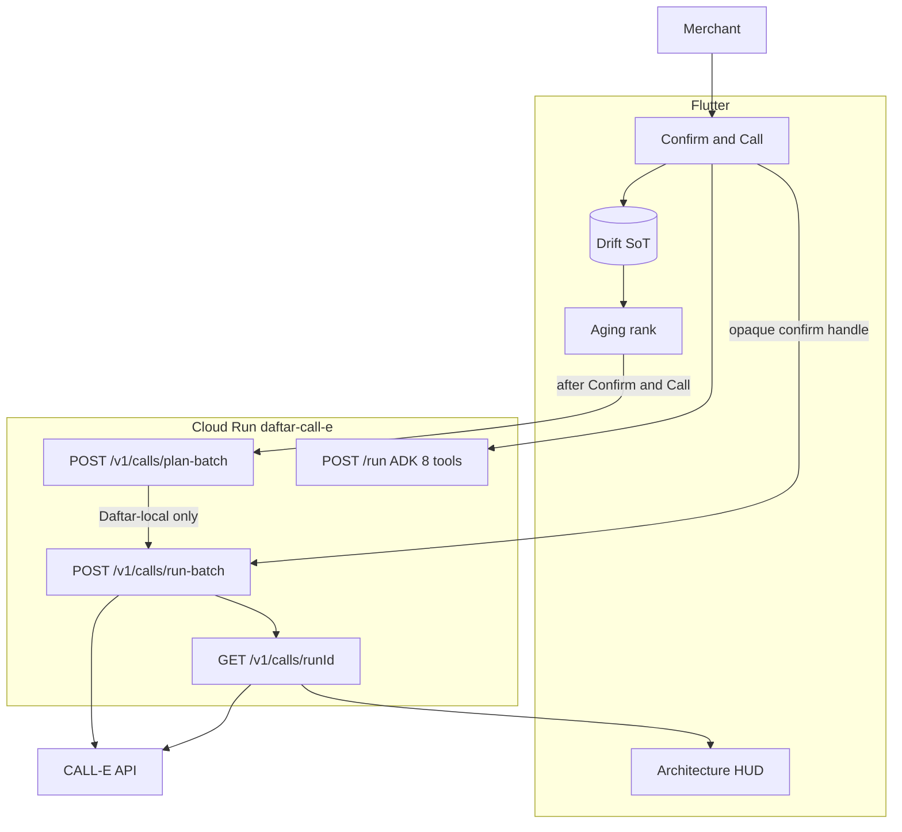

# Daftar Closing Agent — CALL-E Contest Execution Roadmap (v3)

> **Version:** 3.2 · **Date:** 2026-09-01 · **Submission Period:** 23 Jul 2026 – 14 Sep 2026 11:45pm SGT
>
> **Derived from:** Locked Confirm & Call catalog (brainstorm Aug–Sep 2026) · [CALL-E: Your Code Is Calling](https://call-e.devpost.com/) [Official Rules](https://call-e.devpost.com/rules) · [CALL-E integrations](https://github.com/CALLE-AI/call-e-integrations) region table · Developer API `POST /v1/calls` + `GET /v1/calls/{id}` (`calle-ai` 0.7.0) · MCP/CLI `plan_call` / `run_call` / `get_call_run` is a **separate** surface (owner-ops only) · disclosed Daftar ledger + All Things Agentic Closing Agent already in this repository ([`roadmap_v2.md`](roadmap_v2.md) v2.8, **frozen heritage**)
>
> **v3.1 headline:** This fork ships **Daftar Closing Agent — Confirm & Call** for CALL-E. After the merchant taps **Confirm & Call**, Cloud Run **`POST /v1/calls`** (`calle-ai` `calls.create`) phones the device-ranked, allowlisted, **region-eligible** overdue contacts. CALL-E negotiates a **promise** in Arabic or English and returns a **structured result**. The device writes **integer** `promised_amount_minor` into Drift. **Gemini never dials and never cashiers.** Money still commits **on confirm** (Model C). Gmail SMTP remains the rail for Yemen / missing phone / unsupported region / Confirm without calling. Stack: existing **Gemini 3.5 + ADK + Cloud Run** (eight frozen FunctionTools) plus a **sibling** CALL-E FastAPI route using the **Python `calle-ai==0.7.0` SDK** — **not** an ADK tool, mirroring [`agent/email_send/router.py`](../agent/email_send/router.py). New Cloud Run service **`daftar-call-e`**. Do **not** redeploy the frozen Agentic URL. Demo **Architecture HUD** adds a call chip (`runId` last-8 = CALL-E `call.id`). Test destination: owner **US DID** (Zadarma or equivalent) first; consented **SA/AE/EG** mobile last. Prize aim: **Most Practical**.
>
> **v3.0 changelog:** New binding contract. Dual outreach rail. Device HITL Confirm Gate then sibling `plan-batch` / `run-batch`. Poll-first (no public webhook). YE not supported. Allowlist + kill switch. B-trigger. Portable `ledger-collections-call` skill. Stages 0–7 unchecked.
>
> **v3.1 changelog:** Production path = Developer API `create` / `get` (not MCP `plan_call` / `confirm_token`). `plan-batch` is **Daftar-local** (zero PSTN). `runId` := CALL-E `call.id`. Minimum filmable slice renamed **MFP** (MCP = Model Context Protocol only). Credits: 20 new / +200 existing / pause not auto-charge. Pin `calle-ai==0.7.0`. Gate 0 API 404 probe; Chat ≠ API. Awesome-list `skills/` template + dry-run. Envied URL must not default to the frozen Agentic hostname. NANP `+1` region from allowlist. Integer coercion of structured amounts. Winning-criteria map.
>
> **v3.2 changelog:** Judging-criteria lock only. Winning map answers the four official Stage Two questions plus the Impact tie-break. Post-hackathon: Confirm & Call stays in the product. Skill one-liner, 3:00 beat sheet, four-paragraph Devpost About. Do not open the film on Gemini/ADK. Product, calendar, and J.9 unchanged from v3.1.

**Binding contract:** `docs/roadmap_v3.md` is the **sole implementation contract** for this CALL-E submission. [`docs/roadmap_v2.md`](roadmap_v2.md) v2.8 is **frozen All Things Agentic heritage** — do not execute its Gates. Product Phase 2 (`docs/product/roadmap.md` stub + `docs/archive/`) remains **deferred**.

---

## Contest Identity

| Item | Value |
| --- | --- |
| **Hackathon** | [CALL-E: Your Code Is Calling](https://call-e.devpost.com/) |
| **Sponsor** | AIRUDDER Pte Ltd |
| **Submission Period** | **23 Jul 2026 – 14 Sep 2026 11:45pm SGT** (hard) |
| **Owner buffer** | Submit by **14 Sep 2026 ≤ 18:00 AST** |
| **Feedback / MVF** | Through **18 Sep 2026** — [CALL-E Feedback Survey](https://call-e.devpost.com/) (separate **$200 × 5**; one survey per person; not a project prize) |
| **Judging** | **30 Sep – 13 Oct 2026** · winners ~**19 Oct 2026** |
| **Product name** | Daftar Closing Agent / وكيل إغلاق الدفتر — Confirm & Call |
| **Prize aim** | **Most Practical Use Case** ($4,000). One prize per project. Do not optimize the film for Most Innovative. |
| **Must use at runtime** | CALL-E **Python SDK (`calle-ai==0.7.0`)**, `from calle import CalleClient` — **imported and actually called** via Developer API `POST /v1/calls`. MCP / CLI / SKILL satisfy Stage One if used at runtime; **this submission’s production path is the SDK**, not MCP |
| **Must submit** | Devpost + **PR** to [CALLE-AI/awesome-phone-call-agents](https://github.com/CALLE-AI/awesome-phone-call-agents) (correct Contribution Area) + public **≤3 min** YouTube/Vimeo + CALL-E **account email** |
| **Setup vs submit repos** | Setup: [call-e-integrations](https://github.com/CALLE-AI/call-e-integrations) (optional [installation guide](https://open.heycall-e.com/document/mcp-archive/CALL-E-installation-guide.md) for CLI/MCP owner-ops). Submit list: **awesome-phone-call-agents**. Do not mix. |
| **Credits** | **New** account: **20** free. **Existing** account: request **+200** via [form](https://forms.gle/EPQttEZ1rkW8iq9q6) (1–5 business days, not guaranteed). Exhaustion **pauses** access — **no auto-charge**. `~$0.05` / call is **optional purchase**. Film inside 20 until extras land |
| **Outbound** | CALL-E **KYC** required before dial. Inbound numbers are **not** this submission. |
| **Existing project** | Allowed if **significantly updated** during the Submission Period and disclosed |
| **GCP account** | Contest compute + billing on **`akrm.codes@gmail.com`** / project **`daftar-closing-agent`**; keep Drive OAuth clients on **product** GCP — do not mix |
| **Gmail SMTP sender** | Unchanged from v2.8: dedicated mailbox, App Password in Secret Manager `gmail-smtp-app-password`. **Do not write a live From/To address in this roadmap.** |
| **CALL-E secret** | Secret Manager **`calle-api-key`**. Env: `CALLE_API_KEY` / `CALLE_BASE_URL=https://api.heycall-e.com`. **Never** Flutter / git / chat |
| **Cloud Run (this fork)** | **New** service **`daftar-call-e`**, region **`us-central1`**, min **0** / max **2**, ID-token only. **Do not redeploy** `https://daftar-closing-agent-1487285471.us-central1.run.app` (Agentic freeze) |
| **Package ID** | `com.akrmcodes.daftar` (dedicated demo device/profile) |

> **Deadline math:** Hard cutover is **14 Sep 2026 23:45 SGT** = **14 Sep 2026 18:45 AST** (SGT = UTC+8; AST = UTC+3). The **14 Sep ≤ 18:00 AST** target is a ~45 min safety buffer before the hard deadline — do not treat the buffer as the official Devpost time.

### Two CALL-E surfaces (do not conflate)

| Surface | Auth | Mutating call | Confirm | Completion | This submission |
| --- | --- | --- | --- | --- | --- |
| **Developer API / `calle-ai`** | `CALLE_API_KEY` | `POST /v1/calls` (`calls.create`) — **dials** | Device **Confirm & Call** is HITL | `GET /v1/calls/{id}` poll (optional `webhook_url` — we do **not** use it) | **Production** |
| **MCP / `calle` CLI** | OAuth | `plan_call` (no dial) then `run_call` (`confirm_token`) | MCP confirm loop | `get_call_run` (~60s then 5–10s). No `webhook_url` on MCP `run_call` | Owner-ops / optional install only |

`create_and_wait` / `createAndWait` is **Gate 0 laptop smoke only**. Do **not** block Cloud Run on it.

### Winning map (Stage Two — equally weighted)

Source: [CALL-E Devpost judging criteria](https://call-e.devpost.com/) · [Official Rules §6](https://call-e.devpost.com/rules). Stage One is pass/fail (theme + CALL-E at runtime). Stage Two is **four equally weighted** scores. **Ties break on Real World Impact first.** Prize lane stays **Most Practical**. Do **not** copy All Things Agentic 4:00 / Christina check-in into this film. Judges may score from **video + repo + awesome-list PR** and are not required to install the APK.

**Phone-work problem (reuse in video / About / skill):** At close of day, shops still phone overdue customers themselves — or they forget. CALL-E places the consented call and returns a **promise**, not a payment. Yemen and other unsupported regions stay on **email**. That is **customer outreach** (a Devpost example category), not a generic dialer.

| Official question | Locked answer |
| --- | --- |
| **Real World Impact** — specific phone-work problem; credible for real users; **worth building further after the hackathon**; not generic “AI that makes phone calls” | Close-of-day collections for shops that still keep paper books. Dual rail is honest coverage (CALL-E cannot dial YE). First **0:00–0:25** of the video names the shop and the forgotten calls. **After submit:** Confirm & Call **stays in the product**; dual rail remains how Daftar covers shops CALL-E cannot dial. Phase 2 (sync / RevenueCat) stays deferred — that is not this feature. Demo destinations are consented (owner DID / friend), **never real debtors** |
| **Quality of the Idea** — creative, non-obvious; understands the problem; contribution clear, well-scoped, reusable | Do **not** claim we invented collections promises ([`apps/python/kept`](https://github.com/CALLE-AI/awesome-phone-call-agents/tree/main/apps/python/kept) exists). Non-obvious vs that: (1) device-ranked aging — Gemini **does not** pick who is called; (2) region gate **refuses** unsupported numbers instead of failing PSTN; (3) dual rail (call + SMTP); (4) integer `promised_amount_minor` — promise **never** writes a ledger txn (Model C); (5) Arabic-first offline Drift as SoT. Reusable contribution: Agent Skill `ledger-collections-call` (one-liner in §5.4). B-trigger is README / ≤10 s or skip — **not** the climax |
| **Technical Implementation** — thorough, skillful CALL-E use; working, non-trivial; **imported and actually called at runtime**, not just referenced | Cloud Run: `from calle import CalleClient`; `POST /v1/calls` with `recipients[]`, `region`, `locale`; both `result_schema` and `recipient_result_schema`; `Idempotency-Key`; poll `GET /v1/calls/{id}` to terminal (**no** `create_and_wait` on the request); integer coercion of `promised_amount_minor`. Catalog freeze forbids an ADK dial tool. HUD `call.id` last-8. **Runtime proof is the Flutter Gate 4 live call**, not the skill dry-run (dry-run is no-call by design). **Do not** open the film on Gemini / ADK / Cloud Run — judges score CALL-E; HUD in-frame is enough GCP proof |
| **Product Experience & Demo** — complete, coherent experience; video clearly says what it does and **why it matters** | One workflow, one climax: Confirm & Call. Beat sheet §6.3. **On-device** Flutter footage of the live ring (rules: device for which it was built). English VO or EN subtitles; Devpost text **English**. ≤3:00. Promise card + HUD. Do **not** climax on mid-day capture, Drive, SMTP inbox, WhatsApp, or Gemini |

**Judge testing:** Cloud Run stays ID-token-only (no `allUsers`). Browser **403** on the service URL is expected. Judges: video + public repo + skill dry-run. Keep `daftar-call-e` deployable through **13 Oct 2026** (judging end; min 0 OK).

### Explicit non-goals (this submission)

- Inbound merchant hotline / CALL-E inbound number as the demo
- Customer inbound IVR / installment answering machine
- Gemini Multimodal Live / in-app “live voice companion” as the call plane
- WhatsApp voice notes, Meta WABA / Graph templates / unofficial WhatsApp
- In-call floating HUD on ordinary GSM calls
- Multi-dialect custom TTS (Yemeni/Gulf/Egyptian) beyond CALL-E `locale`
- Automated multi-branch 21:00 standup (Stage 8 sync remains quarantined)
- In-call SMS payment / checkout links (no payment rail)
- **Twilio / Bland / Skype / Google Voice as the dialer** (Stage One fail)
- Auto-dial when a contact exceeds credit limit (B-trigger is **HITL only**)
- Replacing or deleting Gmail SMTP (J.7 stays; dual rail)
- Mutating the frozen Agentic Cloud Run service/URL
- Product Phase 2 Stages 8–19 (multi-device sync as product, Delight, viral, RevenueCat, enterprise)
- Public CALL-E webhook path / second public Cloud Run / `allUsers` on `/run`
- 10DLC / SMS on the test DID
- Claiming CALL-E will dial **YE / +967**
- Treating CALL-E `task_completed` or SMTP `250` as **paid**
- LLM chooses who is called or emailed
- Model as cashier (no `AddTransactionUseCase` from a structured promise)
- App Password or `CALLE_API_KEY` in Flutter / git / chat
- Lock-screen / “Hey Daftar” wake
- Feature-gating Confirm & Call behind `FeatureFlag.whatsappAutomation`

---

## Roadmap Overview

| Phase | Stages | Calendar (2026) | Objective |
| --- | --- | --- | --- |
| **Foundation** | Stage 0 | 1–2 Sep | CALL-E account · KYC · extra calls · US DID · disclosure · new Cloud Run name · Gate 0 live ring |
| **CALL-E sibling** | Stage 1 | 3–4 Sep | `plan-batch` / `run-batch` / `GET` · OpenAPI · catalog freeze |
| **Device contract** | Stage 2 | 5–6 Sep | Schema 26 · E.164 · region gate · allowlist · aging split |
| **Confirm & Call UI** | Stage 3 | 7–8 Sep | Desk badges · B-trigger · HUD call chip · dry-run |
| **Live loop** | Stage 4 | 9–10 Sep | Poll → structured write-back · **MFP filmable** · Gate 4 |
| **Polish + skill** | Stage 5 | 11 Sep | One retry · kill switch · awesome-list skill · **feature freeze EOD** |
| **Package** | Stage 6 | 12–13 Sep | Diagram · README · ≤3 min video · PR · Devpost · **video lock 13** |
| **Submit** | Stage 7 | 14 Sep | Freeze SHA · Devpost · MVF survey |

### Active Workstreams

| Workstream | Owner surface | Status |
| --- | --- | --- |
| Confirm & Call (CALL-E) | Stages 0–7 below | **Binding** |
| All Things Agentic heritage | [`roadmap_v2.md`](roadmap_v2.md) v2.8 | **Frozen** — do not execute |
| Product Phase 2 | [`docs/product/roadmap.md`](product/roadmap.md) stub + [`docs/archive/`](archive/) | Deferred after submit |

### Dependency Graph

```
Stage 0 (CALL-E account + KYC + US DID + disclosure + new Cloud Run)
  └── Stage 1 (Sibling plan/run/get + OpenAPI + eight-tool freeze)
        └── Stage 2 (Drift schema 26 + E.164 + region + allowlist + dual rail)
              └── Stage 3 (Confirm & Call UI + B-trigger + HUD)
                    └── Stage 4 (Live poll + structured write-back + Gate 4 film)
                          └── Stage 5 (Retry + skill pack + feature freeze)
                                └── Stage 6 (Video / README / awesome-list PR / Devpost)
                                      └── Stage 7 (SHA freeze + Devpost submit + MVF)
```

> [!IMPORTANT]
> **Feature freeze:** 11 Sep 2026 EOD — no new CALL-E capabilities after Gate 5 unless Gate 4 is already green. **Do not start Stage 5 until Gate 4.**
> **Video lock:** 13 Sep 2026.
> **Do not start Stage N+1** until Stage N Validation Gate is checked.
> **Stop product Phase 2 / Shipaton / Agentic-main work.** This fork only. Do not push to the frozen Agentic repository.

### Minimum Filmable Product (MFP)

Must be **filmable by Gate 4 (~10 Sep)**. Everything beyond this is polish. **MFP** is this contest slice. **MCP** in this document means **Model Context Protocol** only.

1. Merchant **Confirm & Call** on the closing plan (HITL)
2. Cloud Run **`plan-batch` (Daftar-local) then `run-batch` (`calls.create`)** using `calle-ai` (not an ADK tool)
3. **One** allowlisted **US** destination rings (owner DID)
4. Structured outcome on device (`outcome` + integer promise fields) + HUD **`runId` last-8** (= CALL-E `call.id`)
5. Cloud Logging **`daftar.agent.call`**
6. A **YE-seeded** overdue row stays on **email** (region gate), never a failed CALL-E dial

**Slip protocol:** If Gate 0 live ring fails, **do not** build Flutter UI on hope — fix PSTN/KYC/credits first. Collapse to one golden path (single recipient, English, `region: US`). If Arabic PSTN fails the week of filming, film US English and **narrate the region gate**. If extra-call credits lag, stay inside **20 free calls** (live cap **3** recipients). If SMTP owner-ops regress, film call rail only but **do not delete** J.7.

**Demo utility framing:** Film a **specific phone-work problem** (close-the-day collections for shops that still keep paper books) — not “AI that makes phone calls.” **Why it matters:** they still make those calls themselves, or they forget; CALL-E returns a promise, not a payment; YE stays on email. **Worth building further:** Confirm & Call stays in the product after submit. Sequence: problem → one confirm → live CALL-E call → structured promise on device → HUD `runId`. Name **CALL-E SDK/API** out loud. **Do not open on Gemini / ADK / Cloud Run.** Judges may score from **video + repo + awesome-list PR**. Architecture HUD in-frame. English VO or EN subtitles. **≤3:00** (judges need not watch more). Beat sheet: §6.3.

### Key Architectural Pivots (Contest v3.1)

| Pivot | Agentic v2.8 (heritage) | CALL-E (v3.1) | Rationale |
| --- | --- | --- | --- |
| **Scope** | Close-the-day + Gmail SMTP | Same ritual + **Confirm & Call** last mile | Sponsor scores CALL-E at runtime |
| **Lead outreach** | SMTP send set ≤20 / PDF Top 5 | **Dual rail:** call set ≤5 + email remainder | YE is not on CALL-E’s table; SMTP is the honest fallback |
| **Consent** | Confirm & Send Statements | **Confirm & Call** on the device **is** HITL; then `run-batch` → `POST /v1/calls`. Email button stays explicit | Model C. There is **no** API `confirm_token` |
| **Dialer** | n/a | **CALL-E only** (`calle-ai` `calls.create` on Cloud Run) | Stage One pass/fail |
| **Completion proof** | SMTP `250` + inbox on camera | CALL-E terminal status + structured result + HUD `call.id` (**poll-first**) | `task_completed` ≠ paid; no public webhook |
| **Cloud Run** | `daftar-closing-agent` URL | **New** `daftar-call-e`; Agentic URL **frozen** | Do not disturb Agentic judging |
| **ADK catalog** | Eight `propose_*` tools; SMTP is sibling | **Same eight**; CALL-E is **another sibling** | Model must not dial |
| **Test destination** | Owner Gmail plus-aliases | Owner **US DID** first; consented **SA/AE/EG** last | YE PSTN unsupported |
| **Reusable contribution** | App + SMTP | App + **Agent Skill** PR (`skills/ledger-collections-call/`) | Quality of Idea / community |

---

## Product Spec — Locked Feature Catalog

### Mental model

**Voice clerk by day · Closing agent by night · Confirm before any money moves or anyone is phoned.**

### Model C — Hybrid ledger truth (unchanged)

| Piece | Rule |
| --- | --- |
| Money events (debt/payment) | Commit to **real Drift ledger immediately after confirmation** |
| Day Journal | Append-only **AI audit/UX** trail (not sole source of closing totals) |
| Close the day summary | **Drift queries for merchant `localDay`** |
| CALL-E promise | **Not money.** Persist on `collection_promises`. Recording payment is still `AddTransactionUseCase` |
| Forbidden | Shadow money until night; creating a txn from `structured_result`; closing summary that disagrees with Drift |

### Chapter 1 — Wake the clerk (heritage, keep)

| Feature | Spec | Status |
| --- | --- | --- |
| AI entry UI | Dedicated Closing Agent surface | Landed (v2.8) |
| Center FAB | **Tap** → agent · **Long-press** → quick-add | Landed |
| Architecture HUD | v2.8 overlay **plus** call chip (`runId` last-8 + status). SMTP chip unchanged. Not a product tour | Must (Stage 3–4) |
| “Hey Daftar” / lock-screen | — | Out of scope |

### Chapter 2 — Mid-day capture (heritage, keep)

Record debt/payment, identity resolution, create contact/ledger, ask-the-books, on-demand PDF, TTS — **unchanged**. Credit-limit **warning** after save already exists ([`check_credit_limit_use_case.dart`](../lib/application/contact/check_credit_limit_use_case.dart)). v3 adds a **B-trigger prompt** (Chapter 5), not a new parse path.

### Chapter 3 — Close the day (climax, extended)

Canonical sequence:

1. Goal: “Close the day” / “سكر اليوم”
2. Agent shows **plan** (`propose_closing_plan`)
3. Merchant **confirms plan** (one plan-level confirm)
4. **Day summary** from **Drift `localDay`**
5. **Drive backup** (fail does **not** abort)
6. Build overdue shortlist via Appendix D
7. Split **call set** vs **email set** (dual rail)
8. **One card, two explicit buttons** (no silent combo):
   - **Confirm & Call** — outreach consent for the call set → Daftar-local `plan-batch` then `run-batch` (`POST /v1/calls`)
   - **Confirm & Send Statements** — unchanged SMTP for the email set
   - **Confirm without calling** / **Confirm without sending** — first-class
9. Poll `GET /v1/calls/{runId}` until terminal → persist structured result → promise card
10. **Closing report:** call rows `planned` / `ringing` / `completed` / `failed` / `skipped` / `callUnavailable`; email rows as v2.8

Empty close (0 overdue) is success: backup + “nothing to collect.”
Missing phone **and** missing email → `skipped`.
Do **not** auto-open WhatsApp after either confirm.

### Chapter 4 — Dual-rail collections

| Rule | Detail |
| --- | --- |
| Call lead | **CALL-E** after **Confirm & Call**. Cap **call set** = `min(call-eligible, 5)`; demo **1–3** |
| Email rail | **Gmail SMTP** (J.7) for email-eligible remainder, YE, missing phone, Confirm without calling. Send set ≤20; PDF ranked Top 5 — **unchanged** |
| Call-eligible | Valid E.164 from [`PhoneNumber`](../lib/domain/value_objects/phone_number.dart); country in Appendix **J.10**; not DNC; on **allowlist**; `CALLE_ALLOW_DIAL=true` |
| Email-eligible | Non-empty valid email (v2.8) |
| Unsupported region (incl. **YE**) | **Email only**. Badge `callUnavailable`. **Never** POST that number to CALL-E |
| Consent | Does **not** silently dial or send. Two explicit buttons |
| Who is called | **Device aging** ranks. Gemini **narrates**; it does **not** pick IDs |
| Preview = sent/said | Desk preview **equals** the CALL-E **task** string (C.3) and C.2 email. No LLM bodies on the close path |
| Delivery proof (call) | Terminal CALL-E status + `structured_result` on device + `daftar.agent.call` logs. **Not** “paid” |
| Delivery proof (email) | SMTP **`250` + Message-ID** + inbox on camera (heritage) |
| Secret | `calle-api-key` and Gmail App Password in Secret Manager only |
| Contest entitlements | Do **not** gate on `FeatureFlag.whatsappAutomation` |

### Chapter 5 — Two triggers, one skill

| Trigger | When | Film? |
| --- | --- | --- |
| **A-story** | Closing ritual → Confirm & Call | **Yes** (climax) |
| **B-trigger** | After a save where `CreditWarningLevel.exceeded` → prompt “Call to say no new goods until a payment?” → same plan/run | **Ship.** README + ≤10 s or skip the video. **Never auto-dial** |

Same `recipient_result_schema`. B-trigger may set `acknowledged_hold`.

### Confirm layering (professionalism)

| Moment | Confirm |
| --- | --- |
| Each money write | Always (read-back) |
| Create contact/ledger | Ask first |
| Start close-the-day plan | Once |
| Customer **call** | **Confirm & Call** on the plan (then live desk) **or** Confirm without calling |
| Customer **email** | **Confirm & Send Statements** **or** Confirm without sending |
| Credit-limit call | Extra HITL prompt, then the same call confirm |
| Attach PDFs | SMTP only; ranked Top 5 (heritage) |
| Structured promise | Display only. Payment is a later money confirm |

### Account aging (before draft)

Unchanged FIFO mental model (Appendix D). v3 **adds** eligibility split **after** rank: call vs email vs unavailable vs skipped.

### Languages

Arabic-first RTL **and** English equal quality. Locale drives agent replies, C.2 email, and C.3 CALL-E task language. CALL-E `locale` / `region` follow J.10 — **do not** send `region: YE`.

### Offline honesty

If Cloud Run or CALL-E unreachable: clear localized message; **manual ledger + quick-add still work**. Do not queue silent dials.

### Safety (non-negotiable)

| Control | Rule |
| --- | --- |
| `CALLE_ALLOW_DIAL` | Default **false** until Gate 0. Settings kill switch. Server **and** device enforce |
| Allowlist | Only E.164 in owner-ops allowlist (gitignored) may be passed to `run-batch`. Public demo stays dry-run |
| DNC | Per-contact `doNotCall` → omit from call set |
| Idempotency | `batchId` UUID; same batch must not double-dial (J.9) |
| Consent | Owner plus-aliases / owned DID / written consented friend. **No real debtors** |
| Disclose AI | C.3 task tells CALL-E to identify as the store’s assistant, not a human pretending otherwise |

---

## Architecture

### Runtime topology

```
Flutter (RTL, Khazna, HUD)
        │  Google ID token
        ▼
Cloud Run daftar-call-e  (NEW — do not mutate Agentic URL)
        │
        ├──────── POST /run                  ADK · 8 frozen tools · Gemini 3.5
        ├──────── POST /v1/email/send-batch  Gmail SMTP (J.7 heritage)
        ├──────── POST /v1/calls/plan-batch  Daftar-local gate (no CALL-E, no dial)
        ├──────── POST /v1/calls/run-batch   CALL-E `calls.create` / POST /v1/calls (dials)
        ├──────── GET  /v1/calls/{runId}     CALL-E `calls.get` / GET /v1/calls/{id} (poll)
        ├──────── POST /v1/tts               Chirp (heritage)
        ├──────── Secret Manager             gmail-smtp-app-password · calle-api-key
        └──────── Cloud Logging              daftar.agent.email · daftar.agent.call
        │
        ▼
Device Confirm Gate → Drift (SoT) · collection_call_* · collection_promises
```



### Execution rule (non-negotiable)

| Action class | Where | When |
| --- | --- | --- |
| Plan / NLP | Cloud Run `/run` + Gemini (`propose_*` only) | Online |
| Rank, region, allowlist, C.2 / C.3 strings, integer money | Device (Drift) | Always preferred for truth |
| Create/update money, contacts, ledgers | Device use cases | **After confirm only** |
| Drive backup | Device Drive use cases | After closing-plan confirm (fail does not abort) |
| Gmail SMTP | Cloud Run `POST /v1/email/send-batch` | After **Confirm & Send Statements** |
| Daftar plan-batch (no dial) | Cloud Run `POST /v1/calls/plan-batch` — **local** allowlist / J.10 / C.3 echo | After **Confirm & Call** (or dry-run). **Does not** call CALL-E |
| CALL-E create (dial) | Cloud Run `POST /v1/calls/run-batch` → `calls.create` / `POST /v1/calls` | After merchant confirm **and** exact Daftar confirm handle from the preceding plan-batch |
| CALL-E status | Cloud Run `GET /v1/calls/{runId}` ← device poll → `GET /v1/calls/{call.id}` | Until terminal; first poll after ~60s, then 5–10s (MCP polling guidance; not an API deadline) |
| Persist structured result | Device | After terminal; **no txn**; integer-only `promised_amount_minor` |
| Public CALL-E webhook | — | **Non-goal** (IAM; same lesson as retired J.8) |

**Production path = Developer API / Python SDK** on Cloud Run. **Do not** use MCP `run_call` in production (OAuth, no `webhook_url`, Chat success ≠ API KYC).

**Do not** block Cloud Run on `create_and_wait` for the product path (timeout / scale-to-zero). `create_and_wait` is **Gate 0 laptop smoke only**.

### Reuse map (do not reinvent)

| Capability | Path |
| --- | --- |
| Voice entity context | `lib/application/ai/get_active_voice_context_use_case.dart` |
| Reminder / aging candidates | `lib/application/contact/get_reminder_eligible_contacts_use_case.dart` (extend for phone + region) |
| Credit-limit B-trigger | [`check_credit_limit_use_case.dart`](../lib/application/contact/check_credit_limit_use_case.dart) |
| Phone normalize | [`phone_number.dart`](../lib/domain/value_objects/phone_number.dart) — add **E.164 with `+`** for CALL-E; today `normalized` is digits-only |
| Gmail SMTP | [`agent/email_send/router.py`](../agent/email_send/router.py) · device `DispatchCollectionsEmailUseCase` |
| CALL-E sibling (new) | `agent/calls/` mirroring `email_send/` · device `DispatchCollectionsCallUseCase` (indicative) |
| Catalog freeze | [`agent/tests/test_tool_catalog_freeze.py`](../agent/tests/test_tool_catalog_freeze.py) — still **eight** tools; **assert no call FunctionTool** |
| Contact statement PDF | `prepare_contact_statement_use_case.dart` + `pdf_generator.dart` isolate |
| Architecture HUD | `lib/presentation/shared/widgets/daftar_architecture_hud.dart` — add call chip |
| Drive upload | `lib/application/backup/upload_drive_backup_use_case.dart` |
| Confirm gate | existing `AgentConfirmGate` / `proposalId` single-flight |
| Errors | `lib/core/utils/error_translator.dart` (never raw `Failure.message`) |

### New Drift tables (Stage 2) — schema **25 → 26**

Today: [`DbConstants.schemaVersion`](../lib/core/constants/db_constants.dart) **25**. Bump **`DbConstants` and `DriveBackupConstants.schemaVersion` together**. `onUpgrade from < 26`. Stage 8 sync tables **remain inert**. Names indicative — finalize in the migration PR.

| Table | Purpose |
| --- | --- |
| `collection_call_batches` | `id` UUID · `batchId` UUID · `correlationId` · `trigger` `closeDay` \| `creditLimit` · `status` · `createdAt` UTC |
| `collection_call_runs` | `id` UUID · `batchId` · `contactId` · `region` · `locale` · `runId` (CALL-E `call.id`) · `outcome` · `promisedAmountMinor` int? · `promisedCurrency` · `promisedDate` · `acknowledgedHold` · `evidenceQuote` · `rawStatus` · `createdAt` / `updatedAt` UTC |
| `collection_promises` | `id` UUID · `contactId` · `runId` · `amountMinor` int · `currencyCode` · `promisedDate` · `status` `pending` \| `kept` \| `broken` \| `cancelled` — **display only**, no ledger movement |
| Contact flag | `doNotCall` bool default false (column on `contacts` **or** settings row — pick one in the PR) |

**Daftar confirm handle:** treat as secret. Prefer **not** persisting plaintext; hold in memory for the confirm→run hop. Persist `runId` (= CALL-E `call.id`) only. This is **not** MCP `confirm_token` — the Developer API has none.

**Allowlist:** owner-ops env / secure settings — **not** a git file of real numbers. Demo seeder reads gitignored `.env` (see [`docs/qa/flutter_env.template.md`](qa/flutter_env.template.md) — extend in Stage 2, do not put live DIDs in this roadmap).

Invariants: UUID PKs · integer money · UTC · masked E.164 in logs (last-4 only).

---

## Precise Implementation Timeline

| Dates (2026) | Stage | Focus | Exit |
| --- | --- | --- | --- |
| **Tue 1 – Wed 2 Sep** | 0 | CALL-E account · KYC · extra calls · US DID · disclosure · `daftar-call-e` service name | Gate 0 |
| **Thu 3 – Fri 4 Sep** | 1 | Sibling plan/run/get · OpenAPI · eight-tool freeze | Gate 1 |
| **Sat 5 – Sun 6 Sep** | 2 | Schema 26 · E.164 · region · allowlist · dual-rail aging | Gate 2 |
| **Mon 7 – Tue 8 Sep** | 3 | Confirm & Call UI · B-trigger · HUD · dry-run | Gate 3 |
| **Wed 9 – Thu 10 Sep** | 4 | Live poll + write-back · **MFP filmable** | Gate 4 |
| **Fri 11 Sep** | 5 | Retry · kill switch · skill pack · **feature freeze EOD** | Gate 5 |
| **Sat 12 – Sun 13 Sep** | 6 | Video ≤3 min · README · awesome-list PR · Devpost · **video lock 13** | Gate 6 |
| **Mon 14 Sep** | 7 | Submit by **official 23:45 SGT** (owner buffer ≤ **18:00 AST**) | Gate 7 |

> **As-of note (v3.2):** This repository is a duplicate of the Agentic submission. Stages 0–7 **above** are CALL-E work and start **unchecked**. Do **not** rewrite v2.8 calendar history. v3.1 locked the Developer API surface. v3.2 locks judge-facing claims only; product catalog unchanged.

---

## Stage 0: CALL-E Foundation + Hygiene + Test Destination

**Goal:** CALL-E can place **one** consented outbound call to an owner **US DID** answered in a provider app/webphone. Eligibility disclosure exists. New Cloud Run service is named and must not collide with the frozen Agentic URL. Secrets never land in git. `CALLE_ALLOW_DIAL` disk default remains **false**; Gate 0 smoke passed with a one-shot process env `true`.

**Prerequisites:** This fork at `/Users/aq/Work/01_Projects/daftar-call-e` is linked to a **new** git remote. Frozen Agentic `main` is not this repo. `.env` is gitignored.

**Features from Product Spec:** Safety kill switch default off; test-number policy.

**Integration / Architecture Notes:**

- CALL-E is the **caller**. You buy a **destination** DID (US local), not a “from” number.
- **Zadarma (recommended) or Sonetel (backup):** US geographic/mobile, inbound voice, **no SMS/10DLC**. Docs: passport/ID + **Yemen address** is enough — no US SSN/EIN. Answer **in the provider app/webphone over Wi‑Fi**. Do **not** forward to +967 as the primary path.
- **If they reject +967 SMS at signup:** do not use a friend number yet. Next: Callcentric (email signup) → DIDWW (US geographic, no registration) → VoIP.ms. Details: [`docs/contest/CALLE_STAGE0_OWNER_OPS.md`](contest/CALLE_STAGE0_OWNER_OPS.md) §0.2.
- **Do not** start with Twilio trial from Yemen (YE is not on Twilio’s trial-country list; trial inbound requires a **verified Caller ID** CALL-E does not have).
- Skype Numbers are **dead** (May 2025).
- Friend **SA/AE/EG** mobile is the **last** Arabic film take, not a forwarder.
- Optional owner-ops: [CALL-E installation guide](https://open.heycall-e.com/document/mcp-archive/CALL-E-installation-guide.md) installs CLI/MCP (`plan_call` / `run_call` / `get_call_run`). **Not** the production path. **Chat or MCP ringing does not prove Developer API KYC.**
- Privacy: CALL-E / AIRUDDER API traffic is **Singapore-hosted**. Names and amounts leave the device. Test destinations only; disclose in README (Stage 6).

### Task Checklist

**0.0 Contest hygiene (day 1 — eligibility)**

- [x] Rewrite [`docs/CONTEST_DISCLOSURE.md`](CONTEST_DISCLOSURE.md) for **this** hackathon: ledger **pre-Aug 2026** substrate; All Things Agentic Closing Agent (**Aug 2026**, disclosed prior work, overlapping CALL-E window but **not** claimed as CALL-E-new); CALL-E sibling + Confirm & Call = **this contest-new**
- [x] Point [`docs/contest/README.md`](contest/README.md) execution contract at **this file (v3.2)** — still **Stage 0/6**, not this doc-pass
- [x] Register on [CALL-E Devpost](https://call-e.devpost.com/)
- [x] Set Devpost project start **1sep** inside the Submission Period; explain the **significant update**
- [x] Stop product Phase 2 / Shipaton / Agentic-main pushes
- [x] Dedicated demo device/profile for `com.akrmcodes.daftar`
- [x] Confirm this repo remote ≠ frozen Agentic repo

**0.1 CALL-E account, KYC, credits**

Owner-ops (no secrets in git): [`docs/contest/CALLE_STAGE0_OWNER_OPS.md`](contest/CALLE_STAGE0_OWNER_OPS.md).

- [x] Create CALL-E account at [heycall-e.com](https://www.heycall-e.com/) / [dashboard](https://dashboard.heycall-e.com/account/api-keys)
- [x] Complete **outbound KYC** (proven 2026-09-02 by Developer API `create_and_wait` → `completed`)
- [x] Create API key · store only in Secret Manager later (`calle-api-key`) · never chat/git
- [x] Submit extra-calls form immediately: https://forms.gle/EPQttEZ1rkW8iq9q6 (**+200** if this is an existing account; 1–5 business days, not guaranteed)
- [x] Note the **20**-call budget until extras land; exhaustion **pauses** (no auto-charge); do **not** burn calls on UI work

**0.2 Test destination (US DID)**

- [x] Purchase **one** US local/mobile DID (Callcentric Pay Per Minute, NY 347 — 2026-09-02)
- [x] Voice inbound only — **no** SMS enable, **no** 10DLC (confirm **Activate SMS** was not clicked)
- [x] Confirm webphone/app rings from a **human** test call
- [x] Put E.164 **only** in gitignored owner-ops / `.env` — **never this file, never git**
- [x] Do **not** buy SA/AE/EG virtual numbers for development (expensive, heavier KYC). Arabic take = consented real mobile **last**

**0.3 Google Cloud (new service, same project)**

- [x] Same contest project `daftar-closing-agent` / `akrm.codes@gmail.com`
- [x] **Do not** `gcloud run deploy` onto service `daftar-closing-agent` / the frozen URL
- [x] Plan new service name **`daftar-call-e`**, region `us-central1`, min 0 / max 2, dedicated SA `call-e-runner@…` with Vertex/logging/speech **plus** secret-level `calle-api-key` (and Gmail accessor). Cloud Run service **not** created (Stage 1)
- [x] Create secret `calle-api-key` (file mount, not plaintext env in Console screenshots)
- [x] Keep `gmail-smtp-app-password` available to the **new** service (SMTP rail stays)
- [x] Budget alerts remain $50 / $100 / $140 — owner confirmed in Console 2026-09-02 (did not enable `billingbudgets.googleapis.com`)
- [x] Vertex routing unchanged: `GOOGLE_GENAI_USE_VERTEXAI=TRUE`, `GOOGLE_CLOUD_LOCATION=global`

**0.4 Kill switch + allowlist (owner-ops)**

- [x] Document env `CALLE_ALLOW_DIAL` default **false**
- [x] Document allowlist env (comma-separated E.164) — gitignored
- [x] Gate 0 smoke may set `CALLE_ALLOW_DIAL=true` **locally** for the one DID only

**0.5 Laptop smoke (required for Gate 0)**

- [x] Zero-cost API probe **before** a live call: `GET https://api.heycall-e.com/v1/calls/{nonexistent-id}` with `Authorization: Bearer $CALLE_API_KEY` — authenticated **`404`** means the key works; `401`/`403`/`credential_grant_unavailable` means **stop** (Chat ringing is **not** this test)
- [x] From a trusted laptop (not Flutter): `calle-ai==0.7.0` / `CalleClient.calls.create_and_wait` to the US DID with a trivial `result_schema` (`from calle import CalleClient`)
- [x] Answer in the DID provider app / webphone / Linphone (Wi‑Fi)
- [x] Confirm terminal status + structured result locally (`completed`, `can_hear_clearly=yes`, `call.id=call_GfN-BQcGMORm2NkgSfxdIw`)
- [x] Smoke **succeeded** — MCP/Chat was **not** used as proof. Stage 1 may start. If a later live `create` fails, **stop** and do not treat Chat as Gate 0.

#### Stage 0 Validation Gate

- [x] Disclosure drafted for CALL-E (substrate vs Agentic vs CALL-E-new)
- [x] CALL-E account + KYC + API key in Secret Manager (not git) — key is in Secret Manager; outbound KYC proven by live `create`
- [x] Extra-calls form submitted
- [x] Authenticated `GET /v1/calls/{nonexistent}` → `404` (API key works)
- [x] US DID rings in provider app
- [x] One consented **Developer API** `create_and_wait` succeeded (not Chat/MCP-only)
- [x] Frozen Agentic URL was **not** redeployed
- [x] No phone numbers, keys, or App Passwords in git

---

## Stage 1: CALL-E Sibling Routes (not an ADK tool)

**Goal:** Cloud Run `daftar-call-e` exposes plan / run / get. Gemini still cannot dial. Dry-run never hits PSTN. Production dials via Developer API **`calls.create`**, not MCP `run_call`.

**Prerequisites:** Gate 0.

**Features from Product Spec:** C.3 task is accepted as device-owned strings; allowlist + region + `CALLE_ALLOW_DIAL` **server-side**.

**Integration / Architecture Notes:**

- Mirror [`agent/email_send/`](../agent/email_send/) → new `agent/calls/`
- Python SDK: pin **`calle-ai==0.7.0`** in [`agent/requirements.txt`](../agent/requirements.txt). Import: `from calle import CalleClient`
- Prefer `client.calls.create(...)` (TypeScript 0.7.0 has it; Python should mirror). If Python lacks non-blocking `create`, raw `POST /v1/calls` then `GET`. **Never** `create_and_wait` on the Cloud Run request
- Native batch: **one** `POST /v1/calls` with `recipients[]` per Confirm & Call. **Spike:** if per-recipient `structured_result` is unusable, sequential creates with `Idempotency-Key = {batchId}:{contactId}`
- Send **both** task-level `result_schema` (e.g. `completed_count: integer`) **and** J.9 `recipient_result_schema`
- Auth = Appendix **J.1** (same Google ID token as `/run`)
- Idempotency-Key / `batchId` = J.9
- First poll guidance: wait **~60s** after `create` returns, then 5–10s (CALL-E MCP docs). This is a polling recommendation, **not** a completion deadline
- Persist `runId` := CALL-E `call.id`; **never** `create` again to “retry poll”
- Extend [`test_tool_catalog_freeze.py`](../agent/tests/test_tool_catalog_freeze.py): `ALL_TOOLS` still exactly the eight `propose_*` / `parse_goal` names; **assert** no `plan_call` / `run_call` / `propose_call` FunctionTool
- OpenAPI in [`agent/openapi.yaml`](../agent/openapi.yaml) must match J.9
- **URL landmine (1.0):** [`lib/core/env/env.dart`](../lib/core/env/env.dart) `CLOSING_AGENT_BASE_URL` default is **empty**. Gitignored `.env` must point at **`daftar-call-e` only** — never a silent fallback to `https://daftar-closing-agent-1487285471.us-central1.run.app`

### Task Checklist

**1.0 Deploy skeleton**

- [x] Deploy **`daftar-call-e`** from this fork (`adk` + FastAPI as today: `/run`, send-batch, tts)
- [x] Confirm frozen `daftar-closing-agent` revision is untouched
- [x] Flutter `.env` / dart-define **new** base URL only — no secrets; **change or empty** the Envied default so a missing `.env` cannot hit the frozen URL
- [x] Min 0 / max 2 on service **and** revision
- [x] `calle-ai==0.7.0` in agent requirements; Python **≥3.11**

**1.1 `POST /v1/calls/plan-batch`**

- [x] Accepts device-owned recipients (J.9) ≤5
- [x] **Daftar-local only** — allowlist, J.10, DNC, kill switch, C.3 echo. **Does not** call CALL-E. **Does not dial**
- [x] Returns a one-time **Daftar** confirm handle to the device (not logs)
- [x] Rejects: not allowlisted, unsupported region (J.10), DNC, `CALLE_ALLOW_DIAL=false` (unless `dryRun: true` which still must **not** dial), `recipients.length > 5`
- [x] `dryRun: true` → validate + echo C.3 task — **zero PSTN**, **zero** `POST /v1/calls`
- [x] Observability `daftar.agent.call` action=`plan` · masked E.164 · `correlationId` · `batchId`

**1.2 `POST /v1/calls/run-batch`**

- [x] Requires exact Daftar confirm handle from the immediately preceding plan-batch
- [x] Calls `client.calls.create(...)` (or raw `POST /v1/calls`) — **can place a real call** — only if `CALLE_ALLOW_DIAL=true` and allowlist match
- [x] Prefer one CALL-E task with `recipients[]`; fallback sequential if spike fails
- [x] Returns `runId` (= CALL-E `call.id`) immediately — **do not** `create_and_wait` on this request
- [x] Same recipient cap and server-side guards as plan
- [x] Idempotent on `batchId` (+ `contactId` if sequential) if `runId` already stored
- [x] Observability action=`run`

**1.3 `GET /v1/calls/{runId}`**

- [x] Proxies `client.calls.get` / `GET /v1/calls/{id}`
- [x] Returns status, terminal flag, `structured_result` validated against J.9 schema, masked phone
- [x] Never returns API key or confirm handle

**1.4 Tests + OpenAPI**

- [x] Unit tests with fake CALL-E client: plan does not call fake.create; run without handle → 400; dry-run never dials; YE region → 400; over-cap → 400
- [x] Catalog freeze test updated
- [x] `openapi.yaml` J.9 paths
- [x] Smoke script `agent/scripts/smoke_calls_plan_run.py` (owner-ops; no numbers in git)

#### Stage 1 Validation Gate

- [x] `daftar-call-e` URL documented in owner-ops only (optional in README after Stage 6)
- [x] Plan-batch does not call CALL-E and does not dial
- [x] Run-batch dials only with exact Daftar handle + allowlist + kill switch on
- [x] Dry-run never hits PSTN
- [x] Eight ADK tools unchanged; no call FunctionTool
- [x] OpenAPI matches J.9
- [x] Agentic URL untouched; Envied/`.env` does not default to the frozen hostname

---

## Stage 2: Device Contract + Dual Rail + Schema 26

**Goal:** Drift can store call batches/runs/promises. Aging splits call vs email. E.164 and region gate are unit-tested. No live call required.

**Prerequisites:** Gate 1.

**Features from Product Spec:** Dual rail, DNC, allowlist on device (defense in depth; **server remains authoritative**).

### Task Checklist

**2.1 Schema 26**

- [ ] Tables `collection_call_batches`, `collection_call_runs`, `collection_promises` (+ `doNotCall`)
- [ ] `DbConstants.schemaVersion` **26** and `DriveBackupConstants.schemaVersion` **together**
- [ ] `onUpgrade from < 26`
- [ ] Integer money columns only
- [ ] BACKUP_SPEC example versions bumped if required by existing hygiene

**2.2 E.164 + region**

- [ ] Helper: digits-only `PhoneNumber.normalized` → **`+` + digits** for CALL-E `phones[]`
- [ ] J.10 lookup: ISO country from calling code; YE → `callUnavailable`
- [ ] **NANP:** `+1` is US **and** CA (and others). Demo DID → `region: US` from **allowlist/config**, not inferred from `+1`
- [ ] US/AE/SA/EG/OM (and other J.10 rows we actually use) → eligible **iff** allowlisted
- [ ] Tests: YE, SA `+9665…`, US `+1…` with explicit `region: US`, empty, invalid

**2.3 Aging split**

- [ ] After Appendix D rank: attach `rail` = `call` \| `email` \| `both` \| `callUnavailable` \| `skipped`
- [ ] Call set = `min(call-eligible, 5)`
- [ ] Email set = existing send-set rules (email present, cap 20, PDF Top 5)
- [ ] Gemini does not receive a picker of IDs to choose from

**2.4 Demo seeder**

- [ ] One call-eligible contact whose phone comes from **gitignored env** (US DID)
- [ ] Remaining overdue contacts: **YE phones + valid emails** (prove region gate → email)
- [ ] No live numbers in `tool/` or `lib/`

**2.5 Allowlist + DNC on device**

- [ ] Device refuses to put non-allowlisted E.164 in `run-batch`
- [ ] `doNotCall` omits from call set
- [ ] Settings stub for kill switch (wired Stage 5; env sufficient until then)

#### Stage 2 Validation Gate

- [ ] Schema 26 migrates on a debug install
- [ ] Unit tests for E.164, YE gate, split, DNC — **no PSTN**
- [ ] Seeder has no committed phone numbers
- [ ] `flutter analyze` clean for touched files

---

## Stage 3: Confirm & Call UI + B-trigger + HUD

**Goal:** Merchant can dry-run the desk. Preview equals C.3. Credit-limit prompt does not auto-dial. HUD has a call chip.

**Prerequisites:** Gate 2.

**Features from Product Spec:** Chapters 3–5 UI. Khazna / Lapis Law. Arabic-first.

### Task Checklist

**3.1 Collections Desk**

- [ ] One card, **two explicit buttons**: Confirm & Call · Confirm & Send Statements
- [ ] Confirm without calling / without sending remain first-class
- [ ] Badges: call · email · both · `callUnavailable` (YE) · skipped
- [ ] Preview C.3 task string = what Cloud Run will send as `task` (store, `amount_line` from **int**, locale)
- [ ] Copy: **promise ≠ payment** (ARB `ar` + `en`)
- [ ] Live progress `Calling i of N` from **server per-row results**, not a fake spinner

**3.2 B-trigger**

- [ ] After save when `CreditWarningLevel.exceeded`, prompt to call (HITL)
- [ ] Yes → same desk / same plan-run routes with `trigger=creditLimit`
- [ ] No → ledger unchanged (money already committed on the sale confirm)
- [ ] **Never** auto-dial on save
- [ ] Not the filmed climax

**3.3 HUD**

- [ ] Call chip: `Call ·` + `runId` last-8 (= CALL-E `call.id`) + status (`planned` / `ringing` / `completed` / `failed`)
- [ ] SMTP `Sent ·` Message-ID last-8 **unchanged**
- [ ] Do **not** label call completed as `delivered` or `paid`
- [ ] Tests extended from `daftar_architecture_hud_test.dart`

**3.4 Dry-run on device**

- [ ] With `CALLE_ALLOW_DIAL=false`, Confirm & Call runs `plan-batch` dry-run only
- [ ] Desk shows previews; no `runId` from a real dial

#### Stage 3 Validation Gate

- [ ] Widget/provider tests for dual buttons, YE badge, B-trigger **no auto-dial**, HUD chip
- [ ] Device dry-run against Cloud Run succeeds without PSTN
- [ ] RTL/Khazna intact on the desk card

---

## Stage 4: Live Lifecycle + Structured Write-back

**Goal:** Confirm & Call places a real CALL-E call, polls to terminal, writes J.9 result into Drift, shows a promise card. **MFP.** Film Gate 4.

**Prerequisites:** Gate 3. `CALLE_ALLOW_DIAL=true` only on the demo profile. Allowlist = US DID (+ optional consented SA later).

**Features from Product Spec:** Chapter 3 steps 8–10. Model is not cashier.

### Task Checklist

**4.1 Device poll loop**

- [ ] After `run-batch`, persist `runId` (= CALL-E `call.id`)
- [ ] Wait ~60s, then poll `GET /v1/calls/{runId}` every 5–10s until terminal or timeout
- [ ] Timeout → `failed` / `needsHuman`, **do not** `run-batch` again (do not `create` again to poll)
- [ ] Airplane mode / Cloud Run down → ledger intact; show `ErrorTranslator` copy

**4.2 Write-back**

- [ ] Validate `structured_result` (enums + **integer** amount)
- [ ] Accept `promised_amount_minor` only if it is an **int** (or a whole number that converts with **no remainder**). JSON `number` / float → `needsHuman`. Never store `double` in Drift
- [ ] Upsert `collection_call_runs` + `collection_promises` when `outcome=promised` and amount/date present
- [ ] **No** `AddTransactionUseCase`
- [ ] Contact card shows pending promise (date + formatted int money)
- [ ] `task_completed` without schema → `needsHuman`, do not invent amount

**4.3 Email remainder**

- [ ] YE / non-allowlisted / DNC still go through **Confirm & Send Statements** independently
- [ ] Gate 4 film **Should** include a YE row that stayed `callUnavailable` and was emailed (or skipped if owner-ops email off — then narrate)

**4.4 Observability**

- [ ] `daftar.agent.call` on plan, run, terminal (masked phone, `runId`, `outcome`, **no** evidence PII dump)
- [ ] HUD updates from poll

**4.5 Gate 4 film (owner)**

- [ ] Warm Cloud Run once
- [ ] Confirm & Call → US DID rings → short consented script (“I’ll pay {integer} on {date}”)
- [ ] Device shows outcome + promise card + HUD last-8
- [ ] Optional: Cloud Logging screenshot
- [ ] No real debtors

#### Stage 4 Validation Gate

- [ ] Live CALL-E call from **this** app (not only laptop smoke)
- [ ] Structured integer write-back with **no** new txn
- [ ] YE row never dialed
- [ ] HUD `runId` last-8 matches logs (CALL-E `call.id`)
- [ ] SMTP rail still compiles/runs
- [ ] **MFP filmable** — **do not start Stage 5 until this gate is green**

---

## Stage 5: Follow-up, Kill Switch, Skill Pack, Feature Freeze

**Goal:** One no-answer retry, merchant kill switch, portable skill for the awesome-list. **Freeze EOD 11 Sep.**

**Prerequisites:** Gate 4.

### Task Checklist

**5.1 No-answer retry (Should)**

- [ ] If `outcome=no_answer` or `voicemail`, offer **one** HITL retry: a second `calls.create` with a **new** idempotency key (e.g. `{batchId}:retry1`). Developer API `CreateCallInput` has **no** `scheduled_at` — do not claim one
- [ ] Still HITL **or** pre-approved single retry policy documented in the PR
- [ ] Never infinite loops; never exceed remaining call credits blindly

**5.2 Kill switch UI**

- [ ] Settings GlowPill: **Allow CALL-E outbound** bound to the same flag as `CALLE_ALLOW_DIAL`
- [ ] Default off in release unless demo seeder / debug
- [ ] Server still authoritative

**5.3 Promise card polish**

- [ ] Status `pending` / merchant can mark `kept` / `broken` / `cancelled` **without** implying a txn
- [ ] Optional: marking `kept` **navigates** to payment confirm (does not auto-write money)

**5.4 Portable skill (Must for Quality of Idea)**

- [ ] Source copy in this repo: `docs/skills/ledger-collections-call/` (SKILL.md + references + scripts)
- [ ] Devpost PR payload in [awesome-phone-call-agents](https://github.com/CALLE-AI/awesome-phone-call-agents): **`skills/ledger-collections-call/`** with `SKILL.md`, `references/`, `scripts/`, optional `assets/`
- [ ] **README one-liner (English, paste as the awesome-list entry):** `ledger-collections-call` — HITL outbound collections call from overdue JSON (E.164, integer minor units, region); CALL-E `create` + poll; structured promise out; dry-run default; never posts to unsupported regions (including YE)
- [ ] Skill: overdue JSON in (contact, E.164, `amountMinor`, currency, locale, region) → J.9 schema out; **dry-run / no-call path by default** (CONTRIBUTING: private-only apps are out of scope)
- [ ] Allowlist / YE / HITL / integer-money notes in `references/`
- [ ] English-only list entry; fictional/masked numbers
- [ ] This is the **Agent Skills** PR — **not** the APK. Do not PR a Flutter app as the contribution area
- [ ] Branch `feat/ledger-collections-call`; PR title Conventional Commits; run `python3 scripts/validate_repository.py` before opening

**5.5 Freeze**

- [ ] No new triggers, no inbound, no WhatsApp, no Live API
- [ ] `flutter analyze` + agent tests green

#### Stage 5 Validation Gate

- [ ] Kill switch off → server refuses dial
- [ ] Skill folder exists, reusable without the APK, **dry-run** works without `CALLE_API_KEY`
- [ ] Feature freeze EOD **11 Sep 2026**
- [ ] **Do not start Stage 6 video until Gate 5** (packaging may draft README in parallel)

---

## Stage 6: Contest Packaging (mandatory)

**Goal:** Judges can score from video + repo + PR. Appendix I stretch stays retired.

**Prerequisites:** Gate 5 (film). Packaging copy may start after Gate 4.

### Task Checklist

**6.1 Architecture diagram**

- [ ] Update [`docs/architecture/contest_architecture.md`](architecture/contest_architecture.md) (and PNG) for CALL-E sibling + poll + dual rail
- [ ] Keep HITL rail: Propose → Confirm → Commit → Rank → **Validate / Create / Poll**
- [ ] Caption: CALL-E is not an ADK tool; Agentic URL is not this service; production = Developer API not MCP

**6.2 README / disclosure**

- [ ] Root README: CALL-E hackathon, dual rail, Proof of Action (`task_completed` ≠ paid; poll ≠ webhook theater; SMTP `250` ≠ delivered); one sentence on **Singapore** data residency for CALL-E
- [ ] Link v3.2 as **binding**; v2.8 as heritage
- [ ] [`docs/README.md`](README.md) judge order updated
- [x] [`docs/contest/README.md`](contest/README.md) execution pointer flipped to v3.2 (if not done in Stage 0)
- [ ] Disclosure finalized (Stage 0 draft → final)

**6.3 Video (Must)**

- [ ] Public YouTube or Vimeo, **≤3:00**, English or EN subtitles
- [ ] **On-device** Flutter footage of the live ring (rules: functioning on the device for which it was built) — not laptop `create_and_wait` as the climax
- [ ] Name CALL-E SDK/API on camera (`calle-ai` / `POST /v1/calls`)
- [ ] **Do not** open on Gemini / ADK / Cloud Run. **Do not** climax on mid-day capture, Drive, SMTP inbox, WhatsApp, Live API, inbound, “we invented collections promises,” or All Things Agentic 4:00 pacing
- [ ] SMTP YE row: one `callUnavailable` badge + one line, or narrate
- [ ] **Beat sheet (lock):**

| Time | Beat | Criterion |
| --- | --- | --- |
| 0:00–0:25 | Paper book / forgotten close-of-day calls. Name the user (shop). | Impact — why it matters |
| 0:25–0:40 | Confirm & Call on device (HITL). YE row `callUnavailable`. | Idea + coherent UX |
| 0:40–2:10 | **Live** CALL-E ring on camera (US DID or consented SA). Say `calle-ai` / `POST /v1/calls`. | Technical — on-device, not laptop smoke |
| 2:10–2:40 | Promise card + HUD `call.id` last-8. Narrate **promise ≠ paid**. | Complete loop |
| 2:40–3:00 | Dual rail / Confirm & Call stays in the product. Cut. | Impact tie-break |

- [ ] **Video lock 13 Sep 2026**

**6.4 Awesome-list PR (Must)**

- [ ] PR to [CALLE-AI/awesome-phone-call-agents](https://github.com/CALLE-AI/awesome-phone-call-agents)
- [ ] Contribution Area **Agent Skills**: `skills/ledger-collections-call/` (template in CONTRIBUTING)
- [ ] README one-liner; English; no secrets, no personal numbers, no transcripts with PII — **use the §5.4 locked sentence**
- [ ] Dry-run / fake-server path in the PR
- [ ] `python3 scripts/validate_repository.py` green; branch `feat/ledger-collections-call`
- [ ] Devpost field = **this PR URL**
- [ ] Flutter APK is the Devpost project, **not** the awesome-list contribution

**6.5 Devpost draft**

- [ ] Required **English** text description (Official Rules: features and functionality)
- [ ] **About** — four short paragraphs, one per criterion (paste-ready; do not write Agentic leftover copy):
  1. **Impact:** close-of-day collections; shops still phone overdue customers or forget; CALL-E returns a promise; YE stays on email; Confirm & Call stays in the product after the hackathon
  2. **Idea:** device-ranked dual rail; Gemini does not pick IDs; integer promise ≠ payment; reusable `ledger-collections-call` skill (not a claim that we invented collections)
  3. **Technical:** `calle-ai` `POST /v1/calls` at runtime on Cloud Run; poll `GET`; both result schemas; HUD `call.id`
  4. **Experience:** Confirm & Call on device; live ring; promise card; ≤3 min video
- [ ] CALL-E account email
- [ ] Optional demo URL — do **not** grant `allUsers` on Cloud Run. Keep service deployable through **13 Oct 2026**
- [ ] Testing instructions: *Judges: public video + repo + skill dry-run. Cloud Run returns 403 in a browser (ID-token only). No Pro+ codes in git or README.*

**6.6 Secret scan**

- [ ] `git grep` / existing secret-scan test: no `calle_live`, no App Passwords, no E.164 of real people, no extra-calls form filled with secrets

#### Stage 6 Validation Gate

- [ ] Diagram + README + disclosure match v3.2
- [ ] Video ≤3:00 public; on-device live ring; beat sheet followed
- [ ] English Devpost About covers all four criteria
- [ ] Awesome-list PR opened
- [ ] Devpost draft complete
- [ ] No secrets in tree

---

## Stage 7: Final Validation + Devpost Submit

**Goal:** Submit once. Freeze. MVF survey is extra, not a substitute for the project.

**Prerequisites:** Gate 6.

### Task Checklist

**7.1 Freeze**

- [ ] Record submitted git SHA (annotated tag locally, e.g. `calle-submit-2026-09-14`)
- [ ] Do not push product commits after freeze
- [ ] Confirm Agentic repo still untouched

**7.2 Devpost**

- [ ] Submit before **14 Sep 2026 23:45 SGT** (buffer **≤ 18:00 AST**)
- [ ] PR URL, video URL, CALL-E email, repo
- [ ] Individual / team fields accurate

**7.3 MVF (Should — separate prize)**

- [ ] Feedback survey: **YE missing** from region table; poll-first vs webhook under Cloud Run IAM; Arabic collections locale on SA international vs AE local; Chat/MCP can ring while Developer API returns `credential_grant_unavailable`; NANP `+1` US vs CA; unsigned webhooks; Singapore data residency
- [ ] One survey per person

**7.4 Definition of Ready**

- [ ] Appendix G all checked

#### Stage 7 Validation Gate

- [ ] Devpost submitted
- [ ] SHA recorded
- [ ] MVF submitted or explicitly deferred by owner
- [ ] No post-freeze pushes

---

## Appendix A — Cross-Cutting Invariants

| Invariant | Rule |
| --- | --- |
| Offline-first | Ledger works without agent and without CALL-E |
| Integer money | `int` minor units only — including `promised_amount_minor` |
| UUID PKs | No auto-increment |
| Soft delete | `isDeleted` on domain entities |
| Use cases | Providers never call repositories |
| fpdart | `Either<Failure, T>` — no raw throws across layers |
| RTL | Arabic-first; directional layout |
| Lapis Law | No lapis fill on CTAs |
| Errors | `ErrorTranslator` + ARB |
| Imports | `package:daftar/...` absolute only |
| Closing totals | Drift `localDay` (merchant TZ), not journal alone |
| Sync | Quarantined kill-switch — never start engines |
| Gmail App Password | Secret Manager only — never Flutter / git / chat |
| CALL-E API key | Secret Manager `calle-api-key` only — never Flutter / git / chat |
| Dial | Sibling FastAPI + `calle-ai==0.7.0` `calls.create` — **not** an ADK tool and **not** MCP `run_call` |
| Allowlist + kill switch | Server authoritative; device defends in depth |
| Poll-first | No public CALL-E webhook |
| Promise ≠ payment | No txn from structured result |
| Agentic URL | Frozen — do not redeploy |
| Dual rail | YE / unsupported region → email, never a failed dial |
| Catalog | Eight FunctionTools; SMTP + CALL-E + TTS are siblings |

---

## Appendix B — Tool ↔ Use Case Map

| Agent proposal / sibling | Device execution (after confirm) |
| --- | --- |
| `propose_debt` / `propose_payment` | `AddTransactionUseCase` |
| `propose_create_contact` | `CreateContactUseCase` |
| `propose_create_ledger` | `CreateLedgerUseCase` |
| Closing backup step | Drive enqueue / upload use cases |
| Overdue analysis | Extended reminder/aging query + dual-rail VO |
| Email send (rail) | Device C.2 + optional PDF isolate + `DispatchCollectionsEmailUseCase` → `POST /v1/email/send-batch` — **not** an ADK tool |
| **Call (lead)** | Device C.3 + `DispatchCollectionsCallUseCase` (indicative) → `plan-batch` (local) / `run-batch` (`POST /v1/calls`) / poll — **not** an ADK tool |
| Credit-limit B-trigger | `CheckCreditLimitUseCase` → HITL → same call dispatch |
| WhatsApp Hybrid E leftover | `WhatsAppUtil.openWhatsApp` — **not** the lead, **not** filmed |
| Statement (mid-day) | Existing PDF prepare + share |
| Statement (close-path email) | Ranked Top 5 MIME PDF (heritage) |
| Entity resolve | `GetActiveVoiceContextUseCase` + search contacts |

---

## Appendix C — Collections copy

### C.1–C.2 Email (heritage, keep)

SMTP subject/body remain Appendix C.2 from [`roadmap_v2.md`](roadmap_v2.md) (device-owned named params, `text/plain`, no shame language, PDF ranked Top 5). **Do not regress C.2.**

### C.3 CALL-E task template (Stage 4 lock)

Device fills strings; Cloud Run does **not** re-format money. Shame / urgency / fake legal threats **forbidden**. Disclose that the caller is the **store’s assistant**. Ask for a **promise date** and **amount**. Do not collect card numbers. Do not claim the merchant already filed a case.

**Named parameters** (same money discipline as C.2):

| Param | Source |
| --- | --- |
| `customer_name` | Contact display name |
| `store_name` | Merchant profile; fallback `Daftar` |
| `amount_line` | Formatted **int** minor units + currency on device |
| `locale` | `ar` \| `en` |
| `trigger` | `closeDay` \| `creditLimit` |

**English task (close-day):**

```text
Call {{customer_name}} on behalf of {{store_name}}. Identify yourself as the store's assistant, not a government collector. Their outstanding balance is {{amount_line}}. Ask whether they can promise a payment date and amount. Be brief, polite, and stop if they refuse. Return structured fields only: promised / refused / voicemail / no_answer / wrong_number / callback_requested, integer minor-unit amount if they state one, ISO date if they state one.
```

**English task (credit-limit extra sentence):**

```text
Also tell them new goods are on hold until a payment is arranged. Record acknowledged_hold if they understand.
```

**Arabic task:** equivalent meaning, same constraints, `locale: ar`. Finalize exact ARB strings in the Stage 3 PR — must match desk preview 1:1.

Preview on the desk **must equal** this filled task. No longer freeform composer than CALL-E will receive.

---

## Appendix D — Aging Algorithm + Dual Rail

For each non-deleted, non-archived contact with net debt balance > 0:

1. Load txn timeline ordered by `createdAt`
2. FIFO consume payments against debts to estimate **oldest unpaid open age**
3. `daysSinceLastPayment`, `daysSinceLastDebt`
4. Tone band for **email** copy (friendly / reminder / firm) — heritage
5. Sort shortlist by oldest age desc, then balance desc

Then **eligibility** (v3):

| Condition | Call set | Email set |
| --- | --- | --- |
| Valid E.164, J.10 supported, allowlisted, not DNC, `CALLE_ALLOW_DIAL` | Eligible (cap **5**, demo 1–3) | If email valid, also eligible |
| YE / unsupported calling code | **Never** | If email valid |
| DNC or not allowlisted | **Never** | If email valid |
| No phone, valid email | **Never** | Eligible (send set ≤20) |
| No phone, no email | skipped | skipped |

**Statement set (email PDF)** remains ranked **Top 5 of the email send set**. Gemini does **not** pick who is called or who gets a PDF.

Contest pragmatism: ship **balance + daysSinceLastPayment** first if FIFO is already landed; do not burn Stage 2 on research-grade AR.

---

## Appendix E — Cost & Budget Hygiene

- Extra-calls form **day 1** (Gate 0): **+200** if existing account; 1–5 business days, not guaranteed
- Do **not** burn the 20 free calls on Flutter UI — fixtures until Gate 4
- Exhaustion **pauses** CALL-E access — **no auto-charge**. `~$0.05` is optional purchase after the free/hackathon pool
- Live cap **3** recipients until credits confirm; hard product cap **5**
- Cloud Run **`daftar-call-e`**: min instances = 0 · **max instances = 2** · ID-token only
- **Do not** deploy a public webhook service
- Keep `daftar-call-e` deployable through **13 Oct 2026** (judging end)
- Cap max output tokens; prefer Flash; cache system instruction
- Vertex: `GOOGLE_CLOUD_LOCATION=global`
- Warm **`daftar-call-e`** once before recording; scale to zero after (min 0)
- Watch budget alerts ($50 / $100 / $140)
- Contest GCP on `akrm.codes@gmail.com` — do not mix product Drive OAuth clients
- US DID: Callcentric PPM ~$1.95/mo + $3.95 setup if Zadarma/Sonetel reject +967 SMS; cancel if unused after contest
- Gmail SMTP secret remains; CALL-E secret is additional
- `https://test-api.heycall-e.com` is **not** the filmed path unless it is proven to ring the DID without burning prod credits

---

## Appendix F — Risk Register

| Risk | Mitigation |
| --- | --- |
| Stage One DQ (no CALL-E at runtime) | Sibling SDK path + freeze test forbidding a fake “docs only” integration; film the live call |
| Twilio/Bland/Live/WhatsApp as dialer | Explicit non-goals; C.3 + J.9 only |
| YE not supported | Dual rail; never POST +967; MVF survey |
| Gate 0 ring fails | Stop; do not build UI on hope |
| Zadarma/Sonetel reject +967 SMS | Callcentric (email signup) → DIDWW → VoIP.ms; friend SA/AE/EG last; see owner-ops §0.2 |
| Twilio trial inbound verified-CallerID trap | Do not use Twilio trial as destination |
| Looks like generic “AI calls” | Film close-the-day + aging rank + HITL + integer write-back |
| Looks like `kept` / generic collections | Film close-the-day + dual rail + integer promise ≠ payment; do not claim invented the category |
| Money hallucination | Confirm gate; promise ≠ txn; `proposalId` / `batchId` single-flight |
| `task_completed` misread as paid | README + HUD copy + Appendix G |
| Float / `number` from CALL-E | Integer coercion or `needsHuman`; never `double` in Drift |
| Double-dial | `batchId` + persist `runId`; never re-`create` to poll |
| Public webhook IAM hole | Poll-first; J.8 stays retired |
| Agentic URL drift | New service name; Gate 0/1 checks; Envied must not default to frozen hostname |
| Collections/consent law | Allowlist; no real debtors; C.3 disclose assistant; DNC; Singapore residency note |
| Credits lag / pause mid-film | Form day 1; stay within 20 until +200 lands; exhaustion pauses (no surprise bill) |
| `credential_grant_unavailable` | Chat/MCP can ring while Developer API cannot. Gate 0 = API 404 probe + `create_and_wait`, not Chat |
| NANP `+1` US vs CA | Demo DID `region: US` from allowlist config, never inferred from `+1` |
| Arabic PSTN fail | Film US English; narrate J.10 |
| Scope creep | Feature freeze 11 Sep; **MFP** by Gate 4 |
| Awesome-list PR rejected | `skills/` template; dry-run; `validate_repository.py`; no secrets |
| Video >3 min | Hard cut; judges need not watch more |
| Cold start | Warm once before recording |
| Daftar confirm handle in logs/DB | Memory-only; never `daftar.agent.call` payload |
| Stage 8 excision breaks Drive | Keep quarantine; do not drop tables |

---

## Appendix G — Definition of Ready (Devpost)

- [ ] Live **Confirm & Call** on device using CALL-E SDK/API (`POST /v1/calls`) at runtime
- [ ] Mid-day capture with confirm (heritage)
- [ ] Day Journal + Drift closing summary (heritage)
- [ ] Drive backup in closing path (heritage)
- [ ] Dual rail: call set + email set; YE → email / `callUnavailable`
- [ ] Structured integer promise on device; **no** txn from the call
- [ ] Architecture HUD call chip (`runId` last-8 = CALL-E `call.id`) in the demo video
- [ ] Cloud Logging `daftar.agent.call`
- [ ] Cloud Run **`daftar-call-e`** + Gemini 3.5 + ADK proof; **eight** tools; CALL-E **not** a tool
- [ ] Architecture diagram + README spin-up
- [ ] [`docs/CONTEST_DISCLOSURE.md`](CONTEST_DISCLOSURE.md) present and accurate for **this** contest
- [ ] Video **≤3 min** · English or EN subtitles · public YouTube/Vimeo · **on-device live ring** (not laptop smoke as climax)
- [ ] English Devpost **About** covers all four judging criteria
- [ ] Awesome-list **PR URL** on Devpost (`skills/ledger-collections-call/` + dry-run + locked one-liner)
- [ ] CALL-E account email on Devpost
- [ ] Individual category · no secrets in repo
- [ ] Stage 8 quarantined
- [ ] Allowlist + kill switch
- [ ] Frozen Agentic URL not redeployed; Envied does not default to it
- [ ] Submitted before deadline (§7.2)

---

## Appendix H — Relationship to product docs

| Doc | Role |
| --- | --- |
| **`docs/roadmap_v3.md` v3.2** | **Binding** CALL-E implementation contract |
| [`docs/roadmap_v2.md`](roadmap_v2.md) v2.8 | Frozen All Things Agentic heritage — **not** the live checklist |
| [`docs/product/roadmap.md`](product/roadmap.md) | Phase 2 **deferred** after contest submit |
| `docs/archive/product_roadmap_phase2_v3.6.md` | Archived full product plan (not binding) |
| [`docs/contest/plan.md`](contest/plan.md) | Orientation only — **updated for v3.2** (not a second checklist) |
| `docs/CONTEST_DISCLOSURE.md` | Eligibility — **rewritten Stage 0.0** (three-way split; CALL-E-new still Planned) |
| `docs/contest_demo.md` | Heritage SMTP script — **replace in Stage 6** |
| [`docs/contest/README.md`](contest/README.md) | Owner notes — execution **v3.2** (flipped Stage 0.0) |
| [`docs/contest/GATE0_OWNER_CHECKLIST.md`](contest/GATE0_OWNER_CHECKLIST.md) | Agentic Gate 0 (complete) — CALL-E Gate 0 lives **in this file** |
| `docs/archive/ai_voice_feature_study.md` | Historical; not Gemini Live |

---

## Appendix I — Stretch retired (v3.1)

There is **no remaining stretch list** that may start during the Submission Period. Do **not** “helpfully” add:

1. Outbound via Twilio / Bland
2. Inbound merchant hotline / dictation IVR
3. Gemini Multimodal Live companion
4. WhatsApp / Chirp voice-note dispatcher as climax
5. Customer inbound payment-plan answering machine
6. In-call floating GSM HUD
7. Custom multi-dialect TTS (Yemeni/Gulf/Egyptian) beyond CALL-E locale
8. Multi-branch 21:00 voice standup
9. In-call SMS checkout / payment link

**Confirm & Call + dual rail + J.9 write-back + skill PR** is the product. B-trigger and one no-answer retry are the only Shoulds.

---

## Appendix J — Frozen Device ↔ Agent Contract (v3.1)

Machine-readable schemas live in `agent/openapi.yaml`. This appendix is **normative**.

**J.1–J.7** remain the ADK `/run` + email send-batch contract, applied to the **new** service `daftar-call-e` (same auth, same C.2, same integer money). Field tables in [`roadmap_v2.md`](roadmap_v2.md) Appendix J.1–J.7 are **inherited** except:

| Heritage clause | v3.1 amendment |
| --- | --- |
| J.1 “Cloud Run **agent**” | Service **`daftar-call-e`**. Do **not** point Flutter at the frozen Agentic URL for this submission. Envied `CLOSING_AGENT_BASE_URL` must not silently default to it |
| J.6 “Send-batch is additional… no webhook service” | Also: CALL-E plan/run/get siblings are additional. **Still no webhook service** |
| J.7 “Service = Existing `daftar-closing-agent`” | Service = **`daftar-call-e`** (copy the SMTP sibling onto the new deploy; do not mutate the old URL) |

**J.8 WhatsApp webhooks — Retired.** Do **not** implement. Do **not** add a public CALL-E webhook to replace it.

### J.9 CALL-E plan / run / get (Stage 1 lock)

Deterministic CALL-E client. **Not** a FunctionTool. **Not** Gemini. Auth **identical to J.1**.

**Alias:** Daftar `runId` := CALL-E `call.id` (`object: call_task`). HUD last-8 uses this id.

| Rule | Value |
| --- | --- |
| Plan | `POST /v1/calls/plan-batch` — **Daftar-local**. Does **not** call CALL-E. Does **not** dial |
| Run | `POST /v1/calls/run-batch` → `client.calls.create` / `POST https://api.heycall-e.com/v1/calls` (**dials**) |
| Status | `GET /v1/calls/{runId}` → `client.calls.get` / `GET /v1/calls/{call.id}` |
| SDK | Python **`calle-ai==0.7.0`** (`from calle import CalleClient`). If `create` is missing, raw HTTP POST |
| API base | `https://api.heycall-e.com` |
| Auth | Google ID token (J.1) |
| CALL-E auth | Secret Manager `calle-api-key` on the service — never in the JSON body |
| Cap | `recipients.length` **≤ 5** (reject 400) |
| Kill switch | `CALLE_ALLOW_DIAL` — if false, `run-batch` → 403; `plan-batch` may dry-run |
| Allowlist | Server rejects any `phones[]` not on the allowlist |
| Region | Each recipient `region` + `locale` per J.10; **reject YE**; NANP `+1` region from allowlist, not inferred |
| Batching | Prefer **one** CALL-E task with `recipients[]`. Fallback: sequential `create` with `Idempotency-Key = {batchId}:{contactId}` |
| Idempotency | `batchId` (UUID): do not `create` twice if `runId` stored |
| CALL-E Idempotency-Key | Echo `batchId` (or `{batchId}:{contactId}` if sequential) |
| Observability | JSON `event=daftar.agent.call` — `correlationId`, `batchId`, `runId`, status, **masked** E.164 (last-4), `outcome` when terminal |
| Forbidden | ADK send-call tool · `create_and_wait` on the HTTP request · public webhook · log confirm handle or API key · `amountMinor` re-conversion on server · `>5` recipients · auto-run without device confirm · dialing non-allowlisted or unsupported regions · MCP `plan_call`/`run_call` as production · inventing API `confirm_token` or `scheduled_at` |

**Task-level `result_schema` (CALL-E):**

```json
{
  "type": "object",
  "required": ["completed_count"],
  "properties": {
    "completed_count": { "type": "integer" }
  }
}
```

**`recipient_result_schema` (CALL-E + device):**

```json
{
  "type": "object",
  "required": ["outcome"],
  "properties": {
    "outcome": {
      "type": "string",
      "enum": ["promised", "refused", "voicemail", "no_answer", "wrong_number", "callback_requested"]
    },
    "promised_amount_minor": { "type": ["integer", "null"] },
    "promised_currency": { "type": ["string", "null"] },
    "promised_date": { "type": ["string", "null"], "description": "YYYY-MM-DD" },
    "language": { "type": "string", "enum": ["ar", "en"] },
    "acknowledged_hold": { "type": ["boolean", "null"] },
    "evidence_quote": { "type": ["string", "null"] }
  }
}
```

Device accepts `promised_amount_minor` only as **int** (or a whole number with no remainder). Otherwise `needsHuman`. Never persist `double`.

**Plan-batch request (device → Cloud Run)**

| Field | Type | Notes |
| --- | --- | --- |
| `batchId` | UUID string | Device-generated; idempotency key |
| `correlationId` | UUID string | Same family as J.2 |
| `trigger` | `closeDay` \| `creditLimit` | Observability + C.3 |
| `dryRun` | bool | If true: **zero PSTN**, **zero** CALL-E |
| `locale` | `ar` \| `en` | Default task language |
| `recipients` | array, max **5** | Ordered **call set** (Appendix D) |

Each `recipients[]` element:

| Field | Type | Notes |
| --- | --- | --- |
| `contactId` | UUID string | Drift contact |
| `phoneE164` | string | `+` + digits; must match allowlist |
| `region` | string | ISO country J.10 (`US`, `SA`, `AE`, …) — **not** `YE`; `+1` → `US` from config |
| `locale` | string | e.g. `en-US`, `ar` |
| `task` | string | Already filled C.3 |
| `customer_name` | string | C.3 param |
| `store_name` | string | C.3 param |
| `amount_line` | string | Already formatted from **int** |

**Plan-batch response**

| Field | Type | Notes |
| --- | --- | --- |
| `batchId` | UUID string | Echo |
| `results[]` | array | Same order |
| `results[].contactId` | UUID | Echo |
| `results[].phoneMasked` | string | Last-4 only |
| `results[].readyToRun` | bool | Local gate passed |
| `results[].status` | enum | `planned` \| `dryRun` \| `rejected` \| `failed` |
| `results[].reason` | string? | e.g. `notAllowlisted` \| `unsupportedRegion` \| `killSwitch` \| `dnc` |
| Confirm handle | opaque **Daftar** secret | Return to device for run; **do not log**. **Not** MCP `confirm_token` |

**Run-batch request**

| Field | Type | Notes |
| --- | --- | --- |
| `batchId` | UUID | Same as plan |
| `correlationId` | UUID | |
| `recipients[]` | array | `contactId` + confirm handle **exactly** as returned |

**Run-batch response**

| Field | Type | Notes |
| --- | --- | --- |
| `results[].runId` | string? | Persist; poll this (= CALL-E `call.id`). Native batch may share one id across rows |
| `results[].status` | enum | `queued` \| `rejected` \| `failed` \| `skippedDuplicate` |
| `needsHuman` | bool | KYC / credits / 403 kill switch / CALL-E auth |

**GET `{runId}` response**

| Field | Type | Notes |
| --- | --- | --- |
| `runId` | string | Echo (`call.id`) |
| `status` | string | CALL-E status pass-through (plus device enum) |
| `terminal` | bool | Stop polling when true |
| `taskCompleted` | bool? | **Not** paid |
| `structuredResult` | object? | Task-level and/or per-recipient J.9 schema |
| `phoneMasked` | string | |

Invalid schema or missing `outcome` on terminal → device `needsHuman`, do not write a promise amount.

### J.10 CALL-E regions (device + server)

Source of truth for **supported destinations:** [call-e-integrations README — Supported Regions and Languages](https://github.com/CALLE-AI/call-e-integrations#-supported-regions-and-languages). If the table changes, **code follows GitHub**, not this snapshot.

Snapshot used for planning (Sep 2026):

| Use | Country | Code | Calling | Languages | Line |
| --- | --- | --- | --- | --- | --- |
| **Default demo** | United States | `US` | +1 | English | Local |
| Arabic demo (last) | United Arab Emirates | `AE` | +971 | English, Arabic | Local |
| Arabic demo (last) | Saudi Arabia | `SA` | +966 | English, Arabic | International (testing) |
| Arabic demo (last) | Egypt | `EG` | +20 | English, Arabic | International |
| Arabic option | Oman | `OM` | +968 | English, Arabic | International |
| **Not supported** | Yemen | `YE` | +967 | — | **Email only** |

**Notes (CALL-E):**

- **Local** = local phone line for that country.
- **International** = CALL-E international numbers, **primarily for testing**.
- Demo **Must** use a J.10-supported destination on the allowlist.
- Product **Must** map `YE` → `callUnavailable` + email rail.
- Do not invent `region: YE` to “see if it works” in production code paths.
- **NANP:** `+1` is not uniquely `US`. Set `region` from allowlist/config (demo DID = `US`).

**Test-number policy:** owner US DID (Zadarma/Sonetel) for development; consented SA/AE/EG mobile for the optional Arabic take; **no real debtors**; **no numbers in git**.

---

*End of Contest Execution Roadmap v3.2 — implement top → bottom; check Validation Gates; do not mutate the Agentic Cloud Run URL; submit Stage 7.*
